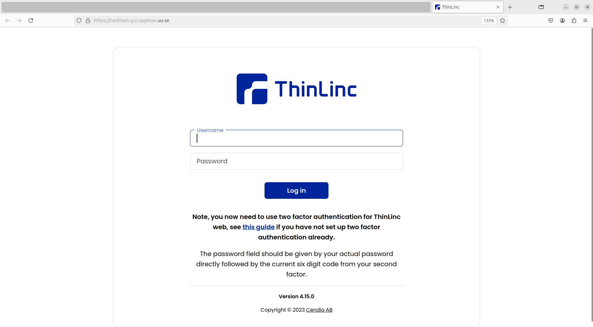

---
tags:
  - login
  - log in
  - Rackham
  - remote desktop
  - website
  - URL
---

# Log in to Rackham's remote desktop via a webbrowser

> Rackham's remote desktop environment via a webbrowser

There are multiple ways to [log in to Rackham](login_rackham.md).
This page described how to log in to its remote desktop environment
via a web browser.

## Procedure

???- question "Prefer a video?"

    This procedure is also shown by [this YouTube video](https://youtu.be/HQ2iuKRPabc).

This is a procedure with one step.
Most work will be to fulfill all [Rackham usage prerequisites](rackham_usage_prerequisites.md).

### 1. Go to [https://rackham-gui.uppmax.uu.se](https://rackham-gui.uppmax.uu.se)

In a webbrowser, go to [https://rackham-gui.uppmax.uu.se](https://rackham-gui.uppmax.uu.se).

- In the first field, fill in your UPPMAX username, e.g. `sven`
- In the second field, fill in your UPPMAX password (e.g. `password`
  and your [UPPMAX 2FA](../getting_started/get_uppmax_2fa.md) (e.g. `123456`)
  together, without a space (e.g. `password123456)

??? question "How does that page look like?"

    

After login, you will be on a [login node](../cluster_guides/login_node.md).

!!! note "How to behave on a login node"

    On a login node, one can and should do simple things only:
    it is a resource shared with all other users on that node.

    If you need to do more intense calculations,
    [use the Slurm job scheduler](../cluster_guides/slurm_on_rackham.md).

    If you need to do more intense calculations interactively,
    [use an interactive node](../cluster_guides/start_interactive_node_on_rackham.md).

## Usage

For tips on how to work with this environment,
see [the UPPMAX ThinLinc page](../software/thinlinc.md)
(as that software is used to do the heavy lifting for that website).
