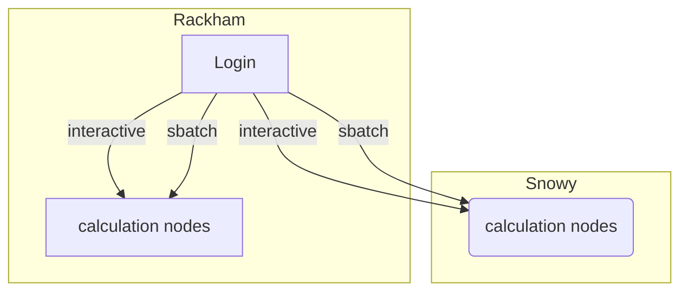

# Login to Snowy

!!! info "[Go to the Snowy portal](../cluster_guides/snowy_portal.md)"

    At [the Snowy portal](../cluster_guides/snowy_portal.md) one can 
    learn about using Snowy, for example:

    - How to do data transfer
    - How to make Snowy do a calculation
    - How to develop code on Snowy

!!! info "Objectives"
    - We'll go through how to reach Snowy

!!! warning
    - If you lack a user account, visit the [Getting started page](https://www.uppmax.uu.se/support/getting-started/course-projects/)

## What is Snowy?

See [Snowy's design](../cluster_guides/snowy.md).

## Local UPPMAX project

- To be able to use the Snowy compute nodes, you need a local UPPMAX project.
https://supr.naiss.se/round/uppmaxcompute2023/

!!! warning
    Snowy is available as compute nodes only

## Reach the Snowy compute nodes

To make Snowy do a calculation, one needs to log in to a Rackham login node,
which is described [here](login_rackham.md).

After logging in, one can

- [Start a batch job using Snowy resources](../cluster_guides/slurm.md)
- [Start an interactive job](../cluster_guides/start_interactive_node_on_snowy.md)

