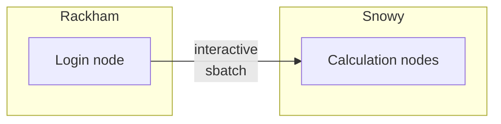

# Log in to Snowy

Here we describe how to log in to [Snowy](../cluster_guides/snowy.md)

One needs to be allowed to use Snowy.
[These prerequisites](rackham_usage_prerequisites.md) describes what is needed before one can use Snowy.

To make Snowy do a calculation, one needs to log in to a Rackham login node,
which is described [here](../getting_started/login_rackham.md).

After logging in, one can

- [Start a batch job using Snowy resources](../cluster_guides/slurm.md)
- [Start an interactive job](../cluster_guides/start_interactive_node_on_snowy.md)

