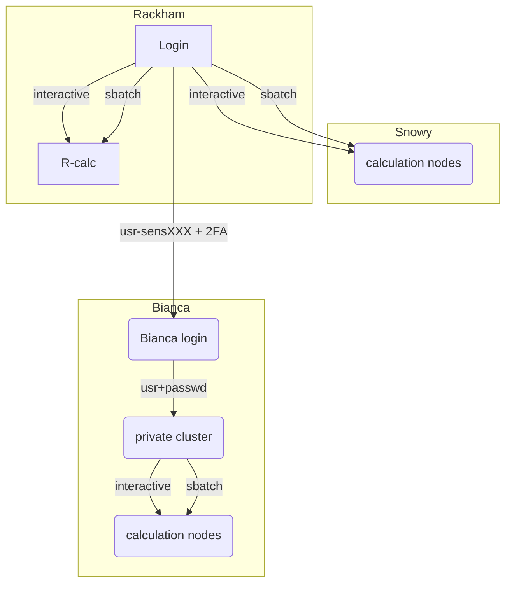

# Login to Snowy

!!! info "Objectives"
    - We'll go through how to reach Snowy

!!! warning
    - If you lack a user account, visit the [Getting started page](https://www.uppmax.uu.se/support/getting-started/course-projects/)

## Local UPPMAX project

## Snowy is availabe as compute nodes

## Login to SNowy

You log in only from Rackham

Two ways:

- Interactive session
- Batch job using Snowy resources

