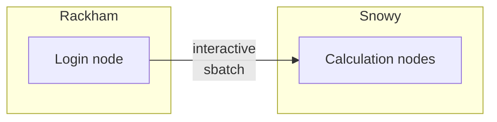

---
tags:
  - login
  - log in
  - Snowy
---

# Log in to Snowy

There are multiple UPPMAX clusters one can [log in to](../getting_started/login.md).
Here we describe how to log in to [Snowy](../cluster_guides/snowy.md)

One needs to be allowed to use Snowy.
[These prerequisites](rackham_usage_prerequisites.md) describes what is needed before one can use Snowy.

To make Snowy do a calculation, one needs to log in to a Rackham login node,
which is described [here](../getting_started/login_rackham.md).

After login, you will be on a [login node](../cluster_guides/login_node.md).

!!! note "How to behave on a login node"

    On a login node, one can and should do simple things only:
    it is a resource shared with all other users on that node.

    If you need to do more intense calculations,
    [use the Slurm job scheduler](../cluster_guides/slurm_on_rackham.md).

    If you need to do more intense calculations interactively,
    [use an interactive node](../cluster_guides/start_interactive_node_on_rackham.md).

After logging in, one can

- [Start a batch job using Snowy resources](../cluster_guides/slurm.md)
- [Start an interactive job](../cluster_guides/start_interactive_node_on_snowy.md)

