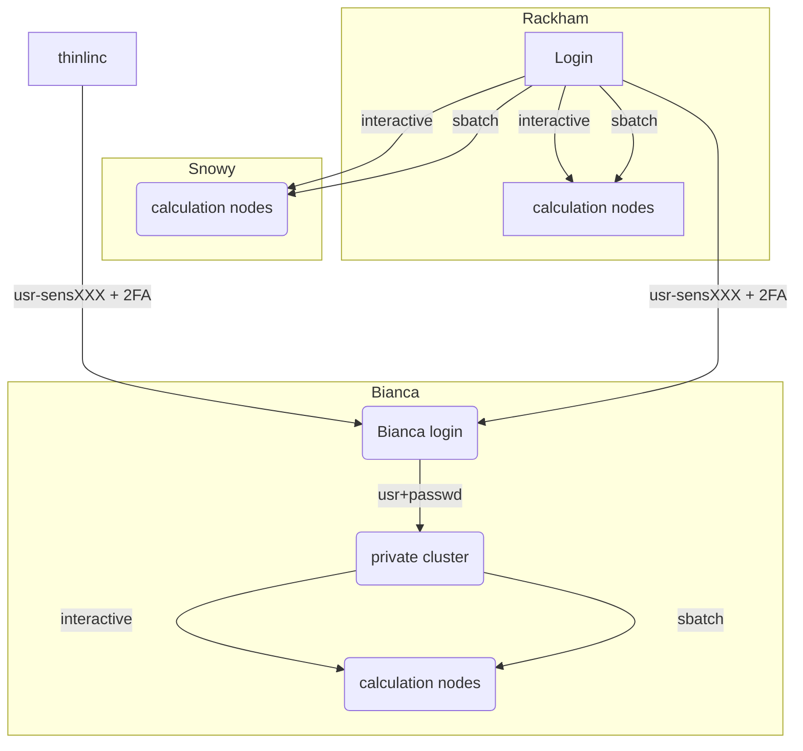

# Login to Snowy

!!! info "Objectives"
    - We'll go through how to reach Snowy

!!! warning
    - If you lack a user account, visit the [Getting started page](https://www.uppmax.uu.se/support/getting-started/course-projects/)

## What is Snowy?

- Snowy can be used for general purpose computing
- We offer GPUs
- We offer long wall time jobs, 30 days. 
- The Snowy hardware: https://uppmax.github.io/UPPMAX-userguide/hardware/clusters/snowy/

## Local UPPMAX project

- To be able to use the Snowy compute nodes, you need a local UPPMAX project.
https://supr.naiss.se/round/uppmaxcompute2023/

!!! warning
Snowy is available as compute nodes

## Login to Snowy

You log in only from Rackham

Two ways:

- Interactive session
- Batch job using Snowy resources

