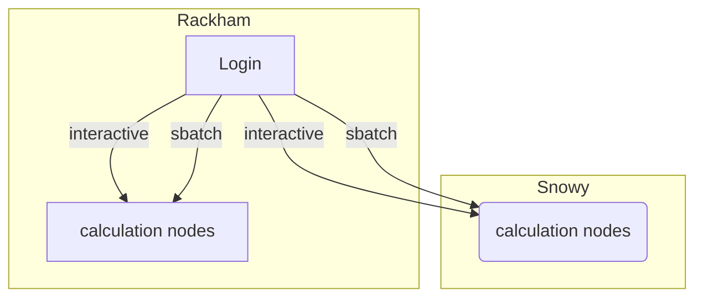

# Log in to Snowy

Here we describe how to log in to [Snowy](snowy.md)

## Prerequisites

- User account: visit the [UPPMAX page on user accounts](user_account.md)
- A local UPPMAX project: see [project](project.md).
  Snowy is available as compute nodes only

## Reach the Snowy compute nodes

To make Snowy do a calculation, one needs to log in to a Rackham login node,
which is described [here](login_rackham.md).

After logging in, one can

- [Start a batch job using Snowy resources](../cluster_guides/slurm.md)
- [Start an interactive job](../cluster_guides/start_interactive_node_on_snowy.md)

