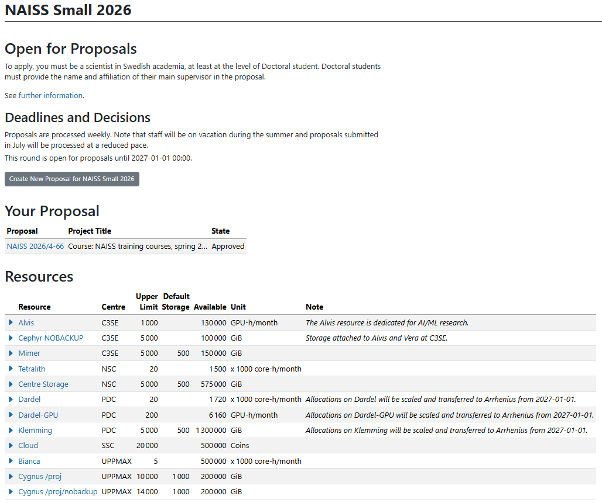
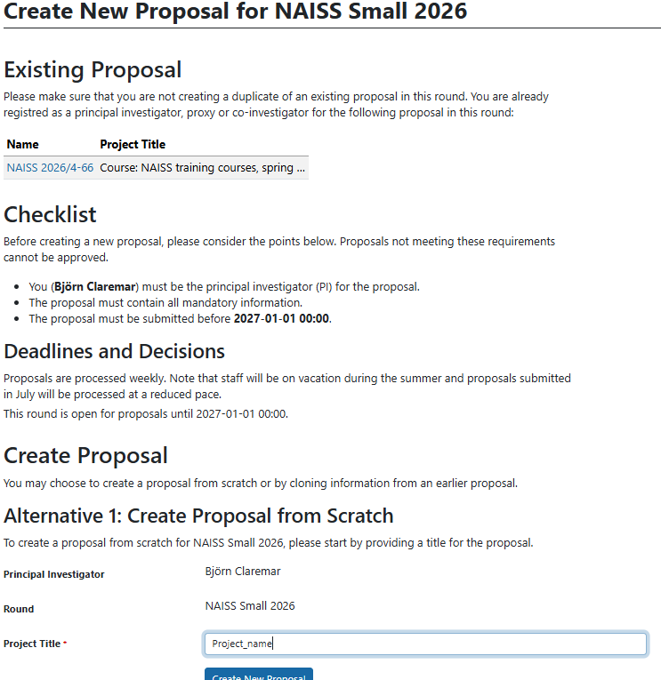
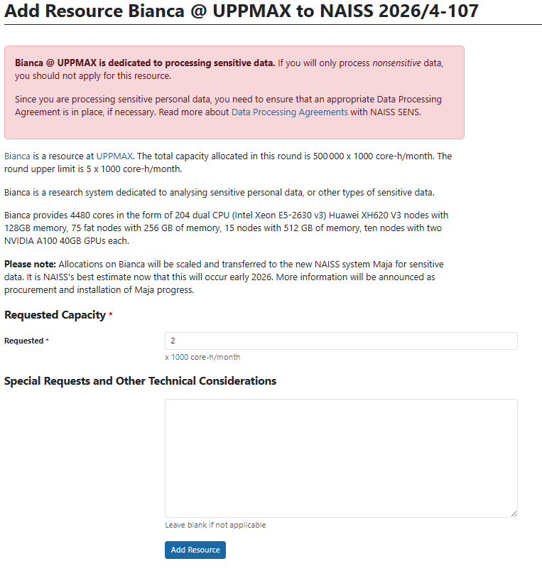
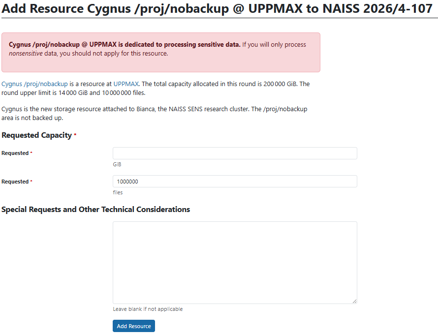
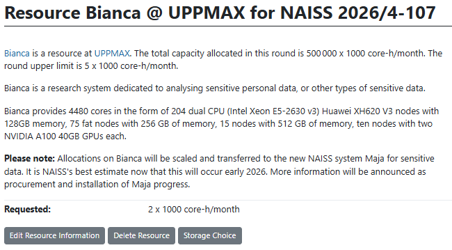

---
tags:
  - project
  - apply
  - application
  - Bianca
---

# Project application for Bianca

To use an UPPMAX cluster, one [needs to apply to a project](project_apply.md).

This page describes how to apply to a Bianca/Sens project.

## Pre-preparations, read this first

- [Applying for NAISS SENS project](https://www.uu.se/en/centre/uppmax/get-started/apply-for-project-and-create-user-account/Applying-for-NAISS-SENS-project)

## Procedure for project application

### 1. Go to [https://supr.naiss.se/](https://supr.naiss.se/)

> Example SUPR NAISS main page

### 2. Click on 'Rounds'

On the main page, click on 'Rounds'

> On the main page, click on 'Rounds'

### 3. Click on 'NAISS rounds' 

In the 'Rounds' menu, click on 'NAISS rounds' 

???- question "How does that look like?"

    

    > In the 'Rounds' menu, click on 'NAISS rounds'

### 4. Click 'Go to NAISS Small/Medium' for the current year

In the 'NAISS Rounds' screen, click 'Go to NAISS Small' or 'Go to NAISS Medium" for the current year, depending on the Size of the project.

- Small: Up to 5,000 core-h/month, and 10 TiB (backup) and 14 TiB (non-backup)
    - Check details and who is eligible to apply at the [NAISS allocation page for small projects](https://www.naiss.se/allocations/small/)
- Medium: Up to 100,000 core-h/month, and 100 TiB (backup) and 50 TiB (non-backup)
    - Check details and who is eligible to apply at the [NAISS allocation page for medium projects](https://www.naiss.se/allocations/medium/)

???- question "How does that look like?"

    

    > In the 'NAISS Rounds' screen, scroll down and click 'Create New Proposal for NAISS Small/Medium Small' for the current year.

### 5. Click 'Create New Proposal for NAISS Small/Medium 2026'"

In the 'Open for Proposals' screen you can view which resources are available (and also clock for details) but to create a new proposal click 'Create New Proposal for NAISS Small/Medium 2026'.

???- question "Example for small project"

    

    > Create New Proposal for NAISS Small/Medium 2026

### 6. Add a project title and click 'Create new proposal'

In the 'Create New Proposal for NAISS SENS Small 2026', add a project title and click 'Create new proposal'

???- question "How does that look like?"

    

    > In the 'Create New Proposal for NAISS SENS Small 2026', add a project title and click 'Create new proposal'

THis leads you to the next page, the proposal details.

???- question "How does that look like?"

    

    > An NAISS compute project

So far it is an ordinary NAISS project, no resource coupled to sensitive projects is yet chosen.

### 8. Scroll down and add the resource Bianca

In your UPPMAX local compute project, scroll down to 'Resources' and add Pelle.

???- question "How does that look like?"

    

    > In your UPPMAX local compute project, scroll down to 'Resources' and add Pelle

Click on 'Add resource to proposal' to add Pelle as a resource.

### 9. Click on 'Add resources to proposal'

In the 'Add resource Pelle' menu, set the number of core hours and click 'Add resource'.

???- question "How does that look like?"

    

    > In the 'Add resource Pelle' menu, set the number of core hours and click 'Add resource'

    

Edit!

???- question "How does that look like?"

    

    > In the 'Add resource Pelle' menu, set the number of core hours and click 'Add resource'

### 10. Click on 'Storage Choice'

In the 'Add resource Pelle' menu, click 'Storage choice'.

???- question "How does that look like?"

    

    > In the 'Add resource Pelle' menu, set the number of core hours and click 'Add resource'

Request needed storage in terms of GiB and number of files.

???- question "How does that look like?"

    

    > In the 'Add resource Pelle' menu, set the number of core hours and click 'Add resource'

    
    
    

### 11. Want to change your numbers?

You can go back and change your choices. In your UPPMAX local compute project, scroll down to 'Resources' section to revisit the resources.

???- question "How does that look like?"

    

    > In your UPPMAX local compute project, revisit resources

    

    > Edit resource

### 12. Submit your proposal

Press the "Submit the Proposal" button on the bottom of the page.

???- question "How does that look like?"

    

    > In your UPPMAX local compute project, Pelle is added

### 13. Done

Now, Bianca is added to your proposal. Well done!
