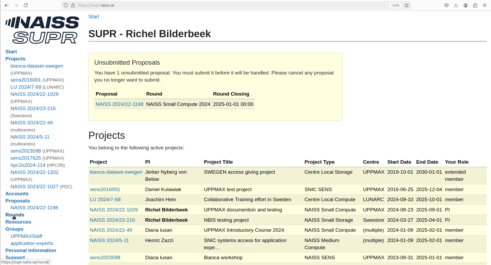

# Project application for Bianca

To use an UPPMAX cluster, one [needs to apply to a project](project_apply.md).
This page describes how to apply to a Bianca project.

## Procedure

### 1. Go to [https://supr.naiss.se/](https://supr.naiss.se/)

> Example <https://supr.naiss.se/> main page

### 2. Click on 'Rounds'

On the main page, click on 'Rounds'

> On the main page, click on 'Rounds'

### 3. Click on 'Go to NAISS SENS'

In the 'Rounds' menu, click on 'Go to NAISS SENS'

> In the 'Rounds' menu, click on 'Go to NAISS SENS'

### 4. Click on 'Go to NAISS SENS Small' for the current year

In the 'NAISS SENS Rounds' menu, click on 'Go to NAISS SENS Small' for the
current year:

> In the 'NAISS SENS Rounds' menu, click on 'Go to NAISS SENS Small' for the current year

### 5. Click 'Create New Proposal for NAISS SENS Small' for the current year

In the 'Open for Proposals' screen, click 'Create New Proposal for NAISS SENS Small' for the current year

> In the 'Open for Proposals' screen, click 'Create New Proposal for NAISS SENS Small' for the current year

### 6. Add a project title and click 'Create new proposal'

In the 'Create New Proposal for NAISS SENS Small 2024', add a project title and click 'Create new proposal'

> In the 'Create New Proposal for NAISS SENS Small 2024', add a project title and click 'Create new proposal'

After this, the procedure is straightforward.

> Resource available for a NAISS SENS Small project
