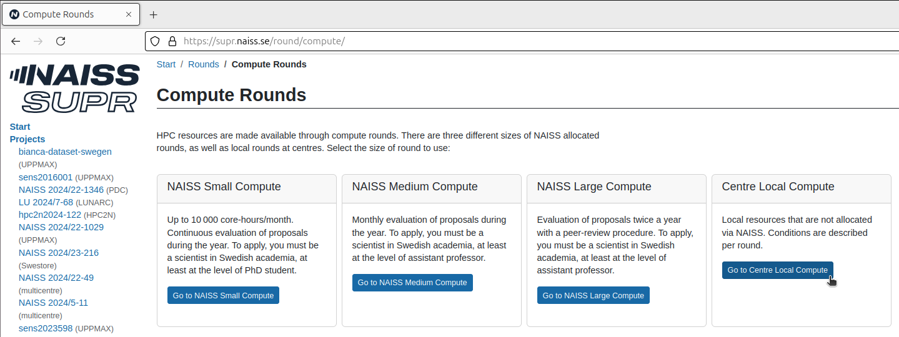
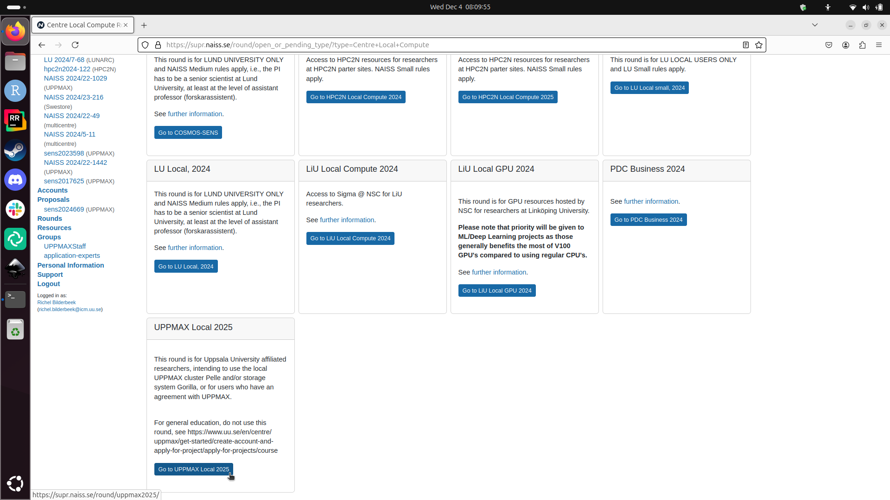
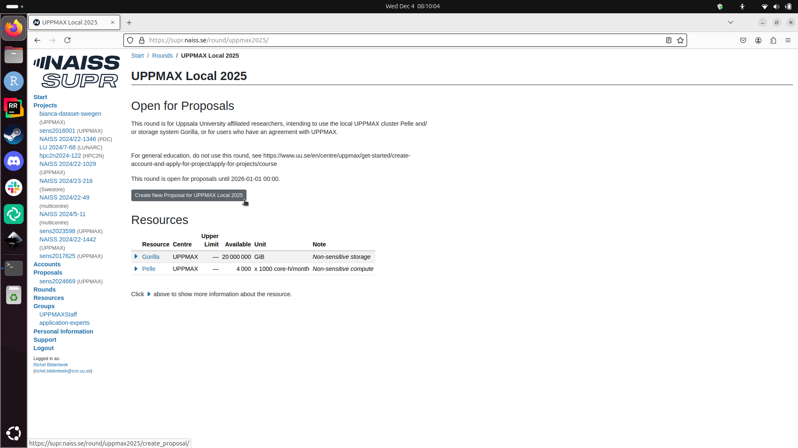
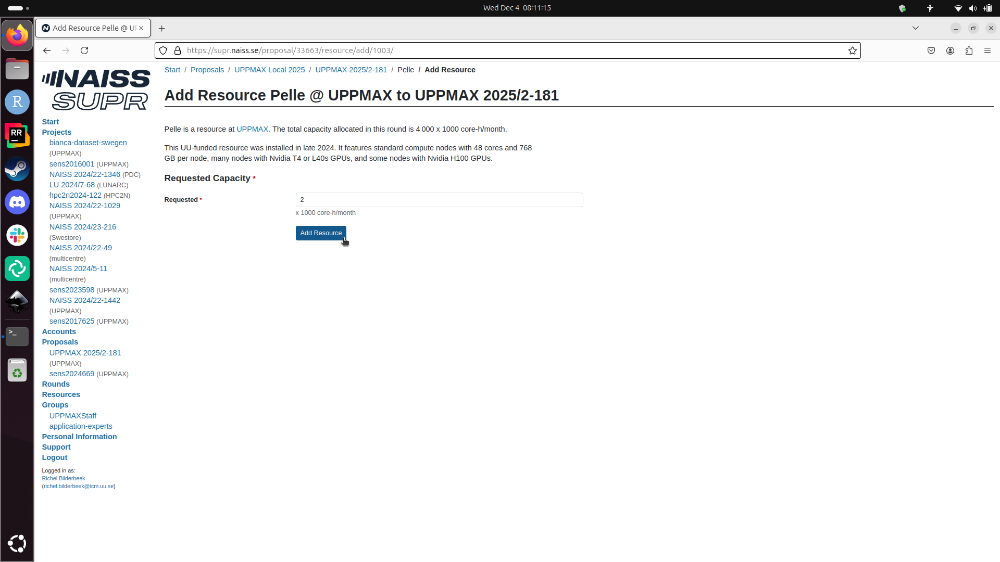

# Project application for Pelle

To use an UPPMAX cluster, one [needs to apply to a project](project_apply.md).
This page describes how to apply to a Pelle project.

## Procedure

### 1. Go to [https://supr.naiss.se/](https://supr.naiss.se/)

> Example SUPR NAISS main page

### 2. Click on 'Rounds'

On the main page, click on 'Rounds'

> On the main page, click on 'Rounds'

### 3. Click on 'Go to Compute Rounds'

In the 'Rounds' menu, click on 'Go to Compute Rounds'

> In the 'Rounds' menu, click on 'Go to Compute Rounds'

### 4. Click on 'Go to Centre Local Compute'

In the 'Compute Rounds' menu, click on 'Go to Centre Local Compute'

> In the 'Compute Rounds' menu, click on 'Go to Centre Local Compute'

### 5. Click on 'Go to Centre Local Compute'

In the 'Centre Local Compute Rounds' menu, click on 'Go to UPPMAX Local'

> In the 'Centre Local Compute Rounds' menu, click on 'Go to UPPMAX Local'

### 6. Click on 'Create new proposal'

In the 'UPPMAX Local' menu, click on 'Create new proposal'

> In the 'UPPMAX Local' menu, click on 'Create new proposal'

### 7. Fill in a title and click on 'Create new proposal'

In the 'Create new proposal for UPPMAX local' menu, fill in a title and click on 'Create new proposal'

> In the 'Create new proposal for UPPMAX local' menu, fill in a title and click on 'Create new proposal'

You have just created an UPPMAX local compute project!

> An UPPMAX local compute project

### 8. Scroll down and add Pelle

In your UPPMAX local compute project, scroll down to 'Resources' and add Pelle.

> In your UPPMAX local compute project, scroll down to 'Resources' and add Pelle

Click on 'Add resource to proposal' to add Pelle as a resource:

> In your UPPMAX local compute project, click 'Add resource to proposal'

### 9. Click on 'Create new proposal'

In the 'Add resource Pelle' menu, set the number of core hourse and click 'Add resource'.

> In the 'Add resource Pelle' menu, set the number of core hourse and click 'Add resource'

### 10. Done

Now, Pelle is added to your UPPMAX local compute project. Well done!

> In your UPPMAX local compute project, Pelle is added
