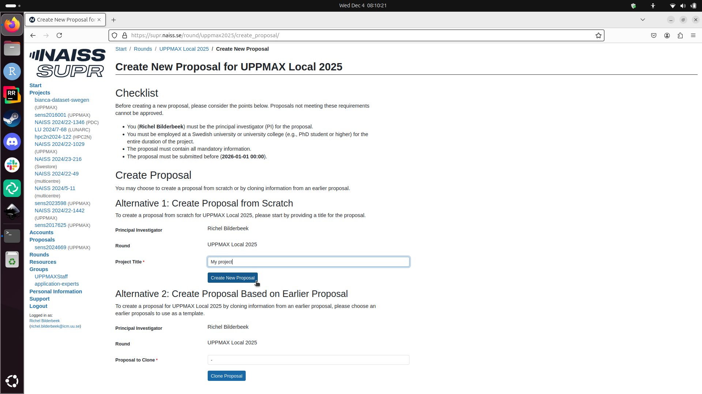
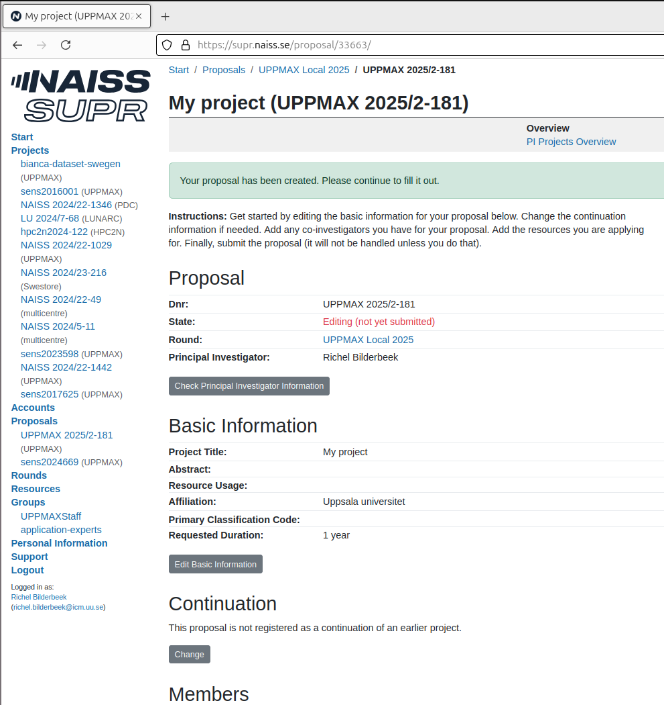
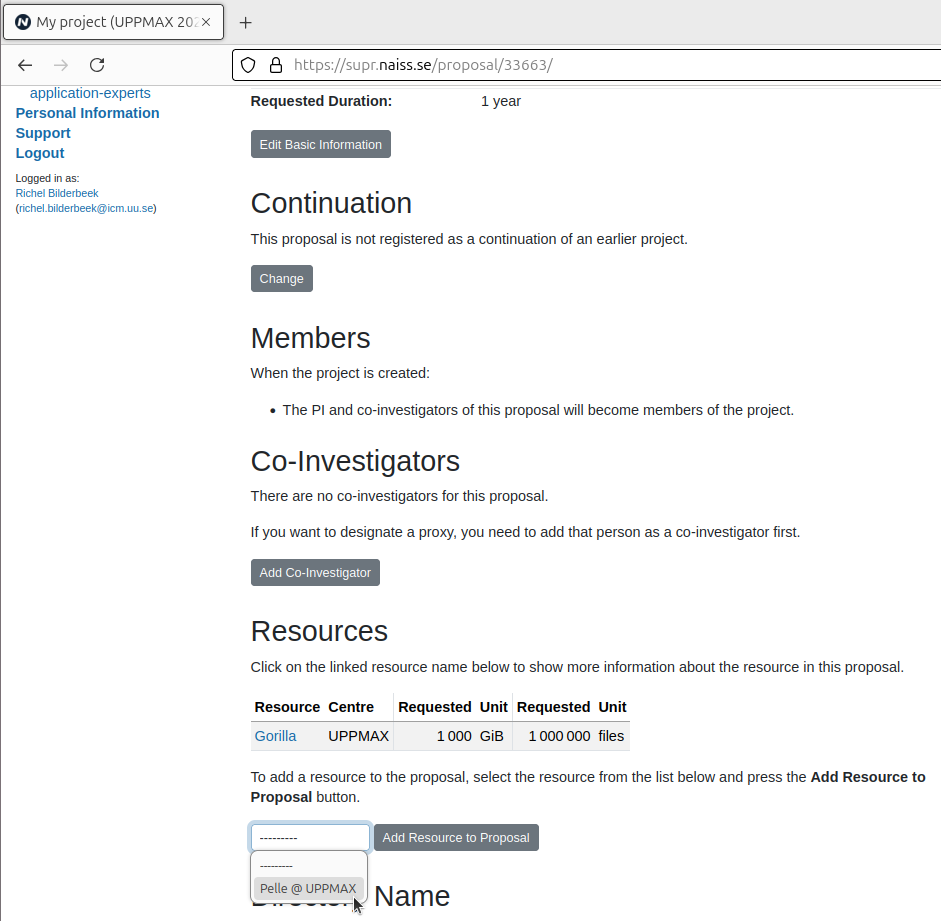

---
tags:
  - project
  - apply
  - application
  - Pelle
---

# Project application for Pelle

To use an UPPMAX cluster, one [needs to apply to a project](project_apply.md).
This page describes how to apply to a [Pelle](../cluster_guides/pelle.md) project.

## Procedure

???- question "Prefer a video?"

    See [the YouTube video 'Apply for an UPPMAX Pelle project'](https://youtu.be/3VOAhPe0Rcg)

### 1. Go to [https://supr.naiss.se/](https://supr.naiss.se/)

???- question "How does that look like?"

    

    > Example SUPR NAISS main page

### 2. Click on 'Rounds'

On the main page, click on 'Rounds'

???- question "How does that look like?"

    

    > On the main page, click on 'Rounds'

### 3. Click on 'Local and Special Rounds'

In the 'Rounds' menu, click on 'Local and Special Rounds'

???- question "How does that look like?"

    

    > In the 'Rounds' menu, click on 'Local and Special Rounds'

### 4. Click on 'Rounds at UPPMAX'

In the 'Local and Special Rounds' menu, click on 'Rounds at UPPMAX'

???- question "How does that look like?"

    

    > In the 'Local and Special Rounds' menu, click on 'Rounds at UPPMAX'

### 5. Click on 'Go to UPPMAX Local 2026'

In the 'Rounds at UPPMAX' menu, click on 'Go to UPPMAX Local 2026'

???- question "How does that look like?"

    

    > In the 'Rounds at UPPMAX' menu, click on 'Go to UPPMAX Local 2026'

### 6. Click on 'Create new proposal'

In the 'UPPMAX Local' menu, click on 'Create new proposal'

???- question "How does that look like?"

    

    > In the 'UPPMAX Local' menu, click on 'Create new proposal'

### 7. Fill in a title and click on 'Create new proposal'

In the 'Create new proposal for UPPMAX local' menu, fill in a title and click on 'Create new proposal'

???- question "How does that look like?"

    

    > In the 'Create new proposal for UPPMAX local' menu, fill in a title and click on 'Create new proposal'

You have just created an UPPMAX local compute project!

???- question "How does that look like?"

    

    > An UPPMAX local compute project

### 8. Scroll down and add Pelle

In your UPPMAX local compute project, scroll down to 'Resources' and add Pelle.

???- question "How does that look like?"

    

    > In your UPPMAX local compute project, scroll down to 'Resources' and add Pelle

Click on 'Add resource to proposal' to add Pelle as a resource.

???- question "How does that look like?"

    

    > In your UPPMAX local compute project, click 'Add resource to proposal'

### 9. Click on 'Create new proposal'

In the 'Add resource Pelle' menu, set the number of core hours and click 'Add resource'.

???- question "How does that look like?"

    

    > In the 'Add resource Pelle' menu, set the number of core hours and click 'Add resource'

### 10. Done

Now, Pelle is added to your proposal. Well done!

???- question "How does that look like?"

    

    > In your UPPMAX local compute project, Pelle is added
