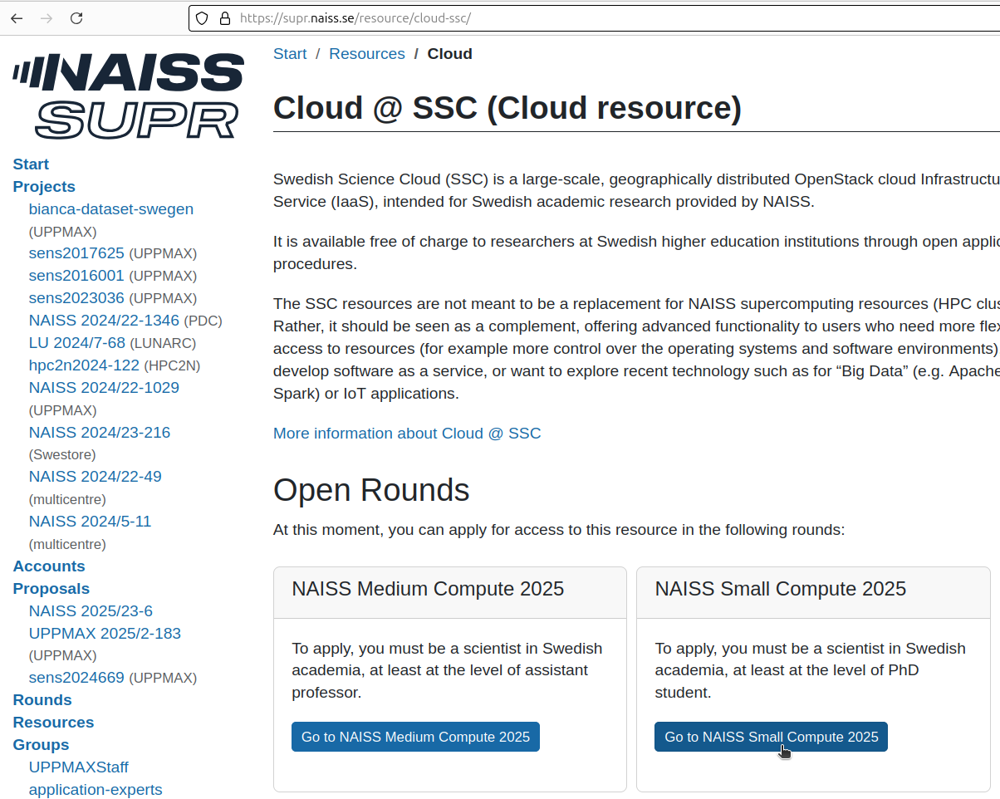
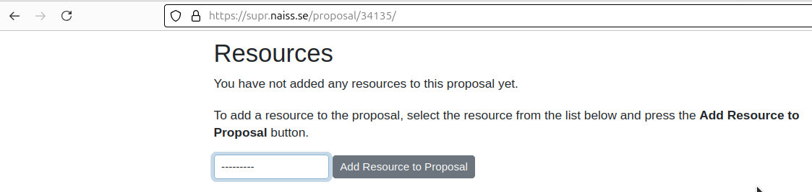
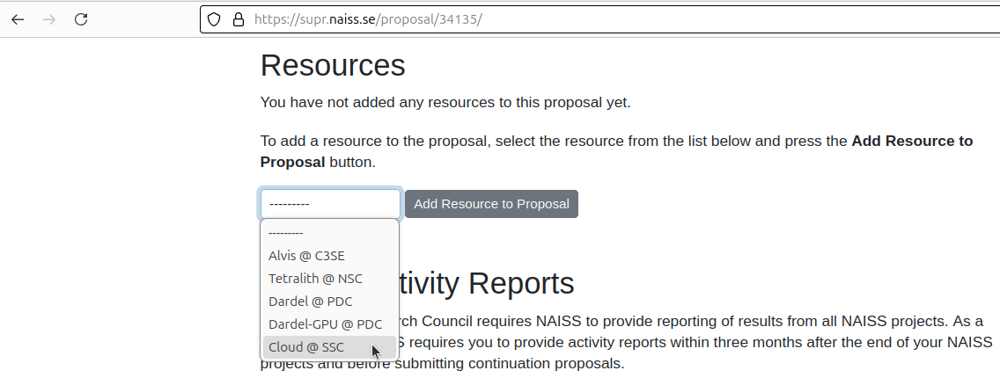
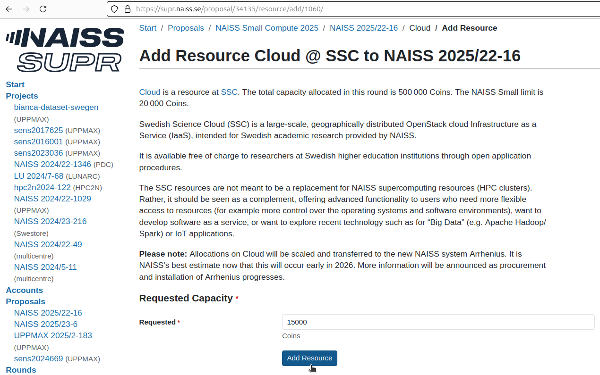

---
tags:
  - project
  - apply
  - application
  - SCC
  - Swedish Science Cloud
---

# Project application for SCC

To use an UPPMAX cluster, one [needs to apply to a project](project_apply.md).
This page describes how to apply to a [SCC](../cluster_guides/pelle.md) project.

## Procedure

???- question "Prefer a video?"

    ...

### 1. Go to [https://supr.naiss.se/](https://supr.naiss.se/)

???- question "How does that look like?"

    

    > Example SUPR NAISS main page

### 2. Click on 'Rounds'

On the main page, click on 'Rounds'

???- question "How does that look like?"

    

    > On the main page, click on 'Rounds'

### 3. Click on 'Go to Swedish Science Cloud'

In the 'Rounds' menu, click on 'Go to Swedish Science Cloud'

???- question "How does that look like?"

    

    > In the 'Rounds' menu, click on 'Go to Swedish Science Cloud'

### 4. Click on 'Go to Swedish Science Cloud'

In the 'Cloud resource' menu, click on 'Go to NAISS Small Compute 2025'.

???- question "How does that look like?"

    

    > In the 'Cloud resource' menu, click on 'Go to NAISS Small Compute 2025'

### 5. Click on 'Create new proposal for NAISS Small Compute'

In the 'Small Compute Rounds' menu, click on 'Create new proposal for NAISS Small Compute'.

???- question "How does that look like?"

    

    > In the 'Small Compute Rounds' menu, click on 'Create new proposal for NAISS Small Compute'

### 6. Add a project title and click on 'Create new proposal'

In the 'Create new proposal' menu, add a project title and click on 'Create new proposal'

???- question "How does that look like?"

    

    > In the 'Create new proposal' menu, add a project title and click on 'Create new proposal'

### 7. Scroll down to 'Resources'

In this NAISS project proposal page, scroll down to 'Resources'.

???- question "How does that look like?"

    

    > In this NAISS project proposal page, scroll down to 'Resources'

### 8. Select 'Cloud @ SCC'

In the 'Resources' dropbox, Select 'Cloud @ SCC'.

???- question "How does that look like?"

    

    > In the 'Resources' dropbox, Select 'Cloud @ SCC'

### 9. Set the amount of coins and click 'Add Resource'

At the 'Add resource Cloud' page, set the amount of coins and click 'Add Resource'.

???- question "How does that look like?"

    

    > At the 'Add resource Cloud' page, set the amount of coins and click 'Add Resource'.

The resource is now added to your project.

???- question "How does that look like?"

    

    > 'Resource Cloud added to proposal'

### 10. Click 'Submit proposal'

In this NAISS project proposal page,
after all other details are filled in,
scroll down and click on 'Submit proposal'

???- question "How does that look like?"

    

    > In this NAISS project proposal page, scroll down and click on 'Submit proposal'
