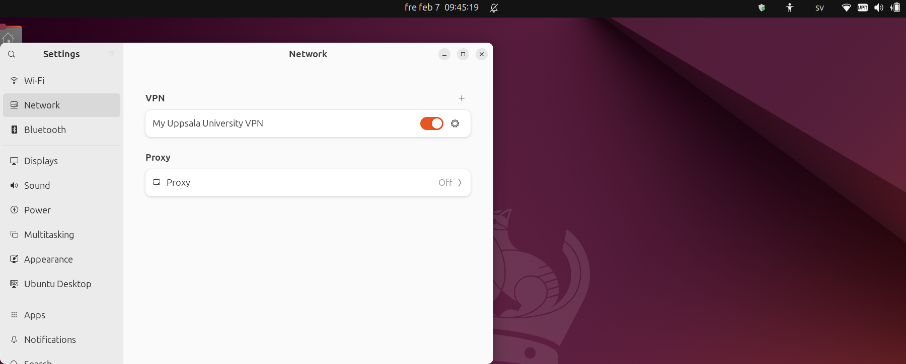

---
tags:
  - setup
  - set up
  - VPN
  - Linux
  - UU
  - Uppsala
---

# Setup a VPN from Uppsala University for Linux

How to [set up a VPN](setup_vpn.md) differs between universities
and differs between operating systems.
This page describes how to set up a VPN from Uppsala University for Linux.

## Procedure

### 1. Install the needed packages

In a terminal, do:

```bash
sudo apt-get install openconnect network-manager-openconnect network-manager-openconnect-gnome
```

??? question "How does that look like?"

 You output look similar to this:

 ```bash
 sven@svens_computer:~$ sudo apt-get install openconnect network-manager-openconnect network-manager-openconnect-gnome
 [sudo] password for sven: 
 Reading package lists... Done
 Building dependency tree... Done
 Reading state information... Done
 The following packages were automatically installed and are no longer required:
  libavcodec58 libavdevice58 libavfilter7 libavformat58 libavutil56 libcodec2-1.0
  libdav1d5 libdcmtk16 libilmbase25 libmfx1 libopenexr25 libpostproc55 libsrt1.4-gnutls
  libswresample3 libswscale5 libtiff5 libvpx7 libx264-163 mailcap
 Use 'sudo apt autoremove' to remove them.
 The following additional packages will be installed:
  libopenconnect5 libpskc0t64 libstoken1t64 libtomcrypt1 libxmlsec1t64-openssl
  python3-asn1crypto python3-mechanize vpnc-scripts
 Suggested packages:
  dnsmasq
 The following NEW packages will be installed:
  libopenconnect5 libpskc0t64 libstoken1t64 libtomcrypt1 libxmlsec1t64-openssl
  network-manager-openconnect network-manager-openconnect-gnome openconnect
  python3-asn1crypto python3-mechanize vpnc-scripts
 0 upgraded, 11 newly installed, 0 to remove and 22 not upgraded.
 Need to get 2 187 kB of archives.
 After this operation, 10,1 MB of additional disk space will be used.
 Do you want to continue? [Y/n] 
 Get:1 http://archive.ubuntu.com/ubuntu noble/main amd64 libxmlsec1t64-openssl amd64 1.2.39-5build2 [84,1 kB]
 Get:2 http://archive.ubuntu.com/ubuntu noble-updates/main amd64 libpskc0t64 amd64 2.6.11-2.1ubuntu0.1 [27,9 kB]
 Get:3 http://archive.ubuntu.com/ubuntu noble/universe amd64 libtomcrypt1 amd64 1.18.2+dfsg-7build1 [384 kB]
 Get:4 http://archive.ubuntu.com/ubuntu noble/universe amd64 libstoken1t64 amd64 0.92-1.1build2 [27,6 kB]
 Get:5 http://archive.ubuntu.com/ubuntu noble/universe amd64 libopenconnect5 amd64 9.12-1build5 [217 kB]
 Get:6 http://archive.ubuntu.com/ubuntu noble/universe amd64 vpnc-scripts all 0.1~git20220510-1 [16,2 kB]
 Get:7 http://archive.ubuntu.com/ubuntu noble/universe amd64 openconnect amd64 9.12-1build5 [667 kB]
 Get:8 http://archive.ubuntu.com/ubuntu noble/universe amd64 network-manager-openconnect amd64 1.2.10-3build2 [556 kB]
 Get:9 http://archive.ubuntu.com/ubuntu noble/universe amd64 network-manager-openconnect-gnome amd64 1.2.10-3build2 [33,6 kB]
 Get:10 http://archive.ubuntu.com/ubuntu noble/universe amd64 python3-asn1crypto all 1.5.1-3 [79,7 kB]
 Get:11 http://archive.ubuntu.com/ubuntu noble/universe amd64 python3-mechanize all 1:0.4.9+ds-2 [93,9 kB]
 Fetched 2 187 kB in 1s (2 434 kB/s)           
 Selecting previously unselected package libxmlsec1t64-openssl:amd64.
 (Reading database ... 481882 files and directories currently installed.)
 Preparing to unpack .../00-libxmlsec1t64-openssl_1.2.39-5build2_amd64.deb ...
 Unpacking libxmlsec1t64-openssl:amd64 (1.2.39-5build2) ...
 Selecting previously unselected package libpskc0t64:amd64.
 Preparing to unpack .../01-libpskc0t64_2.6.11-2.1ubuntu0.1_amd64.deb ...
 Unpacking libpskc0t64:amd64 (2.6.11-2.1ubuntu0.1) ...
 Selecting previously unselected package libtomcrypt1:amd64.
 Preparing to unpack .../02-libtomcrypt1_1.18.2+dfsg-7build1_amd64.deb ...
 Unpacking libtomcrypt1:amd64 (1.18.2+dfsg-7build1) ...
 Selecting previously unselected package libstoken1t64:amd64.
 Preparing to unpack .../03-libstoken1t64_0.92-1.1build2_amd64.deb ...
 Unpacking libstoken1t64:amd64 (0.92-1.1build2) ...
 Selecting previously unselected package libopenconnect5:amd64.
 Preparing to unpack .../04-libopenconnect5_9.12-1build5_amd64.deb ...
 Unpacking libopenconnect5:amd64 (9.12-1build5) ...
 Selecting previously unselected package vpnc-scripts.
 Preparing to unpack .../05-vpnc-scripts_0.1~git20220510-1_all.deb ...
 Unpacking vpnc-scripts (0.1~git20220510-1) ...
 Selecting previously unselected package openconnect.
 Preparing to unpack .../06-openconnect_9.12-1build5_amd64.deb ...
 Unpacking openconnect (9.12-1build5) ...
 Selecting previously unselected package network-manager-openconnect.
 Preparing to unpack .../07-network-manager-openconnect_1.2.10-3build2_amd64.deb ...
 Unpacking network-manager-openconnect (1.2.10-3build2) ...
 Selecting previously unselected package network-manager-openconnect-gnome.
 Preparing to unpack .../08-network-manager-openconnect-gnome_1.2.10-3build2_amd64.deb ...
 Unpacking network-manager-openconnect-gnome (1.2.10-3build2) ...
 Selecting previously unselected package python3-asn1crypto.
 Preparing to unpack .../09-python3-asn1crypto_1.5.1-3_all.deb ...
 Unpacking python3-asn1crypto (1.5.1-3) ...
 Selecting previously unselected package python3-mechanize.
 Preparing to unpack .../10-python3-mechanize_1%3a0.4.9+ds-2_all.deb ...
 Unpacking python3-mechanize (1:0.4.9+ds-2) ...
 Setting up libtomcrypt1:amd64 (1.18.2+dfsg-7build1) ...
 Setting up python3-mechanize (1:0.4.9+ds-2) ...
 Setting up libstoken1t64:amd64 (0.92-1.1build2) ...
 Setting up libxmlsec1t64-openssl:amd64 (1.2.39-5build2) ...
 Setting up vpnc-scripts (0.1~git20220510-1) ...
 Setting up python3-asn1crypto (1.5.1-3) ...
 Setting up libpskc0t64:amd64 (2.6.11-2.1ubuntu0.1) ...
 Processing triggers for libc-bin (2.39-0ubuntu8.3) ...
 Processing triggers for man-db (2.12.0-4build2) ...
 Processing triggers for dbus (1.14.10-4ubuntu4.1) ...
 Processing triggers for sgml-base (1.31) ...
 Setting up libopenconnect5:amd64 (9.12-1build5) ...
 Setting up openconnect (9.12-1build5) ...
 Setting up network-manager-openconnect (1.2.10-3build2) ...
 Setting up network-manager-openconnect-gnome (1.2.10-3build2) ...
 Processing triggers for libc-bin (2.39-0ubuntu8.3) ...
 sven@svens_computer:~$ 
 ```

## 2. Add the VPN

Go to the 'Settings'

??? question "How do I get there?"

    Press the meta/windows/command key
    (the one between `CTRL` and `ALT` that is not called `FN`).

    When typing `settings`, it will pop up. Click it.
    Or move there with the arrow keys and press enter. 

    

Go to 'Network'.

??? question "How does that look like?"

    

In the VPN section, click on the plus to add a VPN.

??? question "How does that look like?"

    

In the 'Add VPN' dialog, click on 'Multi-protocol VPN client (openconnect)'.

??? question "How does that look like?"

    

In the 'Add VPN' dialog, click on the 'Identity' tab.

??? question "How does that look like?"

    

In the 'Identity' tab, set up the following values:

Field     |Value
----------|--------------------------------------------
Name      |Any name, e.g. `My Uppasala University VPN`
Gateway   |`vpn.uu.se`
User Agent|`AnyConnect Linux_64 4.7.00136`

??? question "How does that look like?"

    

Now you have added the VPN.

## 3. Activate the VPN

In the Ubuntu network settings, we can see our inactive VPN.

Click on the slider right of our UU VPN.

??? question "How does that look like?"

    

In the popup, click login.

??? question "How does that look like?"

    

You are now asked for you UU Login:

??? question "How does that look like?"

    

Fill in your UU login name and password.

??? question "How does that look like?"

    

Fill in your 2FA. The 2FA should be called `[akka_id]`, e.g. `svesv314`
(and not `sven.svensson@icm.uu.se`).

???- question "Forgot how to set up 2FA for your UU user account?"

    UU describes how to setup 2FA for your user
    account [here](https://www.uu.se/en/staff/service-and-tools/tools-and-guides/log-in-securely).

    Pick the options for 'user account' (i.e. not for SharePoint).

??? question "How does that look like?"

    

You are now connected!

??? question "How can I see that?"

    You are connected to the UU VPN according to network settings:

    

    You are connected to the UU VPN according to the main menu:
    

??? question "For staff: UIT documentation"

    This page is based on this procedure suggested by UIT:

    

    

    
