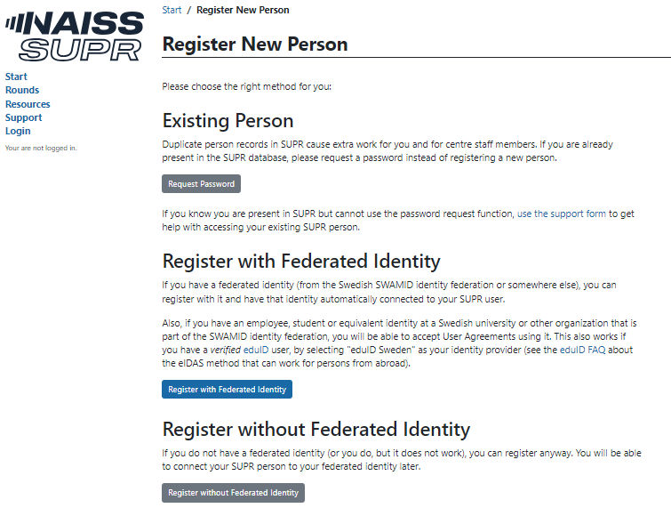
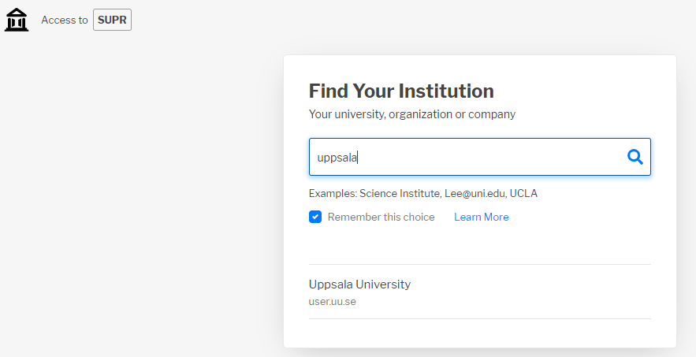
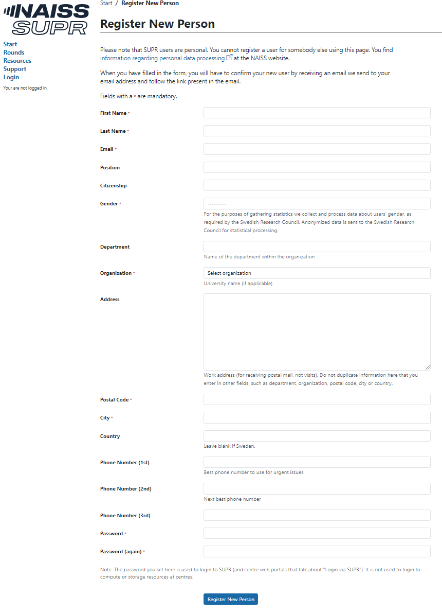
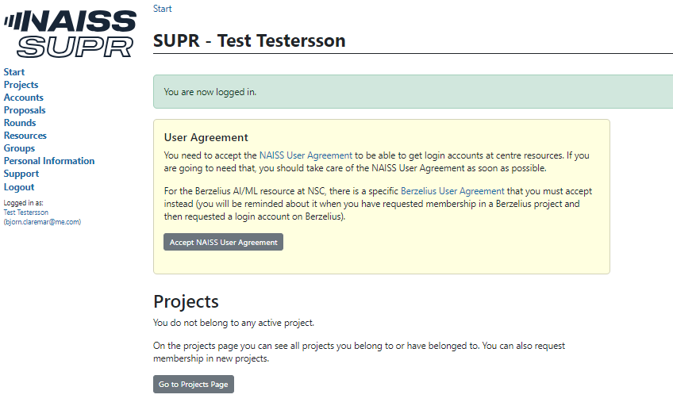

# Register at SUPR.

- Go to https://supr.naiss.se/person/register/
- If you already have an account you must use that account, otherwise you can register with or without SWAMID by clicking on the appropriate button.

- If you clicked on register via SWAMID you will have to choose the university that you belong to. Here as an example I choose Uppsala University:

- Click on the University and then choose if you want to login via this SWAMID once
- or if your browser should remember your choice and use everytime you visit SUPR
- Here again as an example is Uppsala University:

- You can now check the information your university has sent to SUPR and accept it to create a SUPR account.
- If you instead click on Register without SWAMID you will have to fill in this:

- Fill in the form and click the button to create your SUPR account.
- You have to confirm your account by answering an email sent to the address you registered.

## Accept the User Agreement

- After logging into your SUPR account you must accept the user agreement. Click on Handle User Agreement

- Depending on how you take care of the User Agreement, it may be approved automatically or it may require manual checking (for example if you choose to use the paper form). You will get an email from SUPR when it has been approved.
