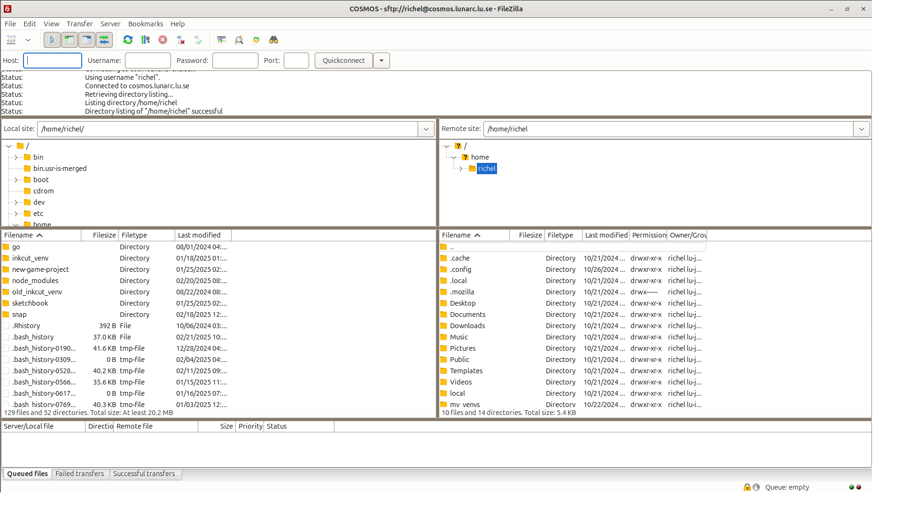
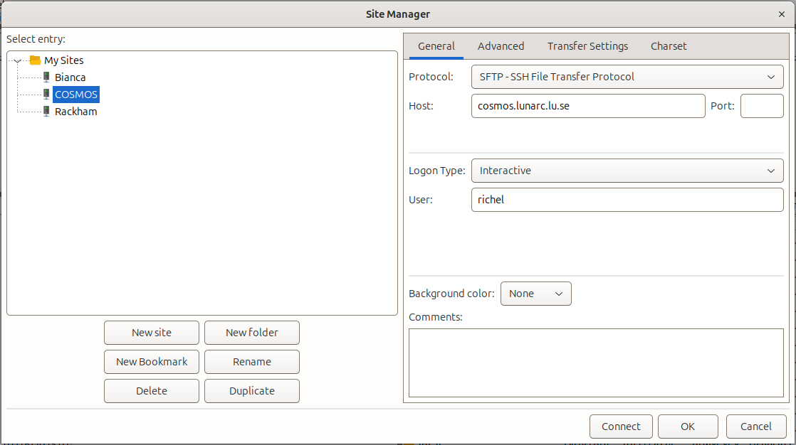

---
tags:
  - FileZilla
  - COSMOS
---

# File transfer to/from COSMOS using FileZilla

???- question "Why is this page at UPPMAX?"

    It is the intention that this guide is moved to the LUNARC documentation.
    However, it has not been suggested to be added to their documentaton
    yet.

HPC clusters have different ways to do
[file transfer using FileZilla](file_transfer_using_filezilla.md).

This page shows how to do so for COSMOS.

> FileZilla connected to COSMOS

## Procedure

???- question "Would you like a video?"

    If you like to see how to do file transfer from/to COSMOS
    using FileZilla, watch the video [here](https://youtu.be/T4qqN_ljsS8)

FileZilla is a secure file transfer tool that works under Linux, Mac and Windows.

To transfer files to/from COSMOS using FileZilla, do
the following steps:

### 1. Start FileZilla

Start FileZilla.

### 2. Start FileZilla's site manager

From the menu, select 'File | Site manager'

???- tip "Where is that?"

    It is here:

    

    > The FileZilla 'File' menu contains the item 'Site manager'

### 3. Add a new site in FileZilla's site manager

In FileZilla's site manager, click 'New site'

???- tip "Where is that?"

    It is here:

    

### 4. Setup the site

In FileZilla's site manager:

- create a name for the site, e.g. `COSMOS`.
- for that site, use all standards, except:
    - Set protocol to 'SFTP - SSH File Transfer Protocol'
    - Set host to `cosmos.lunarc.lu.se`
    - Set user to `[username]`, e.g. `sven`
    - Set logon type to 'Interactive'

???- tip "How does that look like?"

    It looks similar to this:

    

### 8. Connect to the site

Click 'Connect'.

### 9. Ready to transfer files

Now you can transfer files between your local computer and COSMOS.

???- tip "How does that look like?"

    It looks like this:

    
