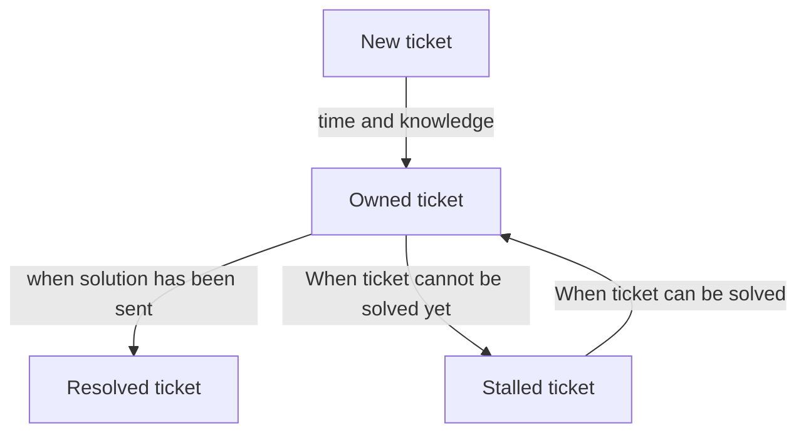
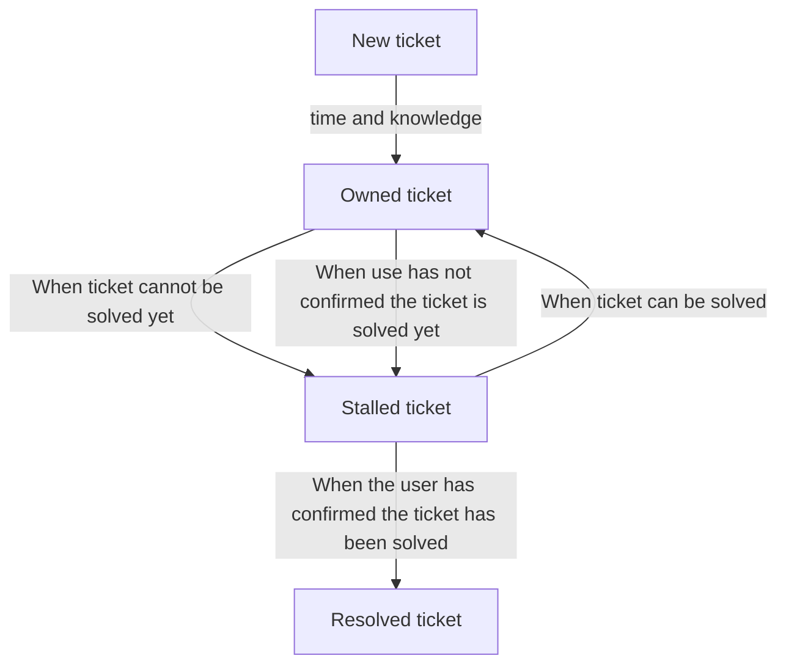

# Request Tracker

Request Tracker, commonly abbreviated to 'RT' is the software
used by the NAISS ticket system.

## Workflow

### As presented

As presented by Henric Zazzi on 2024-10-03 at the NAISS All-Hands:

### Alternative

As discussed at the whiteboard discussion:

