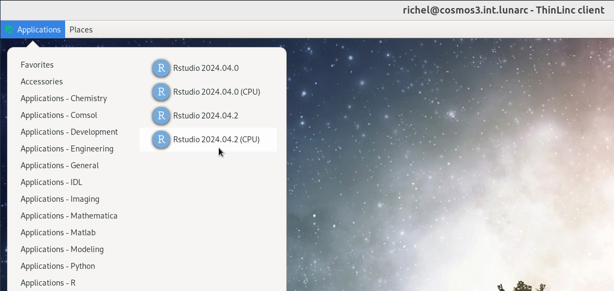

---
tags:
  - RStudio
  - COSMOS
---

# RStudio on COSMOS

???- question "Why is this page at UPPMAX?"

    It is the intention that this guide is moved to the LUNARC documentation.
    However, it has not been suggested to be added to their documentaton
    yet.

## Introduction

[RStudio](../software/rstudio.md) is an [IDE](../software/ides.md)
specialized for the [R](../software/r.md) programming language.

In this session, we show how to use RStudio on COSMOS.

## Procedure to start RStudio

Below is a step-by-step procedure to start RStudio on COSMOS.

??? question "Prefer a video?"

    Watch [the YouTube video 'RStudio on COSMOS'](https://youtu.be/eT4D_K5JODA).

## 1. Start a COSMOS remote desktop environment

See [the LUNARC documentation 'Accessing the LUNARC HPC Desktop'](https://lunarc-documentation.readthedocs.io/en/latest/getting_started/using_hpc_desktop/).

## 2. Click on 'RStudio 2024.04.2 (CPU)'

On the remote desktop, go to the top-left menu
and click 'Applications - R | RStudio 2024.04.2 (CPU)'
to start the job launcher.

???- tip "How does that look like?"

    

    > Click 'Applications - R | RStudio 2024.04.2 (CPU)'

???- tip "What are the other RStudio versions?"

    These are RStudio version that can also use the COSMOS GPUs.

???- tip "Why run this RStudio version?"

    Because this is the most modern version that is run on only CPUs.
    Due to not using GPUs, RStudio will start up quicker.

## 3. Setup the run

In the job launcher, click 'Start'

???- tip "How does that look like?"

    

    > Click 'Start'

???- tip "What are all those other options?"

    See [the LUNARC 'Job launcher' documentation](https://lunarc-documentation.readthedocs.io/en/latest/getting_started/gfxlauncher/#job-launcher)

## 4. Ignore the RStudio update

In RStudio, when asked to update, click 'Ignore update'.

???- tip "How does that look like?"

    

    > Click 'Ignore update'

## 5. Done

Now, you have started RStudio:

