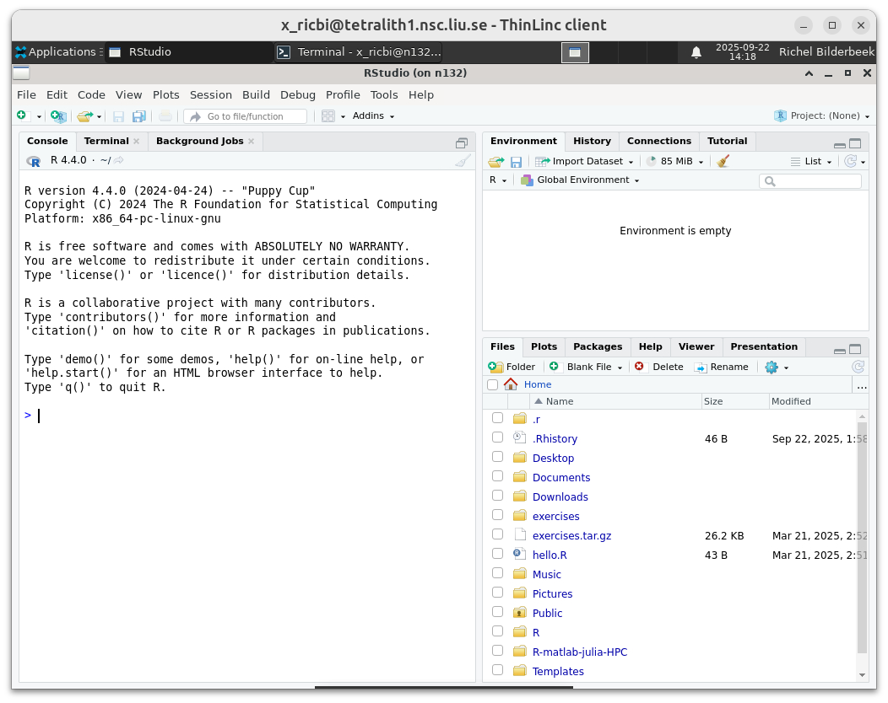
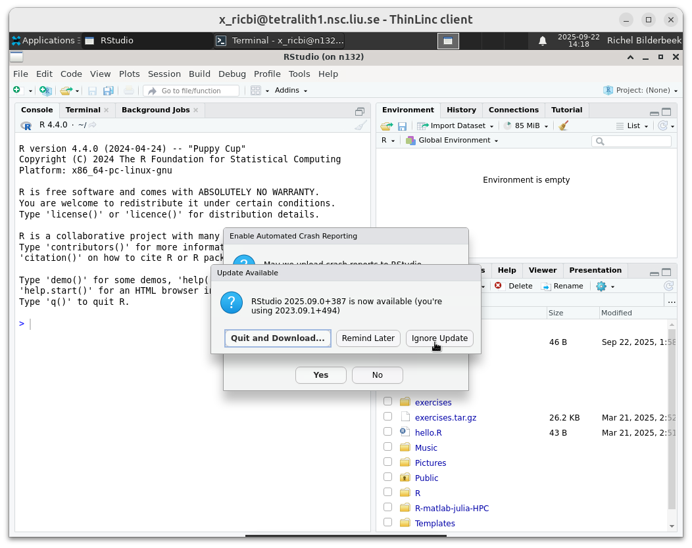
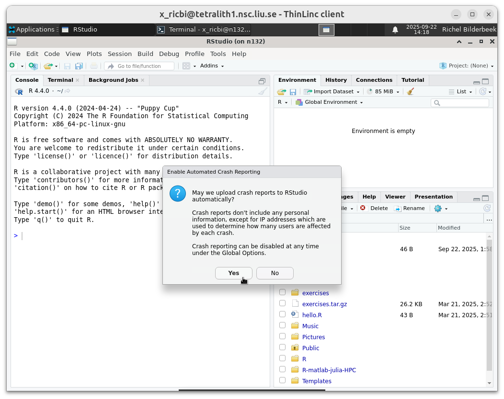

---
tags:
  - RStudio
  - Tetralith
---

# RStudio on Tetralith

???- question "Why is this page at UPPMAX?"

    It is the intention that this guide is moved to the C3SE documentation.
    However, it has not been suggested to be added to their documentaton
    yet.



## Introduction

[RStudio](../software/rstudio.md) is an [IDE](../software/ides.md)
specialised for the [R](../software/r.md) programming language.

In this session, we show how to use RStudio on Tetralith.

As RStudio is a resource-heavy program,
it must be run on an interactive session.

## Procedure to start RStudio

Below is a step-by-step procedure to start RStudio on Tetralith.

??? question "Prefer a video?"

    This procedure is also demonstrated in `TODO`.

## 1. Start a Tetralith remote desktop environment

Follow [the NSC documentation](https://www.nsc.liu.se/support/graphics/)
to login to the Tetralith remote desktop environment.

## 2. Start an interactive session

Within the Tetralith remote desktop environment, start a [terminal](../software/terminal.md).

Within that terminal, start an interactive session with 2 cores:

```bash
interactive -A [naiss_project_id] -n 2 -t [duration]
```

Where:

- `[naiss_project_id]` is your [UPPMAX project code](../getting_started/project.md)
- `[duration]` is the duration of the interactive session

Resulting in, for example:

```bash
interactive -A naiss2024-22-310 -n 2 -t 8:00:00
```

???- question "How does that look like?"

    

    > Click on 'Terminal Emulator' to start a terminal

    

    > Paste the command into the terminal

???- question "Why two cores?"

    RStudio is a resource-heavy program.
    Due to this, we recommend using at least two cores
    for a more pleasant user experience.

You will now be on a compute node,
as indicated by the terminal prompt.

???- question "How does that look like?"

    
  
    The prompt indicates being on `n132`,
    which is a Tetralith compute node.

## 3. Load the modules needed

In the terminal of the interactive session, do:

```bash
module load R/4.4.0-hpc1-gcc-11.3.0-bare RStudio/2023.09.1+494
```

???- question "How does that look like?"

    

    > The terminal after loading the RStudio module

## 4. Start RStudio

With the modules loaded, start RStudio from the terminal (on the
interactive session):

```bash
rstudio
```

???- question "How does that look like?"

    

    > Type `rstudio` and press enter

## 5. Ignore update

In RStudio, when asked, click 'Ignore Update'.

???- question "How does that look like?"

    

    > Click 'Ignore Update'

## 6. Allow automatic crash reporting

In RStudio, when asked whether to automatically
upload crash reports, click your preferred option.

???- question "How does that look like?"

    

    > Click your favourite option

## 7. Done

You are now in RStudio!


