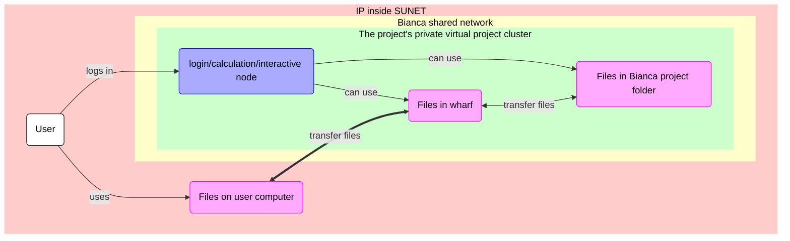
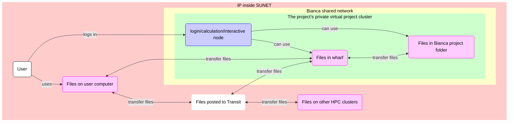

# File transfer to/from Bianca using a graphical tool

> FileZilla connected to Bianca

## Overview

As a user, we need to transfer files
between our local computer and Bianca.
There are
[many ways to transfer files to/from Bianca](../cluster_guides/transfer_bianca.md).
On this page, we learn how to transfer files
to Bianca using a graphical tool/program.

There are constraints on which programs
we can use, due to Bianca being an HPC cluster
for sensitive data.
Details are described in 'Bianca's constraints',
here are graphical tools that work:

Tool                                                |Description
----------------------------------------------------|---------------------
[FileZilla](bianca_file_transfer_using_filezilla.md)|All operating systems
[WinSCP](bianca_file_transfer_using_winscp.md)      |Windows-only

When using such a graphical tool,
one needs [to be inside of SUNET](../getting_started/get_inside_sunet.md).

???- question "Forgot how to get within SUNET?"

    See [the 'get inside the university networks' page](../getting_started/get_inside_sunet.md)

When a tool is setup, one can only transfer files
between you local computer and [your Bianca `wharf` folder](../cluster_guides/wharf.md).

## Bianca's constraints

> Overview of file transfer on Bianca, when using a graphical tool.
> The purple nodes are about file transfer,
> the blue nodes are about 'doing other things'.
> In this session, we will transfer files between
> 'Files on user computer' and 'Files in wharf'
> using a graphical tool, e.g. FileZilla

Bianca is an HPC cluster for sensitive data.
To protect that sensitive data,
Bianca has no direct internet connection.
This means that files cannot be downloaded directly.

???- tip "What is an HPC cluster again?"

    See [the UPPMAX page on HPC clusters](../cluster_guides/uppmax_cluster.md).

Instead, one needs to learn one of the many ways to do **secure** file transfer.

Here, we show how to transfer files using a graphical tool called FileZilla.

In general, one can pick any graphical tools with these constraints:

- the tool must support SFTP
- the tool must not store a password

Whatever tool one picks, it must do secure file transfer.
For secure file transfer, Bianca supports the SFTP protocol.
So, for secure file transfer to Bianca, one needs a tool
that supports SFTP.

???- warning "Use SFTP ... and why users think incorrectly that SCP will work"

    Only SFTP will work. SCP will never work.

    However, some users use tools that support SFTP,
    yet that have 'SCP' in the name, for example, 'WinSCP'.
    As users hear from colleagues that the tool 'WinSCP' works,
    they may incorrectly conclude that SCP will work.

    SCP will never work. Only SFTP will work.

Whatever tool one picks, additionally, the tool must **not** store a password.
Due to security reasons, one needs to connect to Bianca using a password
**and** a two-factor authentication number (e.g. `VerySecret123456`).
If a tool stores a password, that password will be valid for only one session.

One tool that can be used for file transfer to Bianca
is FileZilla, which is described in detail below.
The extra materials at the bottom of this page contain
other tools.

### File transfer overview

> Overview of file transfer on Bianca
> The purple nodes are about file transfer,
> the blue nodes are about 'doing other things'.
