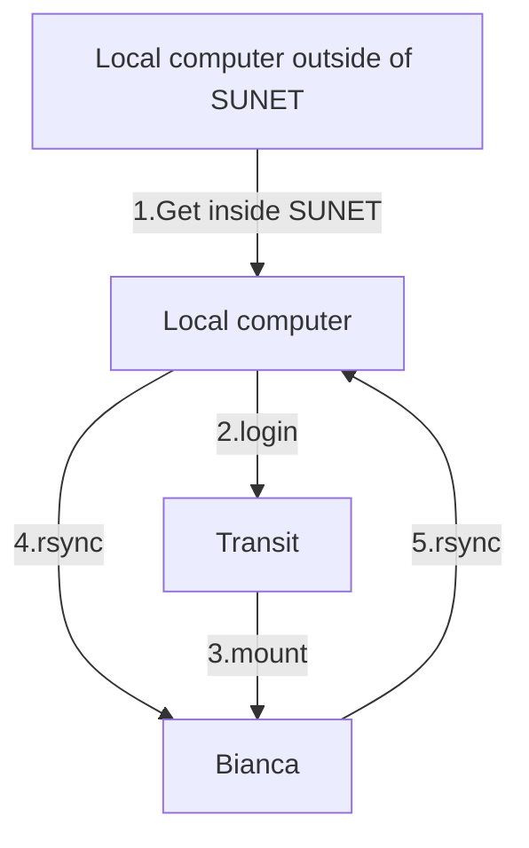

# File transfer to/from Bianca using rsync

[rsync](../software/rsync.md) is a tool [to do file transfer to/from Bianca](../cluster_guides/transfer_bianca.md),
that works under Linux, Mac and Windows.

???- question "Prefer a video?"

    Watch [this video](https://youtu.be/QlGhgPm_h7I)
    to see the procedure below as a video.

To transfer files to/from Bianca using [rsync](../software/rsync.md), do the following steps:



## 1. Get inside SUNET

Get inside SUNET.

???- question "Forgot how to get within SUNET?"

    See the 'get inside the university networks' page [here](../getting_started/get_inside_sunet.md)

## 2. Log in to Transit

On your local computer, start a [terminal](../software/terminal.md) and use [`ssh`](../software/ssh.md) to login to Transit:

```bash
ssh [username]@transit.uppmax.uu.se
```

where

- `[username]` is your UPPMAX username

For example:

```bash
ssh sven@transit.uppmax.uu.se
```

When asked for a password, use your UPPMAX password (without 2FA).

See [Log in to transit](../cluster_guides/login_transit.md) for more details
on how to log in to [Transit](../cluster_guides/transit.md).

## 3. Mount a Bianca project

On transit, mount the wharf of your Bianca project:

```bash
mount_wharf [project_id]
```

where

- `[project_id]` is the ID of your [NAISS project](../getting_started/project.md)

???- question "What about the `[path]` argument?"

    Well spotted!

    Indeed, the Transit server gives these arguments:

    ```bash
    mount_wharf [project_id] [path]
    ```

    However, the `[path]` argument is optional: if not
    given, a default will be used.
    
    To simplify matters, here we use the default.

for example:

```bash
mount_wharf sens2016001
```

The password is your normal UPPMAX password directly followed by
the six digits from the [the `UPPMAX` 2-factor authentication](https://www.uu.se/en/centre/uppmax/get-started/2-factor).
For example, if your password is `VerySecret` and the second factor code is `123456`
you would type `VerySecret123456` as the password in this step.

Now a folder called `sens2016001` is created.

## 4. Transfer files to Bianca

You can transfer files to Bianca by:

- [4a. Transfer individual files to Bianca](#4a-transfer-individual-files-to-bianca)
- [4b. Transfer all files in a folder to Bianca](#4b-transfer-all-files-in-a-folder-to-bianca)

### 4a. Transfer individual files to Bianca

On local computer, do:

```bash
rsync [my_local_file] [username]@transit.uppmax.uu.se:[project_id]
```

where

- `[my_local_file]` is the path to your local file
- `[project_id]` is the ID of your [NAISS project](../getting_started/project.md)
- `[username]` is your UPPMAX username

for example:

```bash
rsync my_local_file.txt sven@transit.uppmax.uu.se:sens2016001
```

No need to specify the path to the mounted folder, if defaults are used.

The files can now be found in [your wharf folder](../cluster_guides/wharf.md).

### 4b. Transfer all files in a folder to Bianca

On local computer, do:

```bash
rsync --recursive my_folder [username]@transit.uppmax.uu.se:[project_id]
```

where

- `[project_id]` is the ID of your [NAISS project](../getting_started/project.md)
- `[username]` is your UPPMAX username

for example:

```bash
rsync --recursive my_folder sven@transit.uppmax.uu.se:sens2016001
```

No need to specify the path to the mounted folder, if defaults are used.

The files can now be found in [your wharf folder](../cluster_guides/wharf.md).

## 5. Transfer files from Bianca to you local computer

!!! note "Be responsible with sensitive data"

    This command below will copy data from Bianca to your local computer.

You can transfer files from Bianca to your local computer by:

- [5a. Transfer individual files from Bianca to your local computer](#5a-transfer-individual-files-from-bianca-to-your-local-computer)
- [5b. Transfer all folders from Bianca to you local computer](#5b-transfer-all-folders-from-bianca-to-you-local-computer)

## 5a. Transfer individual files from Bianca to your local computer

On your local computer, do:

```bash
rsync [username]@transit.uppmax.uu.se:[project_id]/[file_in_wharf] .
```

where

- `[project_id]` is the ID of your [NAISS project](../getting_started/project.md)
- `[username]` is your UPPMAX username
- `[file_in_wharf]` is the name of the file in `wharf`
- `.` means 'in the current folder of my local computer' or 'here'

for example:

```bash
rsync sven@transit.uppmax.uu.se:sens2016001/my_file_in_wharf.txt .
```

To copy the individual files in your wharf to your local computer.

## 5b. Transfer all folders from Bianca to you local computer

!!! note "This will copy all folders in your wharf"

    This command below will copy all folders in your [wharf](../cluster_guides/wharf.md) folder
    to your local computer.

    This assumes that there is few data in your [wharf](../cluster_guides/wharf.md) folder.

    We assume your follow good [wharf](../cluster_guides/wharf.md) hygiene,
    i.e. your [wharf](../cluster_guides/wharf.md) folder is mostly empty most of the time.

On your local computer, do:

```bash
rsync --recursive [username]@transit.uppmax.uu.se:[project_id] .
```

where

- `[project_id]` is the ID of your [NAISS project](../getting_started/project.md)
- `[username]` is your UPPMAX username
- `.` means 'in the current folder of my local computer' or 'here'

for example:

```bash
rsync --recursive sven@transit.uppmax.uu.se:sens2016001 .
```

To your wharf folder to your local computer.
The folder created on your local computer will be called `[project_id]`,
for example, `sens2016001`.
