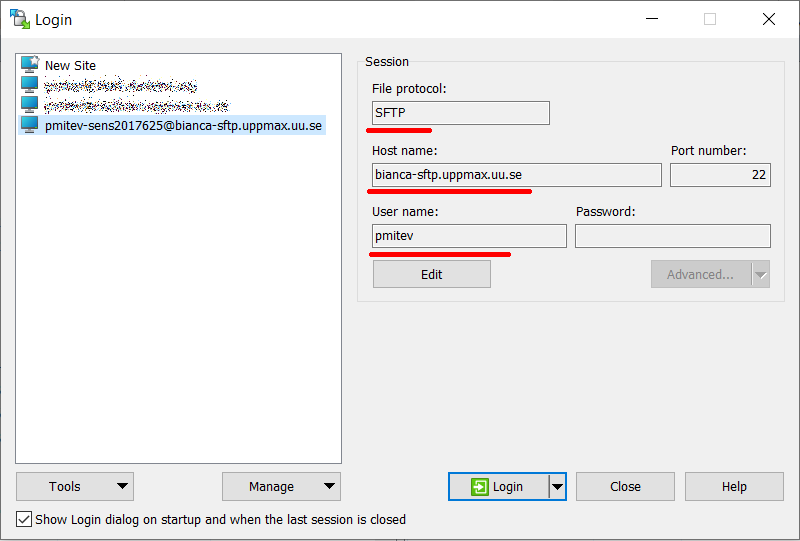

---
tags:
  - transfer
  - data transfer
  - file transfer
  - Bianca
  - WinSCP
---

# File transfer to/from Bianca using WinSCP

Download and install [WinSCP](https://winscp.net/eng/docs/guide_install)

WinSCP is a secure file transfer tool that works under Windows.

To transfer files to/from [Bianca](../cluster_guides/bianca.md) using WinSCP, do the following steps:

## 1. Get inside SUNET

Get inside SUNET.

???- question "Forgot how to get within SUNET?"

    See the 'get inside the university networks' page [here](../getting_started/get_inside_sunet.md)

## 2. Start WinSCP

Start WinSCP.

## 3. Create a new site

In WinSCP, click on 'Create new site'.

For that site, use all standards, except:

- Set file protocol to 'SFTP'
- Set host name to `bianca-sftp.uppmax.uu.se`
- Set user name to `[username]-[project]`, e.g. `sven-sens123456`
- **Do not set password! Provide your UPPMAX password followed immediately by the UPPMAX 2FA  when asked by the interactive login.**

???- tip "How does that look like?"

    It looks like this:

    

## 4. Transfer files

Now you can transfer files between your local computer and [your `wharf` folder](../cluster_guides/wharf.md).
