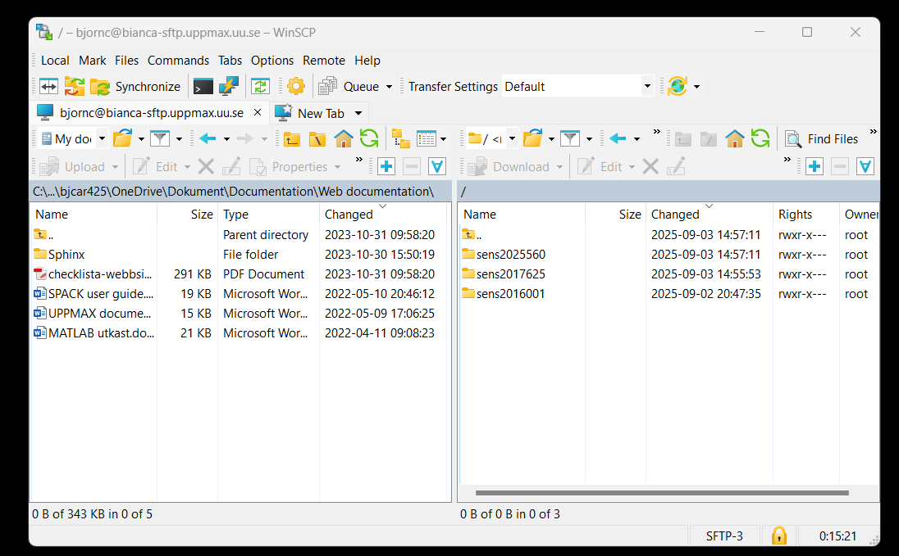

---
tags:
  - transfer
  - data transfer
  - file transfer
  - Bianca
  - WinSCP
---

# File transfer to/from Bianca using WinSCP

Download and install from [UU Software Center](https://www.uu.se/en/staff/service-and-tools/tools-and-guides/manage-and-update-your-windows-computer/installing-or-ordering-software-windows).

You can also download the software from [WinSCP](https://winscp.net/eng/docs/guide_install) website.

WinSCP is a secure file transfer tool that works under Windows.

!!! note

    - Now you shall just log in with user name, like ``sven`` and NOT with project name, like ``sven-sens2025999``
    - All your project folders will all show up on the remote!

To transfer files to/from [Bianca](../cluster_guides/bianca.md) using WinSCP, do the following steps

## Procedure

???- question "Would you like a video?"

    See the YouTube video (needs update because of not needed project name as username, see below)
    [how to do file transfer from/to Bianca using FileZilla](https://youtu.be/DYPWawyK5UE)

To transfer files to/from Bianca using WinSCP, do the following steps:

### 1. Get inside SUNET

[Get inside of SUNET](../getting_started/get_inside_sunet.md).

???- question "Forgot how to get within SUNET?"

    See [the 'get inside the university networks' page](../getting_started/get_inside_sunet.md)

### 2. Start WinSCP

Start WinSCP.

### 3. Create a new site

In WinSCP, click on 'Create new site'.

For that site, use all standards, except:

- Set file protocol to 'SFTP'
- Set host name to `bianca-sftp.uppmax.uu.se`
- Set user name to `[username]`, e.g. `sven`
- **Do not set password here!**

???- tip "How does that look like?"

    It looks like this:

    

### 4. Click 'Connect'

In WinSCP, click 'Connect'

You will be asked for your password with two-factor identification in two steps.

First enter [your password], and in next window [2FA code]

!!! note

    - Now you shall just log in with user name, like ``nisse`` and NOT with project name, like ``nisse-sens2025999``
    - All your project folders will all show up on the remote!

Now you can transfer files between your local computer and [your `wharf` folder](../cluster_guides/wharf.md).

