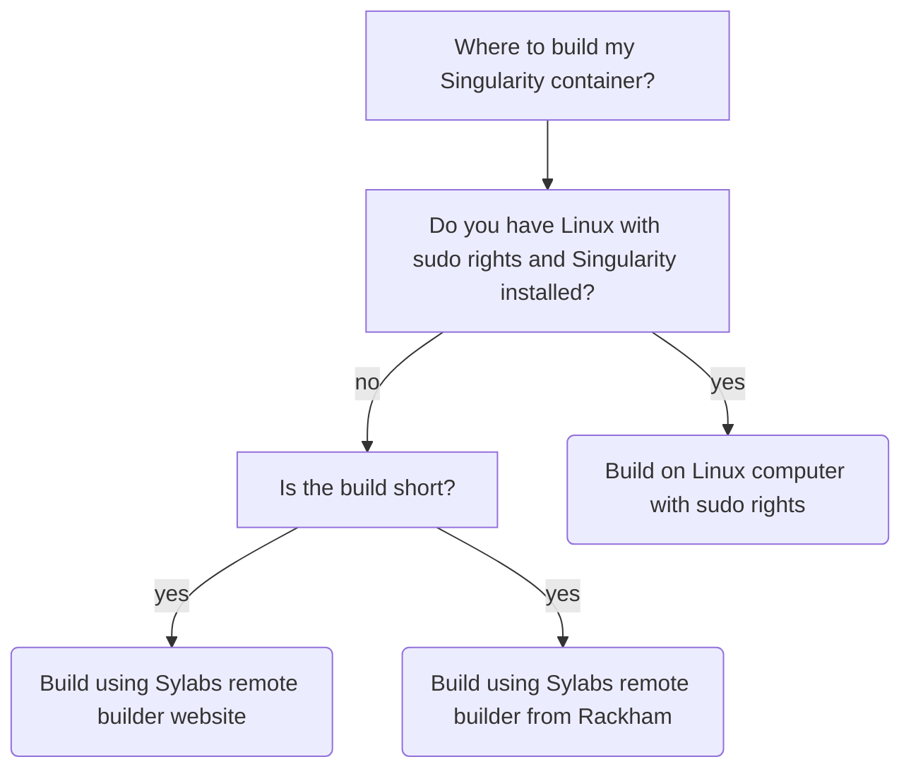

---
tags:
  - Singularity
  - Singularity container
  - create
  - build
---

# Creating a Singularity container

There are many ways to create a [Singualrity](singularity.md) container.

## How and where to build?

Here is a decision tree on how and where to build a Singularity container.

How and where                                                                                                             |Features
--------------------------------------------------------------------------------------------------------------------------|----------------------------------------------
[Local Linux](create_singularity_container_from_a_singularity_script_on_linux.md)                                         |Easiest for Linux users, can do longer builds
[Remote builder from website](create_singularity_container_from_a_singularity_script_using_remote_builder.md)             |Easiest for non-Linux users, short builds only
[Remote builder from Rackham](create_singularity_container_from_a_singularity_script_using_remote_builder_from_rackham.md)|Can do longer builds
