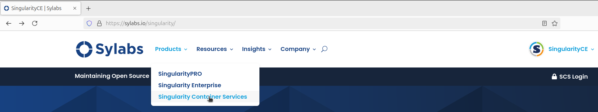
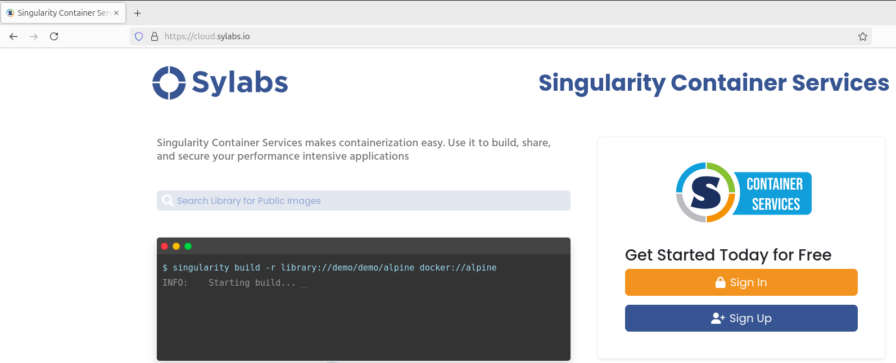
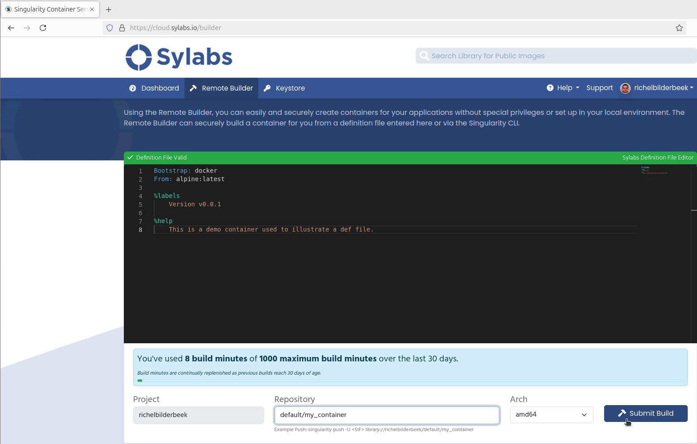
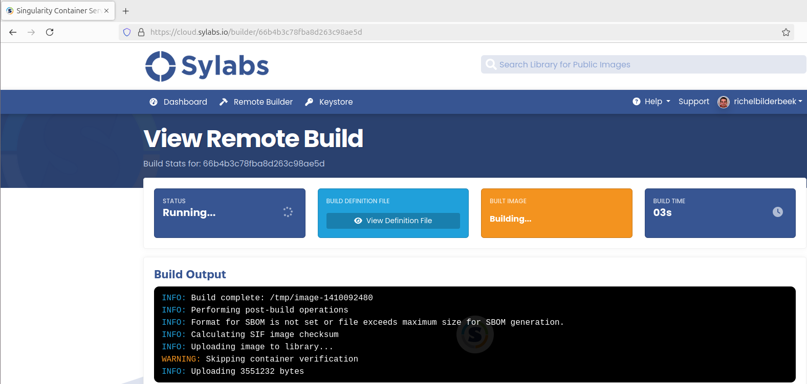
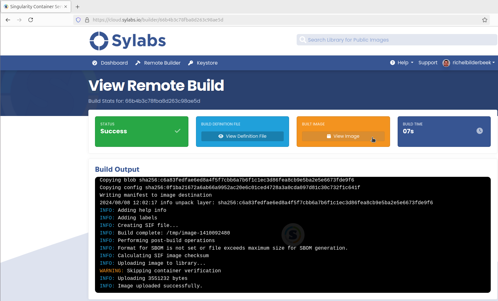
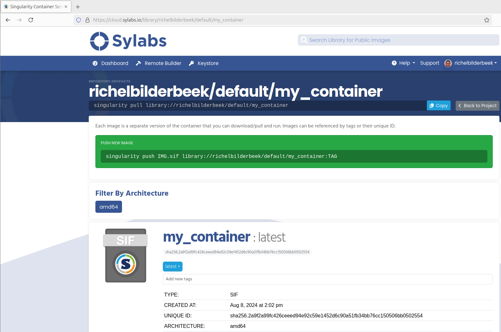

---
tags:
  - Singularity
  - Singularity script
  - create
  - build
  - website
  - Sylabs
  - remote builder
---

# Create a Singularity container from a Singularity script using a website

There are multiple ways how to [create a Singularity container from a Singularity script](create_singularity_container_from_a_singularity_script.md).

This page shows how to do so using a website

## Procedure

### 1. Go to to Sylabs website

Go to [the Sylabs website](https://www.sylabs.io/)

???- question "How does that look like?"

    The Sylabs website looks similar to this:

    

### 2. Got to the Sylabs Singularity Container Services website

On [the Sylabs website](https://www.sylabs.io/),
click 'Products | Singularity Container Services'

???- question "Where to click?"

    Click here:

    

You will be takes to the 'Singularity Container Services'.

???- question "How does that look like?"

    The Singularity Container Services website looks similar to this:

    

### 3. Sign in or sign up

At the 'Singularity Container Services' website, click 'Sign Up' or 'Sign In'

???- question "How does signing in look like?"

    Signing in looks similar to this:

    

You are now logged in at the 'Singularity Container Services':

???- question "How does that look like?"

    The Singularity Container Services looks similar to this after logging in:

    

### 4. Go to the remote builder

Click on 'Remote builder'.

???- question "Where to click?"

    Click here:

    

### 5. Setup the remote builder

The remote builder shows a Singularity script and some default settings.

???- question "How does that look like?"

    The remote builder's default settings look similar to this:

    

Make the following changes:

- paste your Singularity script in the text box
- change `Repository` to a valid name (as indicated), for example, as `default/my_container`

???- question "How does that look like?"

    The remote builder with modified values looks similar to this:

    

### 6. Let the container be built

Click 'Submit Build'.

???- question "Where to click?"

    Click here:

    

The building will start.

???- question "How does that look like?"

    A build that has just started looks similar to this:

    

After a while the building will be done.

???- question "How does that look like?"

    A build that has finished looks similar to this:

    

### 7. Download the container

There are multiple ways to download your Singularity container:

- Download from the website: click on 'View image',
  then scroll down and click 'Download'

???- question "How does that look like?"

    Click on 'View image' here:

    

    The 'View image' page looks similar to this:

    

    At the 'View image' page, scroll down to find the 'Download' button:

    

- Use a `singularity pull`

For example:

```bash
singularity pull library://sven/default/my_container
````

???- question "How does that look like?"

    For example:

    ```bash
    $ singularity pull library://pontus/default/sortmerna:3.0.3
    WARNING: Authentication token file not found : Only pulls of public images will succeed
    INFO:    Downloading library image
     65.02 MiB / 65.02 MiB [=========================================================================================================================================] 100.00% 30.61 MiB/s 2s
    ```

### 8. Use the container

How to use a container, depends on what it does.

Here are some thing to try:

Run the container without arguments, in the hope of getting a clear error message with instructions:

```bash
./my_container.sif
```

Run the container in the hope of seeing its documentation:

```bash
./my_container.sif --help
```

Run the container on the local folder, in the hope of getting a clear error message with instructions:

```bash
./my_container.sif .
```
