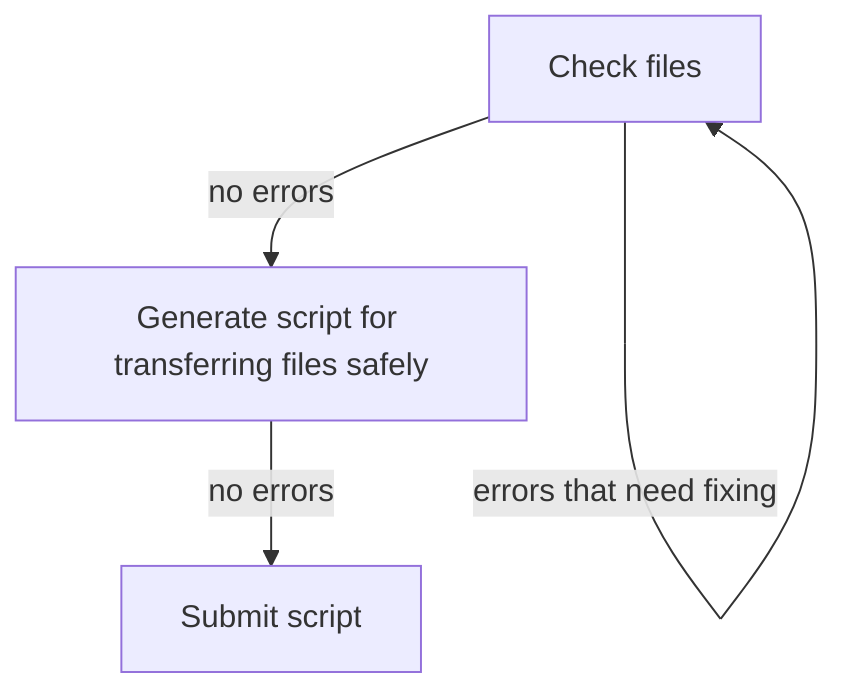

# Darsync

[Darsync](https://github.com/UPPMAX/darsync) is a tool used to prepare
your project for transfer to
[Dardel](https://support.pdc.kth.se/doc/contact/contact_support/).
It has two modes; **check mode** where it goes through your files
and looks for uncompressed file formats and counts the number of files,
and **gen mode** where it generates a script file you can submit
to [Slurm](../cluster_guides/slurm.md) to do the actual data transfer.

The idea is to

1. Run the check mode and mitigate any problems problems it finds.
1. Run the gen mode.
1. Submit the generated script as a job.



> The Darsync workflow

!!! warning "Temporarily add a `PATH`"

    Until the darsync script is added to the `/sw/uppmax/bin` folder
    you will have to add its location to your `PATH` variable manually:

    ```bash
    export PATH=$PATH:/proj/staff/dahlo/testarea/darsync
    ```

## TLDR

If you know your way around Linux, here is the short version.

```bash
# run check
darsync check -l /path/to/dir

# fix warnings on your own

# book a 30 day single core job on Snowy and run the rsync command
rsync -e "ssh -i ~/.ssh/id_rsa" -acPuv /local/path/to/files/ username@dardel.pdc.kth.se:/remote/path/to/files/

```

???- question "How does that look like?"

    Running the temporary export gives no output:

    ```bash
    [sven@rackham4 ~]$ export PATH=$PATH:/proj/staff/dahlo/testarea/darsync
    ```

    The folder `GitHubs` is a folder containing multiple GitHub repositories
    and is chosen as the test subject:

    ```bash
    [sven@rackham4 ~]$ darsync check -l GitHubs/


       ____ _   _ _____ ____ _  __
      / ___| | | | ____/ ___| |/ /
     | |   | |_| |  _|| |   | ' /
     | |___|  _  | |__| |___| . \
      \____|_| |_|_____\____|_|\_\

    The check module of this script will recursivly go through
    all the files in, and under, the folder you specify to see if there
    are any improvments you can to do save space and speed up the data transfer.

    It will look for file formats that are uncompressed, like fasta and vcf files
    (most uncompressed file formats have compressed variants of them that only
    take up 25% of the space of the uncompressed file).

    If you have many small files, e.g. folders with 100 000 or more files,
    it will slow down the data transfer since there is an overhead cost per file
    you want to transfer. Large folders like this can be archived/packed into
    a single file to speed things up.
    GitHubs/git/scripts


    Checking completed. Unless you got any warning messages above you should be good to go.

    Generate a Slurm script file to do the transfer by running this script again, but use the 'gen' option this time.
    See the help message for details, or continue reading the user guide for examples on how to run it.
    https://

    darsync gen -h

    A file containing file ownership information,
    darsync_GitHubs.ownership.gz
    has been created. This file can be used to make sure that the
    file ownership (user/group) will look the same on Dardel as it does here. See https:// for more info about this.
    ```

    ???- tip "NBIS staff test project code"

        Follow the project application procedure as
        described [here](../getting_started/project_apply.md).
        Request permission to join project `NAISS 2023/22-1027`

## Check mode

To initiate the **check mode** you run Darsync with the check argument. If you run it without any other arguments it will ask you interactive questions to get the information it needs.

```bash
# interactive mode
darsync check

# or give it the path to the directory to check directly
darsync check -l /path/to/dir
```

The warnings you can get are:

### Too many uncompressed files

It looks for files with file endings matching common uncompressed file formats, like `.fq`, `.sam`, `.vcf`, `.txt`. If the combined file size of these files are above a threshold it will trigger the warning. Most programs that uses these formats can also read the compressed version of them.

Examples of how to compress common formats:

```bash
# fastq/fq/fasta/txt
gzip file.fq

# vcf
bgzip file.vcf

# sam
samtools view -b file.sam > file.bam
# when the above command is completed successfully:
# rm file.sam
```

For examples on how to compress other file formats, use an internet search engine to look for

```text
how to compress <insert file format name> file
```

### Too many files

If a project consists of many small files it will decrease the data transfer speed, as there is an overhead cost to starting and stopping each file transfer. A way around this is to pack all the small files into a single `tar` archive, so that it only has to start and stop a single time.

Example of how to pack a folder and all files in it into a single `tar` archive.

```bash
# pack it
tar -czvf folder.tar.gz /path/to/folder

# unpack it after transfer
tar -xzvf folder.tar.gz
```

Once you have mitigated any warnings you got you are ready to generate the Slurm script that will preform the data transfer.

## Gen mode

To generate a transfer script you will need to supply Darsync with some information. Make sure to have this readily available:

- **ID of the UPPMAX project** that will run the transfer job, e.g. `naiss2099-23-99`
    - If you don't remember if, find the name of the project you want to transfer by looking in [the list of active project in SUPR](https://supr.naiss.se/project/).
- **Path to the folder you want to transfer**, .e.g. `/proj/naiss2099-23-999`
    - Either transfer your whole project, or put the files and folder your want to transfer into a new folder in your project folder and transfer that folder.
    - The project's folder on UPPMAX will be located in the `/proj/` folder, most likely a folder with the same name as the project's ID, `/proj/<project id>`, e.g. `/proj/naiss2024-23-999`. If your project has picked a custom *directory name* when it was created it will have that name instead of the project ID, e.g. `/proj/directory_name`. Check which directory name your project has by looking at the project's page in [SUPR](https://supr.naiss.se/project/) and look at the field called `Directory name:`
- **Your Dardel username**.
    - You can see your Dardel username in [SUPR](https://supr.naiss.se/account/)
- **The path on Dardel** where you want to put your data, e.g. `/cfs/klemming/projects/snic/naiss2099-23-999`
    - Check which project ID you have for your project on Dardel in [the list of active project in SUPR](https://supr.naiss.se/project/).
- The **path to the SSH key** you have prepared to be used to login from Rackham to Dardel, e.g. `~/.ssh/id_rsa`
    - Check
- The path to where you want to **save the generated transfer script**.

To initiate the gen mode you run Darsync with the `gen` argument. If you run it without any other arguments it will ask you interactive questions to get the information it needs.

```bash
# interactive mode
darsync gen


# or give it any or all arguments directly
darsync check -l /path/to/dir/on/uppmax/ -r /path/to/dir/on/dardel/ -A naiss2099-23-99 -u dardel_username -s ~/.ssh/id_rsa -o ~/dardel_transfer_script.sh
```

## Starting the transfer

Before you submit the generated transfer script you should make sure everything is in order. You can try to run the transfer script directly on the UPPMAX login node and see if it starts or if you get any errors:

```bash
bash ~/dardel_transfer_script.sh
```

If you start see progress reports from `rsync` you know it works and you can press `ctrl+c` to stop.

Example of how it can look when it works:

```bash
bash darsync_temp.slurm
sending incremental file list
temp/
temp/counts
             10 100%    0,51kB/s    0:00:00 (xfr#4, to-chk=72/77)
temp/export.sh
             13 100%    0,67kB/s    0:00:00 (xfr#5, to-chk=71/77)
temp/my_stuff.py
             70 100%    3,60kB/s    0:00:00 (xfr#7, to-chk=69/77)
temp/run.sh
             52 100%    2,67kB/s    0:00:00 (xfr#8, to-chk=68/77)
temp/sequence_tools.py
            345 100%   17,73kB/s    0:00:00 (xfr#9, to-chk=67/77)
temp/similar_sequences.txt
             24 100%    1,23kB/s    0:00:00 (xfr#10, to-chk=66/77)
temp/t.py
            328 100%   16,86kB/s    0:00:00 (xfr#11, to-chk=65/77)
```

Example of how it can look when it **doesn't** work:

```bash
bash darsync_temp.slurm
user@dardel.pdc.kth.se: Permission denied (publickey,gssapi-keyex,gssapi-with-mic).
rsync: connection unexpectedly closed (0 bytes received so far) [sender]
rsync error: unexplained error (code 255) at io.c(231) [sender=3.2.7]
```

## Troubleshooting

Apart from getting the username or paths wrong, we foresee that the most common problem will be to get the SSH keys generated, added to the [PDC login portal](https://loginportal.pdc.kth.se/), and adding the UPPMAX ip/hostname as authorized for that SSH key. Please see the [PDC user guide on how to set up SSH keys](https://support.pdc.kth.se/doc/contact/contact_support/). Once you have your key created and added to the login portal, go to the login portal again and add the address `*.uppmax.uu.se` to your key to make it work from Rackham.

## Links

- [darsync GitHub repository](https://github.com/uppmax/darsync)
