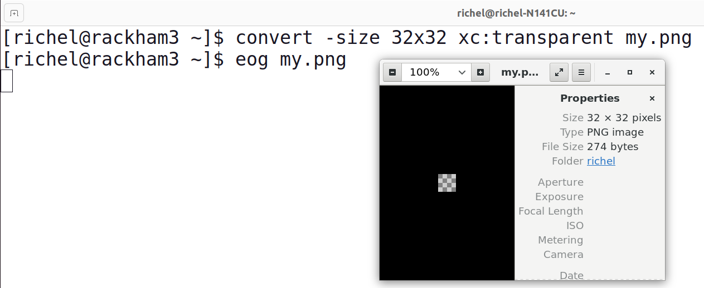

# `eog`



`eog` is a tool to view images on an UPPMAX cluster.

To be able to see the images,
either use [SSH with X-forwarding](../software/ssh_x_forwarding.md)
or [login to a remote desktop](../getting_started/login.md)

Usage:

```bash
eog [filename]
```

for example:

```bash
eog my.png
```

???- question "Need an example image to work with?"

    In the terminal, do:

    ```bash
    convert -size 32x32 xc:transparent my.png
    ```

    This will create an empty PNG image.

???- question "How does this look like?"

    
