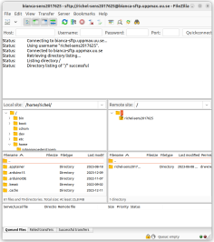

---
tags:
  - FileZilla
  - transfer
  - software
---

# FileZilla

> FileZilla connected to Bianca

FileZilla is a free, open-source and cross-platform tool to transfer files.

## Install FileZilla

You can download and install FileZilla for your operating system
from one or more locations:

<!-- markdownlint-disable MD013 --><!-- Tables cannot be split up over lines, hence will break 80 characters per line -->

Operating system     |Location(s)
---------------------|------------------------------------------------------------------------------------------
Linux                |[FileZilla website](https://filezilla-project.org/download.php), Ubuntu App Center
MacOS (intel)        |[FileZilla website](https://filezilla-project.org/download.php?platform=osx)
MacOS (Apple Silicon)|[FileZilla website](https://filezilla-project.org/download.php?platform=macos-arm64)
Windows              |[UU Software Center](https://www.uu.se/en/staff/service-and-tools/it-and-telephony-services/it-services/computers-and-client-management/client-management/client-management-for-windows) (Suggested!), [FileZilla website (not sponsored version)](https://filezilla-project.org/download.php?show_all=1 )

<!-- markdownlint-enable MD013 -->
!!! warning "AI tool caution"

    If you have a UU registered Windows or MacOS laptop, we suggest downloading from the UU Software Center, if FileZilla is available there.

## Transfer files

- [Transfer file to/from Bianca using FileZilla](bianca_file_transfer_using_filezilla.md)
- [Transfer file to/from Pelle using FileZilla](pelle_file_transfer_using_filezilla.md)
- [Transfer file to/from Transit using FileZilla](transit_file_transfer_using_filezilla.md)
