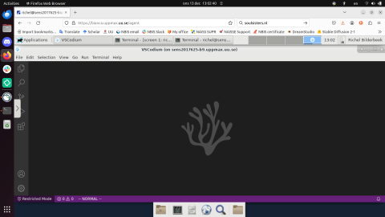

# IDEs on Bianca

> RStudio is one of the IDEs that can be used on Bianca.

Here we show how to use some [IDEs](../software/ides.md) on Bianca.

???- question "Forgot what an IDE is?"

    See at the general page on IDEs [here](../software/ides.md).

???- question "Do you really want to use an IDE on Bianca?"

    Using an IDE on Bianca is cumbersome and
    there are superior ways to develop code on Bianca.

    However, using an IDE may make it easier for a new user to feel
    comfortable using Bianca.

    The [UPPMAX 'Programming Formalisms' course](https://github.com/UPPMAX/programming_formalisms)
    will teach you a superior workflow,
    where development takes place on your own regular computer
    and testing is done using simulated/fake data.
    When development is done,
    the tested project is uploaded to Bianca and setup to
    use the real data instead.

    This avoids using a clumsy remote desktop environment,
    as well as many added bonuses.

Here are step-by-step guides to start these IDEs on Rackham:

IDE                                     |Languages       |Screenshot
----------------------------------------|----------------|-----------------------
[Jupyter](jupyter_on_bianca.md)         |Python          |
[RStudio](rstudio_on_bianca.md)         |R               |
:no_entry: [VSCode](vscode_on_bianca.md)|General-purpose |Impossible
[VSCodium](vscodium_on_bianca.md)       |General-purpose |
