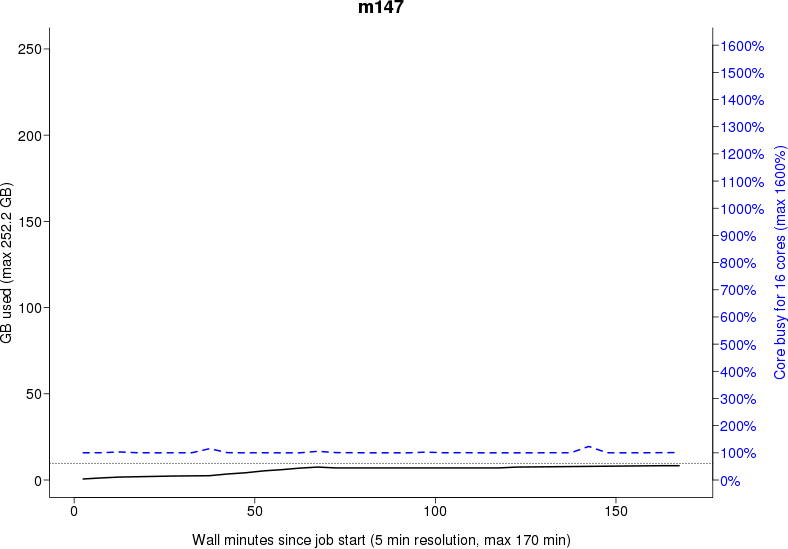
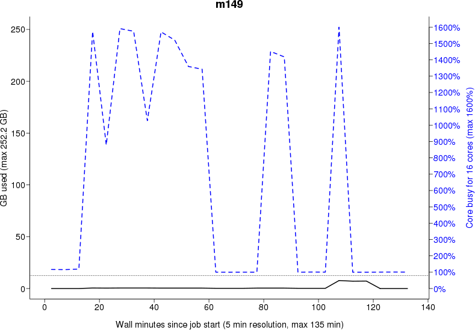

# `jobstats`


`jobststats` is an UPPMAX tool to enable discovery of resource usage 
for jobs submitted to the [Slurm](../cluster_guides/slurm.md) job queue.

```
jobstats --plot [options] [ -M cluster ] [ jobid [ jobid ... ] | -A project | - ]
```

With the -p/--plot option, a plot is produced from the jobstats for each
jobid.  Plots contain one panel per booked node showing CPU (blue) and memory
usage (black) traces and include text lines indicating the job number, cluster,
end time and duration, user, project, job name, and usage flags (more on those
below).  For memory usage, one or two traces are shown: a solid black line
shows instantaneous memory usage, and a dotted black line
shows overall maximum memory usage if this information is available.

Plots are saved to the current directory with the name

cluster-project-user-jobid.png

To view the images you can either download them from UPPMAX, or use Xforwarding. The latter is the quickest way. To do this you will need to connect to UPPMAX with the -Y option

# connect

To be able to see the plots generated by `jobstats`, 
either use [SSH with X-forwarding](../software/ssh_x_forwarding.md)
or [login to a remote desktop](../getting_started/login.md)
 
# generate the plots

```
$ jobstats --plot -A b2015999
```

and then you can use the image viewer eog to view the files.

```
$ eog *.png
```

For this to work you will have to use a computer that has a X-server. Most linux systems have this by default, and Macs used to have it as default before they removed it during 2014. To get this feature back you have to install Xquartz. If you are using a Windows computer you can download the program MobaXterm which is a ssh client with a built-in X-server.

An example plot, this was named milou-b2010042-douglas-8769275.png:


For multiple-node jobs, plots have a two-column format.

Note that not all jobs will produce jobstats files, particularly if the job was cancelled or ran for less than 5 minutes. Also, if a job booked nodes inefficiently by not using nodes it asked for, jobstats files will not be available for the booked but unused nodes. In this case the plot will contain a blank panel for each such node together with the message 'node booked but unused'.

## Interpretation guidelines

When you are looking through the plots you just created you can start thinking of how you can change your bookings so that the jobs are more efficient. Usually it's just a matter of changing how many cores you book and the problem is solved. Here are some guidelines that you can follow when looking for inefficient jobs:

Is the blue line (the jobs cpu usage) at the top of the graph most of the time (>80%)? If so, no need to do anything, no need to check the rest of this list.
Is the horizontal dotted black line (the jobs max memory usage) close to the top of the graph (>80%)? If so, no need to do anything, no need to check the rest of this list.
If neither of 1 or 2 is true, you should adjust the number of cores you book. Look at where the horizontal dotted black line usually is in the jobs of this type. Check how many GiB of RAM that point represents. Book enough cores, maybe 1-2 cores extra to avoid being too close to the limit if the variance is high, to keep your jobs from exceeding the allowed used RAM. You get 8GiB RAM per core you book.
If you follow these guidelines you will be using the resources efficiently. If everyone did this there would probably not even be a queue to run your jobs most of the time. Of course there are grey areas and jobs that have a very random ram requirements. In these cases it is hard to get efficient usage, but they are few and far between.

Here are some examples of how inefficient jobs can look and what you can do to make them more efficient.

### Inefficient job example 1


This job has booked many more cores than it needs. The extra cores are only used for small bursts and 99% of the time the job is running single threaded. The memory gained from the extra cores is not used either. You can see from the dooted grey line that the job used at most as much RAM as you get by booking 4 cores (since it intersects the right Y-axis at 400%). This job would have run perfectly fine on a job with only 5 cores. Instead it used 3x the amount of core hours when it was booked as 16 cores.

### Inefficient job example 2


This job is using almost all of the cores it has booked, but there seems to be something holding them back. The uneven blue curve tells us that something is slowing down the analysis, and it's not by a constant amount. Usually this is how it looks when the filesystem is the cause of a slowdown. Since the load of the filesystem is constantly changing, so will the speed by which a job can read data from it also change. This job should try to copy all the files it will be working with to the nodes local harddrive before running the analysis, and by doing so not be affected by the speed of the filesystem. Please see the guide How to use the nodes own hard drive for analysis for more information. You basically just add 2 more commands to your script file and the problem should be solved.

### Inefficient job example 3


This job is simply misbooked/misconfigured. The job is using 6 of the 8 booked cores constantly with no signs of anything slowing them down (the line is very even). This jobs should either have been booked with 6 cores, or the program running should be told to use all 8 cores.

### Inefficient job example 4



This job has the same problem as the example above, but in a more extreme way. It's not uncommon that people book whole nodes out of habit and only run single threaded programs that use almost no memory. This job is a bit special in the way that it's being run on a high memory node, as you can see on the left Y-axis, that it goes up to 256 GB RAM. A normal node on Milou only have 128GB. These high memory nodes are only bookable of you book the whole node, so you can't book just a few cores on them. That means that if you need 130GB RAM and the program is only single threaded, your only option is to book a whole high memory node. The job will look really inefficient, but it's the only way to do it on our system. The example in the plot does not fall into this category though, as it uses only ~15GB of RAM, which you could get by booking 2-3 normal cores.

### Inefficient job example 5


 
This is one of the grayer areas. The job is using most of the cores from time to time, but is also running single threaded a lot. The memory usage is what you would get by booking only 2 cores (~16GB) as well, so no reason to book a whole, or high memory, node because of that. This job would be better off being booked with 4 cores. The multithreaded steps would be quicker because of the extra cores, and the single threaded parts would take up a proportionally smaller part of the job. The larget part of the job that is taken up by single threaded calculations, the more clear is it that the job should be adjusted. It's hard to draw a clear line when it should be adjusted, but try to keep the overall efficiency of the job at 75% or better. 

## Modes of `jobstats` discovery

There are five modes for discovery, 
depending on what the user provides on the command line: 

- (1) discovery by job number for a completed job; 
- (2) discovery by job number for a currently running job; 
- (3) discovery by node and job number, for a completed or running job; 
- (4) discovery by project
- (5) discovery via information provided on stdin. 

In the example command lines below, the -p/--plot option requests that plots of job resource usage are created.

### `jobstats` discovery mode 1: discovery by job number for a completed job

Discovery by job number for a completed job:

```
jobstats --plot jobid1 jobid2 jobid3
```
The job numbers valid on the cluster. finishedjobinfo is used to determine further information for each job. This can be rather slow, and a message asking for your patience is printed for each job. If multiple queries are expected it would be quicker to run finishedjobinfo yourself separately, see Mode 4 below. See Mode 2 for a currently running job.

### `jobstats` discovery mode 2: discovery by job number for a currently running job

Discovery by job number for a currently running job.

```
jobstats --plot -r jobid1 jobid2 jobid3
```

Job numbers of jobs currently running on the cluster. The SLURM squeue tool is used to determine further information for each running job.

### `jobstats` discovery mode 3: discovery by node and job number, for a completed or running job

Discovery by node and job number, for a completed or running job.

```
jobstats --plot -n m15,m16 jobid
```

`finishedjobinfo` is not called and 
UPPMAX's stored job statistics files for the cluster of interest are discovered directly. 
If you know which node(s) your job ran on 
or which nodes you are interested in, this will be much faster than Mode 1.

### `jobstats` discovery mode 4: discovery by project

Discovery by project.

```
jobstats --plot -A project
```

When providing a project name that is valid for the cluster, finishedjobinfo is used to determine further information on jobs run within the project. As for Mode 1, this can be rather slow, and a message asking for your patience is printed. Furthermore only finishedjobinfo defaults for time span etc. are used for job discovery. If multiple queries are expected or additional finishedjobinfo options are desired, see Mode 5 below.

### `jobstats` discovery mode 5: discovery via information provided on stdin

Discovery via information provided on stdin.

```
finishedjobinfo -q project | jobstats - -p
```

Accept input on stdin formatted like finishedjobinfo output. 
Note the single dash (-) option given to jobstats; 
the long form of this option is --stdin. 
This mode can be especially useful if 
multiple queries of the same job information are expected. 
In this case, save the output of a single comprehensive finishedjobinfo query, 
and extract the parts of interest and present them to this script on stdin. 

For example, to produce analyses of all completed jobs in a project 
during the current calendar year, and produce separate tarballs 
analysing all jobs and providing jobstats plots for each user during this same period:

```
project=myproj
finishedjobinfo -q -y ${project} > ${project}-year.txt
grep 'jobstat=COMPLETED' ${project}-year.txt | jobstats - > ${project}-completed-jobs.txt
for u in user1 user2 user3 ; do
   grep "username=${u}" ${project}-year.txt | jobstats - -p > ${u}-jobs.txt
   tar czf ${u}-jobs.tar.gz ${u}-jobs.txt *-${project}-${u}-*.png
done
```

## Command-Line Options

jobstats -h may be specified to get detailed help including a complete list of command line options.

-M cluster         Cluster on which jobs were run [default current cluster]
 
-A project         Project valid on the cluster.  finishedjobinfo is used to
discover jobs for the project.  See further comments
under 'Mode 3' above.
 
-n node[,node...]  Cluster node(s) on which the job was run.  If specified,
then the finishedjobinfo script is not run and discovery
is restricted to only the specified nodes.  Nodes can be
specified as a comma-separated list of complete node
names, or using the finishedjobinfo syntax:
m78,m90,m91,m92,m100  or  m[78,90-92,100]
Nonsensical results will occur if the syntaxes are mixed.
 
- | --stdin        Accept input on stdin formatted like finishedjobinfo
output.  The short form of this option is a single dash
'-'.
-r | --running     Jobids are for jobs currently running on the cluster. The
SLURM squeue tool is used to discover further information
for the running jobs, and the rightmost extent of the plot
produced will reflect the scheduled end time of the job.
 
 
-m | --memory      Always include memory usage flags in output.  Default
behaviour is to include memory usage flags only if CPU
usage flags are also present.
 
-s | --source  fji | db
Source of the input data.  Default is 'fji', the
finishedjobinfo script. 'db' may be used to access a more
rapid but less comprehensive database of job information.
This may also be used with the - flag when sending job
information via stdin.  '-s db' is currently unsupported.
 
-v | --verbose     Be wordy when describing flag values.
 
-p | --plot        Produce CPU and memory usage plot for each jobid
 
-b | --big-plot    Produce 'big plot' with double the usual dimensions.
This implies '-p/--plot'.
 
-q | --quiet       Do not produce table output
    -Q | --Quick       Run finishedjobinfo with the -q option, which is slightly
                       faster but does not include SLURM's record of maximum
                       memory used. With this option, memory usage analyses can
                       only rely upon what is reported at 5-minute intervals.
 
-d                 Produce a header for table output
 
-h | --help | -?   Produce detailed help information
Further Details
This script produces two types of output. If the -p/--plot command line option is provided, a plot is created of core and memory usage across the life of the job. The name of the file produced has the format:

cluster-project-user-jobid.png

Unless the -q/--quiet option is provided, a table is also produced containing lines with the following tab-separated fields:

jobid cluster jobstate user project endtime runtime flags booked cores node[,node...] jobstats[,jobstats...]

Field contents:

jobid: Job ID
cluster: Cluster on which the job was run
jobstate: End status of the job: COMPLETED, FAILED, TIMEOUT, CANCELLED
user: Username that submitted the job
project: Project account under which the job was run
endtime: End time of the job (with -n/--node, this is .)
runtime: Runtime of the job (with -n/--node, this is .)
flags: Flags indicating various types of resource underutilizations
booked: Number of booked cores (with -n/--node, this is .)
maxmem: Maximum memory used as reported by SLURM (if unavailable, this is .)
cores: Number of cores represented in the discovered jobstats files.
node: Node(s) booked for the job, expanded into individual node names, separated by commas; if no nodes were found, this is .. The nodes for which jobstats files are available are listed first.
jobstats: jobstats files for the nodes, in the same order the nodes are listed, separated by commas; if no jobstats files were discovered, this is .
If -r/--running was used, an additional field is present:

timelimit_minutes : The time limit of the job in minutes
At completion of the script, a brief summary is produced:

*** No jobstats files found for 25 out of 56 jobs, limited resource usage diagnosis and no plot produced

Flags
An important part of jobstats output are usage flags. These provide indications that booked resources might have been underused, either processor cores, or memory, or both.

In both plot and table output, flags are a comma-separated list of cautions regarding core and/or memory underutilisation. The appearance of a flag does not necessarily mean that resources were used incorrectly. It depends upon the tools being used and the contents of the SLURM header, and also depends upon the job profile. Because usage information is gathered every 5 minutes, higher transient usage of cores or memory may not be captured in the log files.

Flags most likely to represent real overbooking of resources are nodes_overbooked, overbooked, !!half_overbooked, !!severely_overbooked, and !!swap_used.

For multinode jobs, flags other than nodes_overbooked are determined based only on the usage of the first node. Multinode jobs require careful analysis so as to not waste resources unnecessarily, and it is a common mistake among beginning Uppmax users to book multiple nodes and run tools that cannot use more than the first. In this case, nodes_overbooked will appear.

Some flags have a threshold below which they appear. 
The default format is generally flag:value-booked:value-used.

nodes_overbooked : nodes booked : nodes used: More nodes were booked than used
overbooked : % used: The maximum percentage of booked cores and/or memory that was used (if < 80%)
!!half_overbooked: No more than one-half of both cores and memory of a node was used; consider booking half a node instead.
!!severely_overbooked: No more than one-quarter of both cores and memory of a node was used, examine your job requirements closely.
!!swap_used: Swap storage was used at any point within the job run
node_type_overbooked : type booked : type used: A fat node was requested that was larger than was needed. This flag may be produced spuriously if SLURM ran the job on a fat node when a fat node was not requested by the user.
cores_overbooked : cores booked : cores used: More cores were booked than used (if < 80%)
mem_overbooked : GB booked : GB used: More memory was available than was used (if < 25% and more than one core).
core_mem_overbooked : GB in used cores : GB used: Less memory was used than was available in the cores that were used (if < 50%).
By default no flags are indicated for jobs with memory-only cautions except for swap usage, because it is common for jobs to heavily use processor cores without using a sizable fraction of memory. Use the -m/--memory option to include flags for memory underutilisation when those would be the only flags produced.

More verbose flags are output with the -v/--verbose option.
