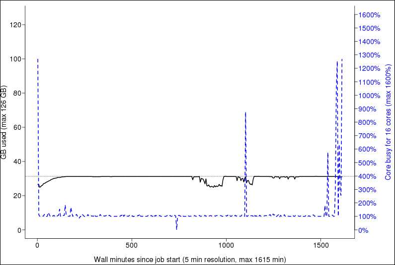
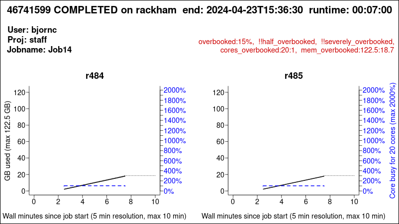
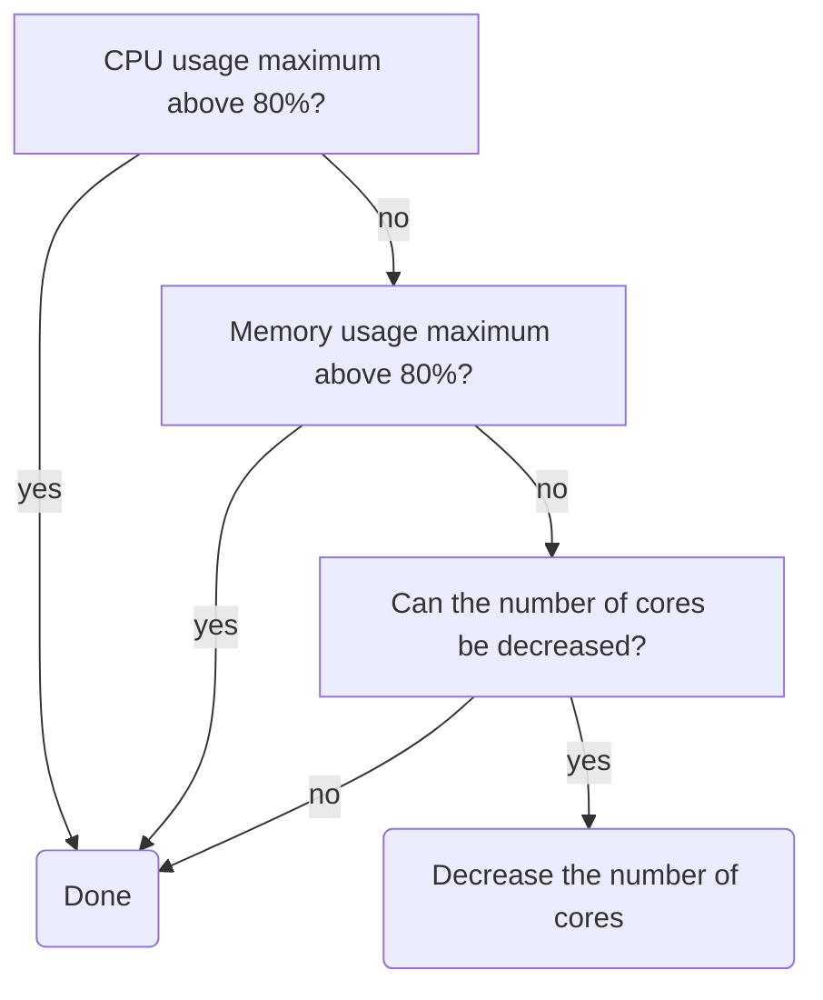
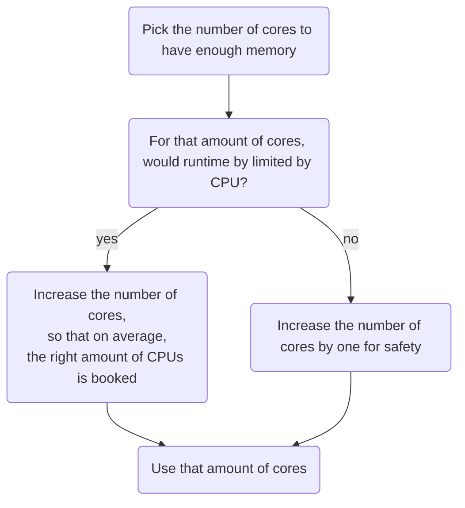

# `jobstats`



> An example plot produced by `jobstats`

`jobststats` is an UPPMAX tool to enable discovery of resource usage
for jobs submitted to the [Slurm](../cluster_guides/slurm.md) job queue.

At this page, it is described:

- [`jobstats --plot`](#jobstats---plot): How to use is `jobstats --plot` to see resource use in a graphical plot
- [Efficient use](#efficient-use): How to use your resources efficiently
- [Examples](#examples): Examples of ineffective resource use plots
- Other `jobstats` functionality
    - Using `jobstats --help`

## `jobstats --plot`

With the `--plot` (or `-p`) option,
a plot is produced showing the resource use per node
for a job that completed successfully and took longer than 5 minutes.

There are many ways to use `--plot`, a minimal use could be:

```bash
jobstats --plot [job_id]
```

for example:

```bash
jobstats --plot 12345678
```

The produced plot will be produced in the local folder
with name
`[cluster_name]-[project_name]-[user_name]-[jobid].png`,
for example `rackham-uppmax1234-sven-876543.png`.
Use any image viewer, e.g. [eog](eog.md) to see it.

Each plot shows:

- detailed information in the title.
- CPU usage in blue
- current memory usage in solid black
- overall memory usage in dotted black (if available)

## Interpreting a plot

For example, in this plot:


- the title shows the detailed info. `milou` is the name of a former UPPMAX cluster.
- CPU usage in blue, which is around 1000%, which is the equivalent of 10 cores
  being used 100%
- current memory usage in solid black, which is around 20 GB (left-side vertical
  axis) or a little bit less than 1 core (right-side vertical axis)
- overall memory usage in dotted black, which is around 340 GB (left-side vertical
  axis) or a little bit less than 11 cores     (right-side vertical axis)

For jobs running on multiple nodes, plots have multiple columns:



Some plots shows suggestions in red:

Text in plot                                        |Description
----------------------------------------------------|---------------------------------------------------------------------------------
`nodes_overbooked : nodes booked : nodes used:`     |More nodes were booked than used
`overbooked : % used`                               |The maximum percentage of booked cores and/or memory that was used (if < 80%)
`!!half_overbooked`                                 |No more than one-half of both cores and memory of a node was used; consider booking half a node instead.
`!!severely_overbooked`                             |No more than one-quarter of both cores and memory of a node was used, examine your job requirements closely.
`!!swap_used`                                       |Swap storage was used at any point within the job run
`node_type_overbooked : type booked : type used:`   |A fat node was requested that was larger than was needed. This flag may be produced spuriously if SLURM ran the job on a fat node when a fat node was not requested by the user.
`cores_overbooked : cores booked : cores used:`     |More cores were booked than used (if < 80%)
`mem_overbooked : GB booked : GB used:`             |More memory was available than was used (if < 25% and more than one core).
`core_mem_overbooked : GB in used cores : GB used:` |Less memory was used than was available in the cores that were used (if < 50%).

In this example plot, however, the setup is considered good enough.

## Determine efficient use

To determine if you efficiently use UPPMAX resources, follow this chart:



If not, follow the strategy at [efficient use](#efficient-use)

## Efficient use

Here is a strategy to effectively use your UPPMAX resources:



???- question "Why not look at CPU usage?"

    Because CPU is more flexible.

    For example, imagine a job with a short CPU spike,
    that can be processed by 16 CPUs.
    If 1 core of memory is enough, use 1 core or memory:
    the spike will be turned into a 100% CPU use (of that one core)
    for a longer duration.

???- question "Need a worked-out example?"

    

    > Pick the number of cores to have enough memory

    The dotted black line hits the left-hand vertical axis at 1070%.
    This means that 11 cores (i.e. 1100%) would be enough for this job.

    > For that amount of cores, would runtime by limited by CPU?

    The answer is 'no'. Having 11 cores would
    mean that most of the time only 10 are used.
    Only in the CPU spike at the end, the runtime is limited by CPU.
    This short time only has a minor impact on the runtime speed.

    > Increase the number of cores by one for safety

    This means booking 12 cores is recommended.

???- question "Need another worked-out example?"

    

    > Pick the number of cores to have enough memory

    The dotted black line hits the left-hand vertical axis at 90%.
    This means that 1 core (i.e. 100%) would be enough for this job.

    > For that amount of cores, would runtime by limited by CPU?

    The answer is 'yes'. Having 1 core would
    mean that around half the time there is too little CPU power.
    This has an effect.

    > Increase the number of cores, so that on average the right amount of CPUs are booked

    This is around 8 cores (800%), as with that amount of cores:

    - half of the time, there is 1 out of 7 cores booked,
      that is 6 too much
    - half of the time, there is 7 out of 13 cores booked,
      that is 6 too little

    This is not an exact algorithm and all numbers from 2 to 9 cores
    can be considered okay.

Sometimes, however, it is inevitable to use resources
inefficiently, see [the examples below](#examples)

!!! note "No queue is possible"

    If everyone followed these guidelines, there would probably not even be a queue most of the time!

## Examples

Here are some examples of how inefficient jobs can look
and what you can do to make them more efficient.

### Inefficient job example 1: booking too much cores


Here booking 5 cores is considered okay.

> Pick the number of cores to have enough memory

The dotted black line hits the left-hand vertical axis at 390%.
This means that 4 cores (i.e. 400%) would be enough for this job.

> For that amount of cores, would runtime by limited by CPU?

The answer is 'no'. Having 4 cores would
mean that most of the time only 1 are used.
Only for some CPU spikes, the runtime is limited by CPU.
This short time only has a minor impact on the runtime speed.

> Increase the number of cores by one for safety

This means booking 5 cores is recommended.

### Inefficient job example 2: booking too much cores


This is one of the grayer areas:
booking 2-9 cores is all considered reasonable.

> Pick the number of cores to have enough memory

The dotted black line hits the left-hand vertical axis at 90%.
This means that 1 core (i.e. 100%) would be enough for this job.

> For that amount of cores, would runtime by limited by CPU?

The answer is 'yes'. Having 1 core would
mean that around half the time there is too little CPU power.
This has an effect.

> Increase the number of cores, so that on average the right amount of CPUs are booked

This is around 8 cores (800%), as with that amount of cores:

- half of the time, there is 1 out of 7 cores booked,
  that is 6 too much
- half of the time, there is 7 out of 13 cores booked,
  that is 6 too little

This is not an exact algorithm and all numbers from 2 to 9 cores
can be considered okay.

### Inefficient job example 3


Here booking 6 cores is considered okay.

> Pick the number of cores to have enough memory

The dotted black line hits the left-hand vertical axis at 40%.
This means that 1 core (i.e. 100%) would be enough for this job.

> For that amount of cores, would runtime by limited by CPU?

The answer is 'yes'. Having 1 core would
mean that most of the time our run is limited by CPU power.
This has an impact on the runtime speed.

> Increase the number of cores, so that on average the right amount of CPUs are booked

This is around 6 cores (600%), as with that amount of cores:

- most of the time, there is 6 out of 6 cores booked,
  that is 0 too much
- only rarely, there is a little spike up or a bigger spike down

There are no signs of anything slowing them down, as the line is very even.

This jobs should either have been booked with 6 cores, or the program running should be told to use all 8 cores.

### Inefficient job example 4: slowdown


This job is using almost all of the cores it has booked,
but there seems to be something holding them back.
The uneven blue curve tells us that something is slowing down the analysis,
and it's not by a constant amount.

Usually this is how it looks when the filesystem is the cause of a slowdown.
Since the load of the filesystem is constantly changing,
so will the speed by which a job can read data from it also change.

This job should try to copy all the files it will be working
with to the nodes local harddrive before running the analysis,
and by doing so not be affected by the speed of the filesystem.

Please see the guide How to use the nodes own hard drive
for analysis for more information.

You basically just add 2 more commands to your script file
and the problem should be solved.

### Inefficient job example 5


This job has the same problem as the example above,
but in a more extreme way.

It's not uncommon that people book whole nodes out of habit
and only run single threaded programs that use almost no memory.
This job is a bit special in the way that it's being run on a high memory node,
as you can see on the left Y-axis, that it goes up to 256 GB RAM.
A normal node on Milou only have 128GB.
These high memory nodes are only bookable of you book the whole node,
so you can't book just a few cores on them.
That means that if you need 130GB RAM and the program is only single threaded,
your only option is to book a whole high memory node.
The job will look really inefficient,
but it's the only way to do it on our system.
The example in the plot does not fall into this category though,
as it uses only ~15GB of RAM, which you could get by booking 2-3 normal cores.

## `jobstats --help`

Use `jobstats --help` to see the help of `jobstats`:

```bash
jobstats --help
```

???- question "How does the output look like?"

    ```text
    USAGE
    -----

        jobstats  -p [-r] [-M cluster] [ jobid [ jobid ... ] | -A project | - ] [other options]

    Discover jobstats for the specified job(s) on the specified cluster.  Cluster
    defaults to the value of $SNIC_RESOURCE ('rackham' on the current system) if
    not specified.

    With the -p/--plot option, a plot is produced from the jobstats for each
    jobid.  Plots contain one panel per booked node showing CPU (blue) and memory
    usage (black) traces and include text lines indicating the job number, cluster,
    end time and duration, user, project, job name, and usage flags (more on those
    below).  For memory usage, one or two traces are shown: a solid black line
    shows instantaneous memory usage, and a dotted black line shows overall maximum
    memory usage if this information is available.

    Plots are saved to the current directory with the name

        cluster-project-user-jobid.png

    Note that not all jobs will produce jobstats files, particularly if the job was
    cancelled or ran for less than 5 minutes.  Also, if a job booked nodes
    inefficiently by not using nodes it asked for, jobstats files will not be
    available for the booked but unused nodes.

    JOBSTATS DISCOVERY
    ------------------

    There are five modes for discovery, depending on what the user provides on the
    command line: (1) discovery by job number for a completed job; (2) discovery by
    job number for a currently running job; (3) discovery by node and job number,
    for a completed or running job; (4) discovery by project; or (5) discovery via
    information provided on 'stdin'.  In each of the example command lines below, the
    -p/--plot option requests that plots of job resource usage are created.

    Mode 1:  jobstats -p jobid1 jobid2 jobid3
    -------
    Job numbers valid on the cluster.  [finishedjobinfo](finishedjobinfo.md) is used to determine further
    information for each job.  If multiple queries are expected, it might be quicker
    to run [finishedjobinfo](finishedjobinfo.md) yourself separately, see Mode 5 below.  See Mode 2 for a
    currently running job.

    Mode 2:  jobstats -p -r jobid1 jobid2 jobid3
    -------
    Job numbers of jobs currently running on the cluster.  The SLURM squeue tool is
    used to determine further information for each running job.

    Mode 3:  jobstats -p -n m15,m16 jobid
    -------
    [finishedjobinfo](finishedjobinfo.md) is *not* called and Uppmax's stored job statistics files are
    discovered directly.  If you know which node(s) your job ran on or which nodes
    you are interested in, this will be much faster than Mode 1.

    Mode 4:  jobstats -p -A project
    -------
    When providing a project name that is valid for the cluster, [finishedjobinfo](finishedjobinfo.md) is
    used to determine further information on jobs run within the project.  As for
    Mode 1, this can be rather slow.  Furthermore only [finishedjobinfo](finishedjobinfo.md) defaults for
    time span etc. are used for job discovery.  If multiple queries are expected or
    additional [finishedjobinfo](finishedjobinfo.md) options are desired, see Mode 5 below.

    Mode 5:  [finishedjobinfo](finishedjobinfo.md) project | jobstats - -p
    -------
    Accept input on stdin formatted like [finishedjobinfo](finishedjobinfo.md) output.  The long form of
    this option is '--stdin'.  This mode can be especially useful if multiple
    queries of the same job information are expected.  In this case, save the
    output of a single comprehensive [finishedjobinfo](finishedjobinfo.md) query, and extract the parts
    of interest and present them to this script on stdin.  For example, to produce
    analyses of all completed jobs in a project during the current calendar year,
    and produce separate tarballs analysing all jobs and providing jobstats plots
    for each user during this same period:

         [finishedjobinfo](finishedjobinfo.md) -y project > proj-year.txt
         grep 'jobstat=COMPLETED' proj-year.txt | jobstats - > all-completed-jobs.txt
         grep 'username=user1' proj-year.txt | jobstats - -p > user1-jobs.txt
         tar czf user1-jobs.tar.gz user1-jobs.txt *-project-user1-*.png
         grep 'username=user2' proj-year.txt | jobstats - -p > user2-jobs.txt
         tar czf user2-jobs.tar.gz user2-jobs.txt *-project-user2-*.png
         ...

    COMMAND-LINE OPTIONS
    --------------------

        -p | --plot        Produce CPU and memory usage plot for each jobid

        -r | --running     Jobids are for jobs currently running on the cluster. The
                           SLURM squeue tool is used to discover further information
                           for the running jobs, and the rightmost extent of the plot
                           produced will reflect the scheduled end time of the job.

        -A project         Project valid on the cluster.  [finishedjobinfo](finishedjobinfo.md) is used to
                           discover jobs for the project.  See further comments
                           under 'Mode 4' above.

        -M cluster         Cluster on which jobs were run [default current cluster]

        -n node[,node...]  Cluster node(s) on which the job was run.  If specified,
                           then the [finishedjobinfo](finishedjobinfo.md) script is not run and discovery
                           is restricted to only the specified nodes.  Nodes can be
                           specified as a comma-separated list of complete node
                           names, or using the [finishedjobinfo](finishedjobinfo.md) syntax:
                                 m78,m90,m91,m92,m100  or  m[78,90-92,100]
                           Nonsensical results will occur if the syntaxes are mixed.

        - | --stdin        Accept input on stdin formatted like [finishedjobinfo](finishedjobinfo.md)
                           output.  The short form of this option is a single dash
                           '-'.

        -m | --memory      Always include memory usage flags in output.  Default
                           behaviour is to include memory usage flags only if CPU
                           usage flags are also present.

        -v | --verbose     Be wordy when describing flag values.

        -b | --big-plot    Produce 'big plot' with double the usual dimensions.
                           This implies '-p/--plot'.

        -q | --quiet       Do not produce table output

        -Q | --Quick       Run [finishedjobinfo](finishedjobinfo.md) with the -q option, which is slightly
                           faster but does not include SLURM's record of maximum
                           memory used. With this option, memory usage analyses can
                           only rely upon what is reported at 5-minute intervals,
                           and the trace of maximum memory used (dotted black line)
                           is not produced.

        --no-extended      Do *not* use extended jobstats information [default is to use it]

        --paging           Include PAGE_IN/PAGE_OUT statistics from extended jobstats [experimental]

        -d                 Produce a header for table output

        --version          Produce version of this script and plot_jobstats, then exit

        -h | -?            Produce brief help

        --help             Produce detailed help information

    The following command-line options are generally useful only for Uppmax staff.

        --cpu-free FLOAT   Maximum CPU busy percentage for the CPU to count as
                           free at that sampling time.  Default is 3 %.
        -x directory       Directory prefix to use for jobstats files.  Default is
                           '/sw/share/slurm', and directory structure is (depending on whether
                           --no-extended is used):

                           <prefix>/<cluster>/extended_uppmax_jobstats/<node>/<jobid>
                           <prefix>/<cluster>/uppmax_jobstats/<node>/<jobid>

        -X directory       Hard directory prefix to use for jobstats files.
                           Jobstats files are assumed available directly:
                               '<hard-prefix>/<jobid>'
        --no-multijobs     Run [finishedjobinfo](finishedjobinfo.md) separately for each jobid, rather
                           than all jobids bundled into one -j option (for debugging)
        -f file            [finishedjobinfo](finishedjobinfo.md) script [default is '/sw/uppmax/bin/finishedjobinfo']
        -P file            plot_jobstats script [default is '/sw/uppmax/bin/plot_jobstats']


    FURTHER DETAILS
    ---------------

    This script produces two types of output.  If the -p/--plot command line option
    is provided, a plot is created of core and memory usage across the life of the
    job.  The name of the file produced has the format:

        cluster-project-user-jobid.png

    Unless the -q/--quiet option is provided, a table is also produces containing
    lines with the following tab-separated fields:

      jobid cluster jobstate user project endtime runtime flags booked cores node[,node...] jobstats[,jobstats...]

    Field contents:

      jobid    : Job ID
      cluster  : Cluster on which the job was run
      jobstate : End status of the job: COMPLETED, RUNNING, FAILED, TIMEOUT, CANCELLED
      user     : Username that submitted the job
      project  : Project account under which the job was run
      endtime  : End time of the job (with -n/--node, this is '.')
      runtime  : Runtime of the job (with -n/--node, this is '.')
      flags    : Flags indicating various types of resource underutilizations
      booked   : Number of booked cores (with -n/--node, this is '.')
      maxmem   : Maximum memory used as reported by SLURM (if unavailable, this is '.')
      cores    : Number of cores represented in the discovered jobstats files.
      node     : Node(s) booked for the job, expanded into individual node names,
                 separated by commas; if no nodes were found, this is '.'.
                 The nodes for which jobstats files are available are listed first.
      jobstats : jobstats files for the nodes, in the same order the nodes are
                 listed, separated by commas; if no jobstats files were discovered,
                 this is '.'

    If -r/--running was used, an additional field is present:

      timelimit_minutes : The time limit of the job in minutes


    FLAGS
    -----

    An important part of jobstats output are usage flags.  These provide indications
    that booked resources -- processor cores or memory -- might have been
    underused.

    In both plot and table output, flags are a comma-separated list of cautions
    regarding core and/or memory underutilisation.  The appearance of a flag does
    not necessarily mean that resources were used incorrectly.  It depends upon the
    tools being used and the contents of the SLURM header, and also depends upon
    the job profile.  Because usage information is gathered every 5 minutes, higher
    transient usage of cores or memory may not be captured in the log files.

    Flags most likely to represent real overbooking of resources are
    nodes_overbooked, overbooked, !!half_overbooked, !!severely_overbooked, and
    !!swap_used.

    For multinode jobs, flags other than nodes_overbooked are determined based only
    on the usage of the first node.  Multinode jobs require careful analysis so as
    to not waste resources unnecessarily, and it is a common mistake among
    beginning Uppmax users to book multiple nodes and run tools that cannot use
    more than the first.  In this case, nodes_overbooked will appear.

    Some flags have a threshold below which they appear.  The default format is
    generally 'flag:value-booked:value-used'.

      nodes_overbooked : nodes booked : nodes used
          More nodes were booked than used
      overbooked : % used (if < 80%)
          The maximum percentage of booked cores and/or memory that was used
      !!half_overbooked
          No more than 1/2 of both cores and memory of a node was used; consider booking
          half a node instead.
      !!severely_overbooked
          No more than 1/4 of both cores and memory of a node was used, examine your job
          requirements closely.
      !!swap_used
          Swap storage was used at any point within the job run
      node_type_overbooked : type booked : type used
          A fat node was requested that was larger than was needed.  This flag may be
          produced spuriously if SLURM ran the job on a fat node when a fat node was not
          requested by the user.
      cores_overbooked : cores booked : cores used
          More cores were booked than used (if < 80%)
      mem_overbooked : GB booked : GB used
          More memory was available than was used (if < 25% and more than one core).
      core_mem_overbooked : GB in used cores : GB used
          Less memory was used than was available in the cores that were used (if < 50%).

    By default no flags are indicated for jobs with memory-only cautions except for
    swap usage, because it is common for jobs to heavily use processor cores
    without using a sizable fraction of memory.  Use the -m/--memory option to
    include flags for memory underutilisation when those would be the only flags
    produced.

    More verbose flags are output with the -v/--verbose option.


    Script:   /sw/uppmax/bin/jobstats
    Version:  2023-11-16
    ```

## Modes of `jobstats` discovery

There are five modes for discovery,
depending on what the user provides on the command line:

- (1) discovery by job number for a completed job;
- (2) discovery by job number for a currently running job;
- (3) discovery by node and job number, for a completed or running job;
- (4) discovery by project
- (5) discovery via information provided on stdin.

In the example command lines below, the -p/--plot option requests that plots of job resource usage are created.

### `jobstats` discovery mode 1: discovery by job number for a completed job

Discovery by job number for a completed job:

```bash
jobstats --plot jobid1 jobid2 jobid3
```

The job numbers valid on the cluster.
[finishedjobinfo](finishedjobinfo.md) is used
to determine further information for each job.
This can be rather slow,
and a message asking for your patience is printed for each job.

If multiple queries are expected it would be quicker
to run [finishedjobinfo](finishedjobinfo.md) yourself separately,
see Mode 4 below. See Mode 2 for a currently running job.

### `jobstats` discovery mode 2: discovery by job number for a currently running job

Discovery by job number for a currently running job.

```bash
jobstats --plot -r jobid1 jobid2 jobid3
```

Job numbers of jobs currently running on the cluster.
[The Slurm schedule](../cluster_guides/slurm.md) is used to determine
further information for each running job.

### `jobstats` discovery mode 3: discovery by node and job number, for a completed or running job

Discovery by node and job number, for a completed or running job.

```bash
jobstats --plot -n m15,m16 jobid
```

[finishedjobinfo](finishedjobinfo.md) is not called and
UPPMAX's stored job statistics files for the cluster of interest are discovered directly.
If you know which node(s) your job ran on
or which nodes you are interested in, this will be much faster than Mode 1.

### `jobstats` discovery mode 4: discovery by project

Discovery by project.

```bash
jobstats --plot -A project
```

When providing a project name that is valid for the cluster,
[finishedjobinfo](finishedjobinfo.md) is used
to determine further information on jobs run within the project.
As for Mode 1, this can be rather slow,
and a message asking for your patience is printed.

Furthermore only [finishedjobinfo](finishedjobinfo.md) defaults
for time span etc. are used for job discovery.
If multiple queries are expected
or additional [finishedjobinfo](finishedjobinfo.md) options are desired,
see Mode 5 below.

### `jobstats` discovery mode 5: discovery via information provided on stdin

Discovery via information provided on `stdin`:

???- question "What is `stdin`?"

    `stdin` is an abbreviation for 'Standard input',
    see [the Wikipedia page on 'stdin'](https://en.wikipedia.org/wiki/Standard_streams#Standard_input_(stdin))

```bash
finishedjobinfo -q project | jobstats - --plot
```

Accept input on `stdin` formatted like [finishedjobinfo](finishedjobinfo.md) output.
Note the single dash (`-`) option given to [jobstats](jobstats.md);
the long form of this option is `--stdin`.
This mode can be especially useful if
multiple queries of the same job information are expected.
In this case, save the output of a single comprehensive [finishedjobinfo](finishedjobinfo.md) query,
and extract the parts of interest and present them to this script on `stdin`.

For example, to produce analyses of all completed jobs in a project
during the current calendar year, and produce separate tarballs
analysing all jobs and providing jobstats plots for each user during this same period:

```bash
project=myproj
finishedjobinfo -q -y ${project} > ${project}-year.txt
grep 'jobstat=COMPLETED' ${project}-year.txt | jobstats - > ${project}-completed-jobs.txt
for u in user1 user2 user3 ; do
   grep "username=${u}" ${project}-year.txt | jobstats - --plot > ${u}-jobs.txt
   tar czf ${u}-jobs.tar.gz ${u}-jobs.txt *-${project}-${u}-*.png
done
```
