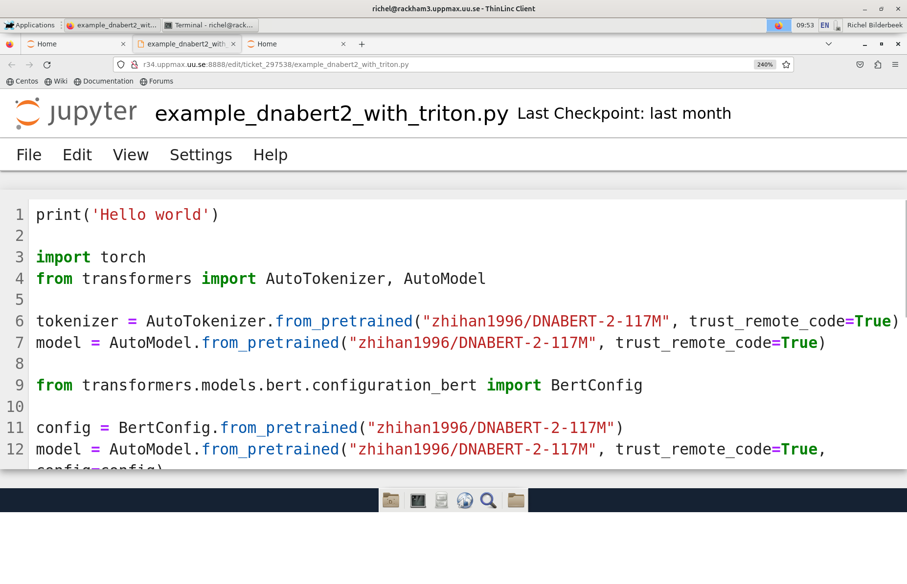

---
tags:
  - Jupyter
  - Rackham
---

# Jupyter on Pelle



There are multiple [IDEs](../software/ides.md) on the UPPMAX clusters,
among other [Jupyter](../software/jupyter.md).
Here we describe how to run [Jupyter](../software/jupyter.md)
on Pelle.

Jupyter is an [IDE](../software/ides.md) specialised for
[the Python programming language](../software/python.md).

## Procedure

??? question "Prefer a video?"

    This procedure is also demonstrated for Rackham (**FIX** in [this YouTube video](https://youtu.be/72rYjwGvWEc?si=Rn2F2ieO-kPufO9f)

### 1. Start a Pelle remote desktop environment

This can be either:

- [Login to the Pelle remote desktop environment using the website](../getting_started/login_pelle_remote_desktop_website.md)
- [Login to the Pelle remote desktop environment using a local ThinLinc client](../getting_started/login_pelle_remote_desktop_local_thinlinc_client.md)

### 2. Start an interactive session

Within the Pelle remote desktop environment, start a [terminal](../software/terminal.md).
Within that terminal,
[start an interactive session](../cluster_guides/start_interactive_session_on_pelle.md):

```bash
interactive -A [project_number] -t 8:00:00
```

Where `[project_number]` is your
[UPPMAX project](../getting_started/project.md), for example:

```bash
interactive -A uppmax2025-2-393 -t 8:00:00
```

???- question "What is my UPPMAX project number?"

    See [the UPPMAX documentation on how to see your UPPMAX projects](../getting_started/project.md)

### 3a. Use software modules to provide Python, Jupyter and python packages needed

- Step 1. Decide what is needed in terms of

    - Python version
    - Python packages (and versions)

- Step 2: Check our [Python Bundles page](python_bundles.md) and choose compatible modules.

    - Check if your needed python packages are compatible with a JupyterLab module.
    - If not you may need to go to 3b instead to create a isolated environment in Conda.

#### Example with latest available versions on Pelle

- Within the terminal of the interactive session,
load the ``JupyterLab`` module compatible with the ``foss2025b`` toolchain (``GCCcore-14.3.0``).
- You get ``Python/3.13.5`` on the fly.
- Also load ``SciPy-bundle`` to get ``numpy`` and ``pandas``
- and ``matplotlib`` that is its own module.
- (You can add any other compatible python package module as well)

```bash
ml JupyterLab/4.4.9-GCCcore-14.3.0
SciPy-bundle/2025.07-gfbf-2025b
matplotlib/3.10.5-gfbf-2025b
```

???- question "Forgot what the module system is?"

    See [the UPPMAX pages on the module system](../cluster_guides/modules.md).

### 3b Create a conda environment

Coming soon!

### 4. Start the Jupyter notebook

Still within the terminal of the interactive session,
start a Jupyter Lab like this:

``` bash
jupyter-lab --ip 0.0.0.0 --no-browser
```

This will start a jupyter server session so leave this terminal open. The terminal will also display multiple URLs.

Copy the URL containing ``pXXX``.

### 5. Browser to the Jupyter notebook

In the remote desktop environment on Pelle, start Firefox.
Set Firefox to the URL addresses from the Jupyter output, which will be similar to ``http://p115.uppmax.uu.se:8888/lab?token=73178b5ec897ae9bed6ae4b1815137d83dff671562574989``

???- question "Can I start Firefox from the terminal too?"

    Yes, in another terminal, one can use:

    ```bash
    firefox [URL]
    ```

    where `[URL]` is a URL produced by Jupyter, for example:

    ```bash
    firefox http://p115.uppmax.uu.se:8888/lab?token=73178b5ec897ae9bed6ae4b1815137d83dff671562574989
    ```
