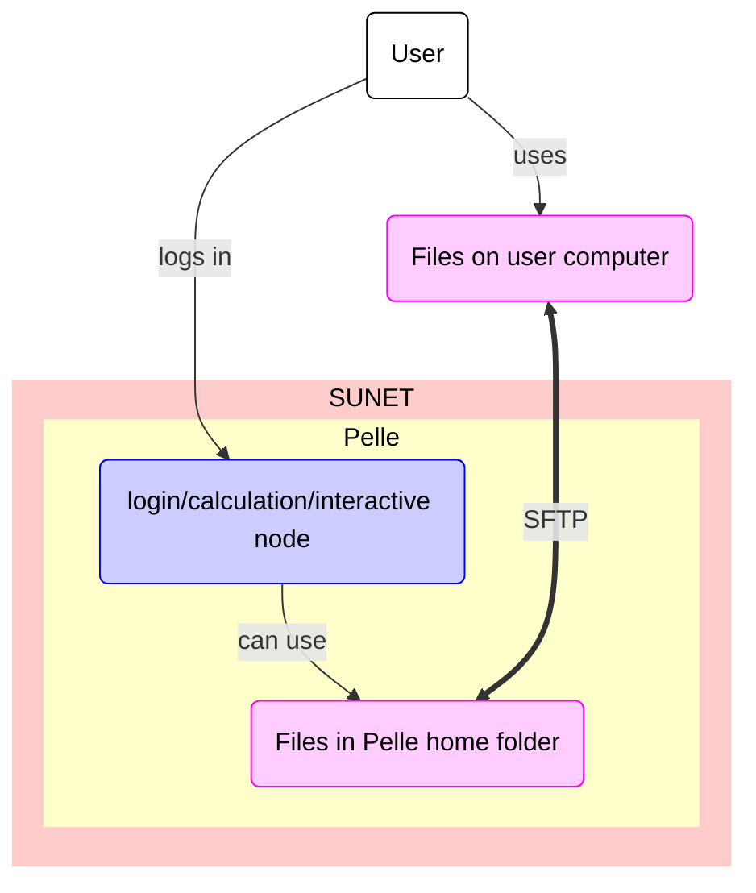

# Data transfer to/from Pelle using SFTP

!!! warning "Does not work yet"

    [Pelle](../cluster_guides/pelle.md) is a new UPPMAX HPC cluster
    that is in the process of being deployed.

    File transfer to/from Pelle using FileZilla does not work yet.

    This page will be updated when this works.

There are multiple ways to [transfer data to/from Pelle](../cluster_guides/transfer_pelle.md).

Data transfer to/from Pelle using SFTP
is one of the ways ways to transfer files to/from Pelle

???- question "What are the other ways?"

    Other ways to transfer data to/from Pelle are described [here](../cluster_guides/transfer_pelle.md)

One can transfer files to/from Pelle using SFTP.
SFTP is an abbreviation of 'SSH File Transfer Protocol',
where 'SSH' is an abbreviation of 'Secure Shell protocol'
The program `sftp` allows you to transfer files to/from Pelle using SFTP.

The process is described here:

## Step 1. Start a terminal on your local computer

Start a [terminal](../software/terminal.md) on your local computer.

## Step 2. Run `sftp` to connect to Pelle

In the terminal, run `sftp` to connect to Pelle by doing:

```bash
sftp [username]@pelle.uppmax.uu.se
```

where `[username]` is your UPPMAX username, for example:

```bash
sftp sven@pelle.uppmax.uu.se
```

### Step 3. If asked, give your UPPMAX password

If asked, give your UPPMAX password.
You can get rid of this prompt if you have setup SSH keys

### Step 4. Upload/download files to/from Pelle

In `sftp`, upload/download files to/from Pelle.

Basic `sftp` command can be found [here](../software/sftp.md).



> Overview of file transfer on Pelle
> The purple nodes are about file transfer,
> the blue nodes are about 'doing other things'.
> The user can be either inside or outside SUNET.
