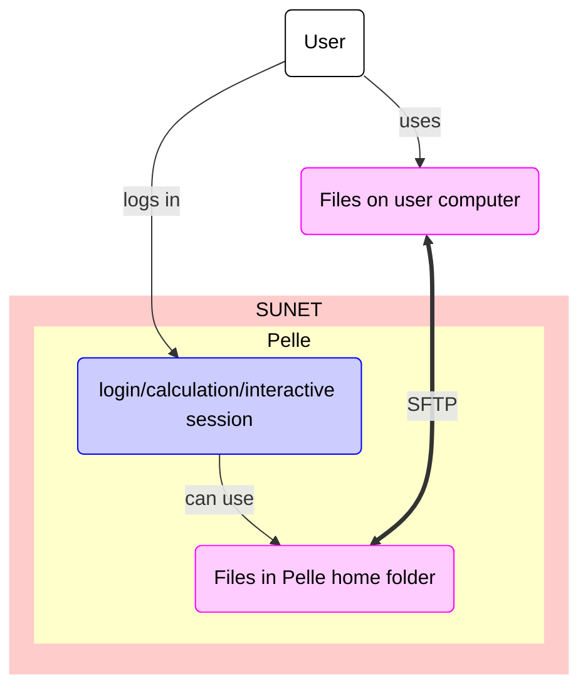

# Data transfer to/from Pelle using SFTP

The program `sftp` allows you to interactively transfer files to/from Pelle
in a terminal, using SFTP. It cannot be used in scripts and it is not intended
for sync or iterative backups.

!!!- info "Other options for file transfer"

    There are multiple ways to
    [transfer data to/from Pelle](../cluster_guides/transfer_pelle.md).

SFTP is an abbreviation of 'SSH File Transfer Protocol',
where 'SSH' is an abbreviation of 'Secure Shell protocol'.
There are graphical file transfer tools and general file managers that can also
use SFTP, but only the terminal program `sftp` is discussed on this page.

The process is described here:

## 1. Start a terminal on your local computer

Start a [terminal](../software/terminal.md) on your local computer.

## 2. Run `sftp` to connect to Pelle

In the terminal, run `sftp` to connect to Pelle by doing:

```bash
sftp [username]@pelle.uppmax.uu.se
```

where `[username]` is your UPPMAX username, for example:

```bash
sftp sven@pelle.uppmax.uu.se
```

## 3. If asked, give your UPPMAX password and TOTP

If asked, give your UPPMAX password and second factor TOTP.
You can get rid of this prompt if you have setup SSH keys

## 4. Upload/download files to/from Pelle

In [`sftp`](../software/sftp.md), upload/download files to/from Pelle.



```mermaid
flowchart TD

    %% Give a white background to all nodes, instead of a transparent one
    classDef node fill:#fff,color:#000,stroke:#000

    %% Graph nodes for files and calculations
    classDef file_node fill:#fcf,color:#000,stroke:#f0f
    classDef calculation_node fill:#ccf,color:#000,stroke:#00f

    user(User)
      user_local_files(Files on user computer):::file_node

    subgraph sub_inside[SUNET]
      subgraph sub_pelle_shared_env[Pelle]
          login_node(login/calculation/interactive session):::calculation_node
          files_in_pelle_home(Files in Pelle home folder):::file_node
      end
    end

    %% Shared subgraph color scheme
    %% style sub_outside fill:#ccc,color:#000,stroke:#ccc
    style sub_inside fill:#fcc,color:#000,stroke:#fcc
    style sub_pelle_shared_env fill:#ffc,color:#000,stroke:#ffc

    user --> |logs in |login_node
    user --> |uses| user_local_files

    login_node --> |can use|files_in_pelle_home
    %% user_local_files <--> |graphical tool|files_in_pelle_home
    %% user_local_files <--> |SCP|files_in_pelle_home
    user_local_files <==> |SFTP|files_in_pelle_home

    %% Aligns nodes prettier
    user_local_files ~~~ login_node
```

> Overview of file transfer on Pelle
> The purple nodes are about file transfer,
> the blue nodes are about 'doing other things'.
> The user can be either inside or outside SUNET.
