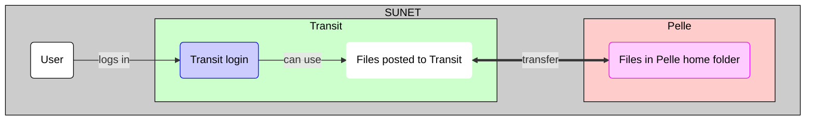

# Data transfer to/from Pelle using Transit and SFTP

!!! warning "Does not work yet"

    [Pelle](../cluster_guides/pelle.md) is a new UPPMAX HPC cluster
    that is in the process of being deployed.

    The procedure as described on this page does not work yet or is untested.

    This page will be updated when this works.

There are multiple ways to [transfer data to/from Pelle](../cluster_guides/transfer_pelle.md).

Data transfer to/from Pelle using [Transit](../cluster_guides/transit.md)
is one of the ways ways to transfer files to/from Pelle

One can use SFTP to copy files between Pelle and Transit,
from either Pelle or Transit.

Both ways are shown step-by-step below.

- [Using SFTP from Pelle](pelle_file_transfer_using_transit_sftp_from_pelle.md)
- [Using SFTP from transit](pelle_file_transfer_using_transit_sftp_from_transit.md)

Basic `sftp` command can be found [here](../software/sftp.md).

## Overview

> Overview of file transfer on Pelle
> The purple nodes are about file transfer,
> the blue nodes are about 'doing other things'.
> The user can be either inside or outside SUNET.
