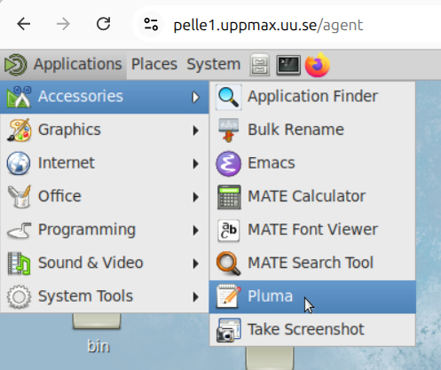

---
tags:
  - text
  - editor
  - pluma
  - graphical
  - GUI
  - pelle
---

# Pluma

Pluma is a simple graphical [text editor](text_editors.md)
and is the default on the Pelle HPC cluster.

Here is how Pluma looks like:

In Pelle's remote desktop environment, you can start Pluma by clicking here:

Here is how Pluma looks like when actually showing some text:

Finding Pluma's 'About' dialog:

Pluma's 'About' dialog:

