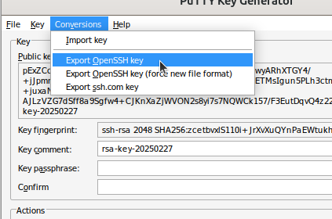

---
tags:
  - puttygen
  - PuTTY Key Generator
  - software
  - SSH 
  - key
  - files
  - ppk
---

# `puttygen`

`puttygen`, also called 'PuTTY Key Generator', is a free program
for Linux, Mac and Windows to create SSH keys in multiple formats,
among others the `.ppk` file format, which is needed for
[FileZilla](filezilla.md).

## Get `puttygen`

`puttygen` can be downloaded from its (advertisement-heavy)
website at [https://www.puttygen.com](https://www.puttygen.com).

## Create SSH key files

???- question "Would you like a video?"

    This procedure is demonstrated in a video `TODO`

This procedure shows how to generate the following SSH key files:

Filename    |Description
------------|----------------------
`my_key`    |Private key, in OpenSSH format
`my_key.ppk`|Private key, in Putty private key format
`my_key.pub`|Public key

Follow the following steps.

### 1. Click on 'generate'

In `puttygen`, click on 'Generate'

???- question "How does that look like?"

    

### 2. Move the mouse cursor over the window

Move the mouse cursor over the `puttygen` window
until the progress bar is filled up.

???- question "How does that look like?"

    

The keys have now been generated

### 3. Click on 'Save public key'

In `puttygen`, click on 'Save public key'.

???- question "How does that look like?"

    

### 4. Save the public key as a `.pub` file

In the 'Save public key as' dialog, save the public key
as `[description].pub`, e.g. `demo.pub`.

???- question "How does that look like?"

    

Now you have your public key file!

### 5. Click on 'Save private key'

In `puttygen`, click on 'Save private key'.

???- question "How does that look like?"

    

### 6. If needed: ignore the warning

You will get a warning, click on 'Ignore'.

???- question "Why is there this warning?"

    In this procedure, the private key does not get a password.
    Some settings, however, do require such a password.

???- question "How does that look like?"

    

### 7. Save the private key as a `.ppk` file

In the 'Save private key as' dialog, save the private key
as `[description]`, e.g. `demo`. It will be saved as
`[description].ppk`, e.g. `demo.ppk`.

???- question "How does that look like?"

    

Now you have your private key file in `ppk` format!

### 8. Click on 'Conversions | Export OpenSSH key'

In `puttygen`, click on 'Conversions | Export OpenSSH key'

???- question "How does that look like?"

    

### 9. If needed: ignore the warning

You will get a warning, click on 'Ignore'.

???- question "Why is there this warning?"

    In this procedure, the private key does not get a password.
    Some settings, however, do require such a password.

???- question "How does that look like?"

    

### 10. Click on 'Save private key'

In the 'Save private key as' dialog, save the private key
as `[description]`, e.g. `demo`. It will be saved as
`[description]` (i.e. without a file extension), e.g. `demo`
(again: without a file extension).

???- question "How does that look like?"

    

Now you have your private key file in OpenSSH format!
