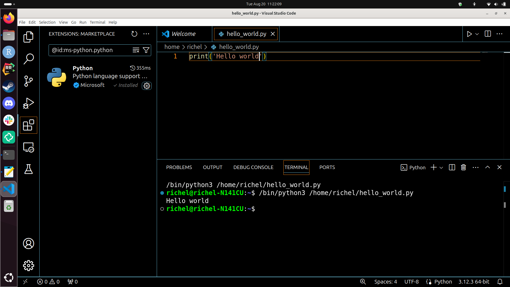

# Python programming

This page describes how to program in [Python](python.md)
on the [UPPMAX clusters](../cluster_guides/uppmax_cluster.md).

There are multiple ways to program in Python:

Description                           |Features                                                                                |Screenshot
--------------------------------------|----------------------------------------------------------------------------------------|-----------
Use a text editor (see below)         |Non-interactive, no help                                                                |
Use the Python interpreter (see below)|Interactive, [terminal](../software/terminal.md)-based, some help                       |
Use [IPython](ipython.md)             |Interactive, [terminal](../software/terminal.md)-based, more help and features          |
Use [Jupyter](jupyter.md)             |Interactive, web-based                                                                  |
Use [Visual Studio Code](vscode.md)   |Interactive, install on local computer, use locally installed Python and Python packages|

## Use a text editor

Using a [text editor](text_editors.md) to program in Python
is a simple way to write code:
it is the same as writing any text file.

Here we use the text editor GNU [`nano`](nano.md) to write a Python script:

```bash
nano example_script.py
```

Within nano, write:

```console
print('Hello, world!')
```

- To save, press `CTRL + O` (i.e. the letter), then enter to keep the same filename
- To quite, press `CTRL + Q`

You can run this Python script in the shell by:

```console
python example_script.py
```

or, if you want to be explicitly use Python 3:

```console
python3 example_script.py
```

Some features of this approach are:

- this is a simple way to write code: it is the same as writing any text file.
- you get no help while writing code
- you can only run the script from start to finish, i.e. you cannot
  partially run the script

???- question "How to run a Python script line-by-line?"

    You can run a Python script line-by-line using a Python debugger,
    such as `pdb`.

    On the terminal, for `python`, do:

    ```bash
    pdb example_script.py
    ```

    or for `python3`:

    ```bash
    pdb3 example_script.py
    ```

    See the official Python documentation of `pdb` [here](https://docs.python.org/3/library/pdb.html).

## Use the Python interpreter

After loading a Python module, you have the Python interpreter available.

???- question "Forgot how to load a Python module?"

    See the UPPMAX page about Python [here](python.md).

???- question "What is a Python interpreter?"

    In computing, an interpreter is a program that reads text
    and runs it directly, without any additional steps.

    The Python interpreter runs the Python commands you type directly,
    without any additional steps.

Start the Python interpreter by typing:

```console
python
```

or (for explicit Python 3):

```console
python3
```

The Python prompt looks like this:

```python
>>>
```

Type, for example:

```python
print('Hello, world!')
```

and the interpreter will run the statement.

Exit the Python interpreter with `CTRL + D`, `quit()` or `exit()`.

The Python interpreter gives limited auto-complete while writing code

???- question "How do I get auto-complete?"

    As an example, writing this line of code in the Python interpreter ...

    ```python
    s = 'Hello, world!'
    ```

    ... and press enter. Now a variable called `s` will hold some text.

    Now type ...

    ```python
    s.
    ```

    and press Tab twice. You will see a list of things you can do with that string.

The Python interpreter can show graphics.

???- question "How do I get the Python interpreter to show graphics?"

    In the Python interpreter, run this code line-by-line:

    ```python
    import matplotlib.pyplot as plt
    plt.plot([1, 4, 9, 16])
    plt.show()
    ```

    (or as a one-liner: `import matplotlib.pyplot as plt; plt.plot([1, 4, 9, 16]); plt.show()`)

    You will see a window appear:

    

    You will only see a window appear, if you've logged in to Rackham with
    [SSH with X forwarding enabled](../software/ssh_x_forwarding.md).

    Spoiler: `ssh -X sven@rackham.uppmax.uu.se`.

The Python interpreter cannot directly run scripts.

## Links

- [Official Python documentation](https://docs.python.org/3/)
- [Python forum](https://www.python.org/community/forums/)
- [Free online book: 'How to Think Like a Computer Scientist'](https://openbookproject.net/thinkcs/python/english3e/index.html)
- [UPPMAX TensorFlow guide](tensorflow.md)
- [UPPMAX PyTorch guide](pytorch.md)
