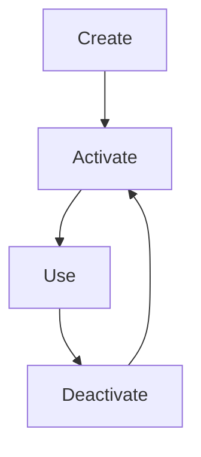

# Virtual environments in Python

This page described how to use virtual environments in [Python](python.md).

## Why use virtual environments?

Virtual environments allows one to have independent Python environments.

This allows one to have multiple projects

- You can install specific, also older, versions into them
- You can create one for each project and no problem if the two projects
  require different versions
- If you make some mistake and install something you did not want or need, you
  can remove the environment and create a new one

## Environment managers

Here is an incomplete overview of virtual environment managers that work with Python:

Virtual environment manager          |Description
-------------------------------------|--------------------------------
[`venv`](python_venv.md)             |Works on [Rackham](../cluster_guides/rackham.md)
[`virtualenv`](python_virtualenv.md) |`venv` for older Python versions
[`conda`](../software/conda.md)|Works on [Rackham](../cluster_guides/rackham.md), recommended on [Bianca](../cluster_guides/bianca.md)
[`pyenv`](python_pyenv.md)           |More advanced than `venv`

## General virtual environment manager workflow

Whatever virtual environment manager you use, this is the workflow:

- You create the isolated environment
- You activate the environment
- You work in the isolated environment.
  Here you install (or update) the environment with the packages you need
- You deactivate the environment after use

A virtual environment can be created in multiple ways,
for example, from scratch.
However, there are more efficient ways,
such as by re-using already installed Python packages.
How to do so, can be found on the page about your specific virtual environment manager.
