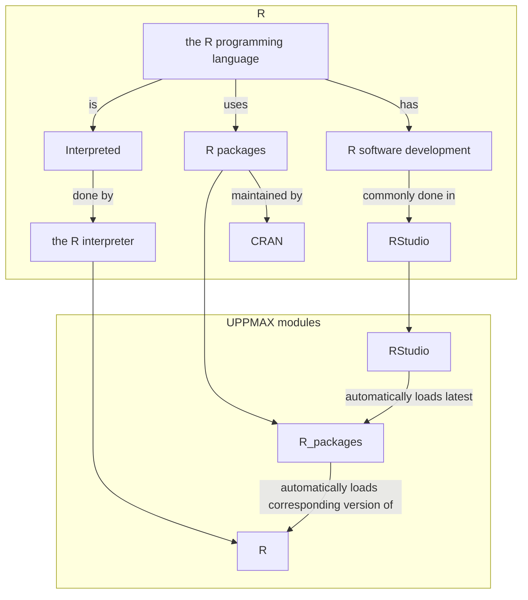

# R


R is a programming language for statistical computing and data visualization
(from [Wikipedia](https://en.wikipedia.org/wiki/R_(programming_language))).

Here we discuss:

- [the R programming language](#the-r-programming-language)
- [the R interpreter](#the-r-interpreter)
- [R packages](#r-packages)
- [R software development](#r-software-development)
- [How to install personal packages](#how-to-install-personal-packages)
- [How to create a Singularity container for an R package](create_singularity_container_for_r_package.md)



## the R programming language

R is ['a programming language for statistical computing and data visualization'](https://en.wikipedia.org/wiki/R_(programming_language)))
and is of the most commonly used programming languages in data mining,
analysis and visualization.

R is an interpreted language; users can access it through [the R interpreter](#the-r-interpreter).

R is a [dynamically typed](https://en.wikipedia.org/wiki/Type_system#DYNAMIC)
programming language with basic built-in data structures are (among others): vectors, arrays, lists, and data frames.
and its supports both procedural programming and object-oriented programming.

R has many user-created [R packages](#r-packages)
to augment the functions of the R language,
most commonly hosted on [CRAN](https://cran.r-project.org).
These packages offer statistical techniques,
graphical devices, import/export, reporting (RMarkdown, knitr, Sweave), etc.

## the R interpreter

The R interpreter is the program that reads R code and runs it.
Commonly, 'the programming language R' and 'the R interpreter'
are use as synonyms.

To load the latest version of the R interpreter,
load the `R` [module](../cluster_guides/modules.md) version 4.3.1 like this:

```bash
module load R/4.3.1
```

???- "Do I really need to load an R module?"

    We strongly recommend loading an R module.

    If you do not load an R module, you will be using the version of
    R used by the UPPMAX systems.

    Sometimes that may work.

    If not, load an R module.

???- "Need a different version?"

    If you need a different R version,
    use the following command
    to see which versions of the R interpreter
    are installed on UPPMAX:

    ```bash
    module spider R
    ```

Then start the R interpreter with:

```bash
R
```

## R packages

R packages extend what R can do.
The most common repository for R packages is [CRAN](https://cran.r-project.org).
As these packages are so common, UPPMAX provides most of CRAN packages
in one module, called `R_packages`

To load the latest version of the pre-installed R packages, do:

```bash
module load R_packages/4.3.1
```

This will automatically load the corresponding version of the R interpreter.

???- "Do I really need to load the `R_packages` module?"

    We strongly recommend loading the `R_packages` module.

    If you do not load the `R_packages` module (nor the `R` module),
    you will be using the version of R used by the UPPMAX systems.

    Sometimes that may work.

    If not, load the `R_packages` module.

???- "Need a different version?"

    If you need a different package version,
    use the following command
    to see which versions of the R packages
    are installed on UPPMAX:

    ```bash
    module spider R_packages
    ```

## R software development


> RStudio in action on Bianca using the remote desktop environment

Software development is commonly done in a so-called
[Integrated Development Environment](../software/ides.md),
abbreviated 'IDE.

[RStudio](rstudio.md) is the most commonly used IDE for R software development.
See [the UPPMAX page about RStudio](rstudio.md) on how to use.

## How to install personal packages

!!! tip "Installing R packages on Bianca"

    If a package is unavailable on Bianca,
    one can [create a Singularity container for R packages](../software/create_singularity_container_for_r_package.md)

First load `R_packages` to make sure that the package is not already installed!

To install personal packages in your own home directory you type

```r
install.packages("package_name")
```

as usual. That will install all your packages under the path `~/R/[arch]/[version of R]/`.
Then you can load it by just doing `library(package_name)`
or `require(package_name)` in the R environment.

You can also specify a specific folder for where to put your packages, with

```r
install.packages("package_name", lib="~/some/path/under/your/home/directory/")
```

But to then be able to find the package inside the R environment
you need to either export the `R_LIBS_USER` environment variable,
or specify the flag `lib.loc` when calling `require`/`library`, e.g.

```r
library(package_name, lib.loc='~/some/path/under/your/home/directory')
```

Notice that if you are planning on running R on different clusters
then it is probably wisest to manually specify the installation directory,
and to have separate directories for each cluster.
This is because some of the clusters have different architectures,
and this will render some packages unusable
if you compile them on one system but try to run them on the other.

## Technicalities

As of this writing, our most recent installations are

- `R/4.3.1`
- `R_packages/4.3.1`
- `RStudio/2023.12.1-402`

If you need an older version, do module avail R or R_packages or RStudio to see older versions as well.

Note that `R_packages/4.3.1` contains 23475 packages, nearly all packages available on CRAN and BioConductor, as well as several custom packages installed from Github and other repositories. See module help R_packages/4.3.1 and R_packages for more information.

## What R packages are in the omnibus `R_packages` modules?

### R_PACKAGES/4.1.1

As of 2021-11-11 there are a total of 21659 R packages installed. A total of 21740 packages are available in CRAN and BioConductor. 18022 CRAN packages are installed, out of 18348 available. 3382 BioConductor-specific packages are installed, out of 3392 available. 255 other R packages are installed. These are not in CRAN/BioConductor, and instead are hosted on github or elsewhere.

These R packages are available as part of the R_packages/4.1.1 module as installed on rackham, bianca and snowy, which requires and loads the R/4.1.1 module.  When the R_packages/4.1.1 module is loaded, it adds a directory to the R_LIBS_SITE environment variable.  Within R, these packages will be available via library(package-name).

- To use some R packages from this module, other modules may need to be loaded. For example, to use the Rmpi package, the openmpi/3.1.5 module must be loaded after loading R_packages/4.0.4.
- See module help R_packages/4.1.1 for more information.

### R_PACKAGES/4.0.4

As of 2021-04-16 there are a total of 20663 CRAN and BioConductor packages installed, out of 20751 packages available. 17354 CRAN packages are installed, out of 17428 available. 3309 BioConductor-specific packages are installed, out of 3323 available.

These R packages are available as part of the R_packages/4.0.4 module as installed on rackham, bianca and snowy, which requires and loads the R/4.0.4 module.  When the R_packages/4.0.4 module is loaded, it adds a directory to the R_LIBS_SITE environment variable.  Within R, these packages will be available via library(package-name).

- To use some R packages from this module, other modules may need to be loaded. For example, to use the Rmpi package, the openmpi/3.1.5 module must be loaded after loading R_packages/4.0.4.
- See module help R_packages/4.0.4 for more information.

### R_PACKAGES/4.0.0

As of 2021-02-24 there are a total of 18652 CRAN and BioConductor packages installed, out of 20422 packages available. 14839 CRAN packages are installed, out of 17165 available. 3217 BioConductor-specific packages are installed, out of 3257 available.

These R packages are available as part of the R_packages/4.0.0 module as installed on rackham, bianca and snowy, which requires and loads the R/4.0.0 module.  When the R_packages/4.0.0 module is loaded, it adds a directory to the R_LIBS_SITE environment variable.  Within R, these packages will be available via library(package-name).

See module help R_packages/4.0.0 for more information.

### R_PACKAGES/3.6.1

As of 2019-09-18 there are a total of 17657 packages available in this module. This includes 14579 CRAN packages installed, out of 14913 available; and 3054 BioConductor-specific packages installed, out of 3079 available. These R packages are available as part of the R_packages/3.6.1 module as installed on rackham, bianca and snowy, which requires and loads the R/3.6.1 module.  When the R_packages/3.6.1 module is loaded, it adds a directory to the R_LIBS_SITE environment variable.  Within R, these packages will be available via library(package-name).

See module help R_packages/3.6.1 for more information.

### R_PACKAGES/3.6.0

As of 2019-05-14 there are a total of 17257 packages available. This includes 13769 CRAN packages installed, out of 14178 available; and 3031 BioConductor-specific packages installed, out of 3079 available. These R packages are available as part of the R_packages/3.6.0 module as installed on rackham, bianca and snowy, which requires and loads the R/3.6.0 module.  When the R_packages/3.6.0 module is loaded, it adds a directory to the R_LIBS_SITE environment variable.  Within R, these packages will be available via library(package-name).

See module help R_packages/3.6.0 for more information.

### R_PACKAGES/3.5.2

As of 2019-02-08 there are a total of 16642 packages available. This includes 13355 CRAN packages installed, out of 13683 available; and 2933 BioConductor-specific packages installed, out of 2959 available. These R packages are available as part of the R_packages/3.5.2 module as installed on rackham, bianca and snowy, which requires and loads the R/3.5.2 module.  When the R_packages/3.5.2 module is loaded, it adds a directory to the R_LIBS_SITE environment variable.  Within R, these packages will be available via library(package-name).

See module help R_packages/3.5.2 for more information.

### R_PACKAGES/3.5.0

With its 3.5.0 version, R_packages now attempts to install all available R packages from both CRAN and BioConductor.

As of 2018-06-26 there are a total of 14532 packages available. This includes 11734 CRAN packages installed, out of 12867 available; and 2798 BioConductor-specific packages installed, out of 2843 available. These R packages are available as part of the R_packages/3.5.0 module as installed on rackham, bianca and snowy, which requires and loads the R/3.5.0 module.  When the R_packages/3.5.0 module is loaded, it adds a directory to the R_LIBS_SITE environment variable.  Within R, these packages will be available via library(package-name).

See module help R_packages/3.5.0 for more information.

### R_packages/3.4.3

A large number of R packages are available as part of the R_packages/3.4.3 module as installed on rackham and bianca, which requires and loads the R/3.4.3 module.  When the R_packages/3.4.3 module is loaded, it adds a directory to the R_LIBS_SITE environment variable.  Within R, these packages will be available via library(package-name).

### R_packages/3.4.0

A large number of R packages are available as part of the R_packages/3.4.0 module, which requires and loads the R/3.4.0 module.  When the R_packages/3.4.0 module is loaded, it adds a directory to the R_LIBS_SITE environment variable.  Within R, these packages will be available via library(package-name).

### R_packages/3.3.2

A large number of R packages are available as part of the R_packages/3.3.2 module, which requires and loads the R/3.3.2 module.  When the R_packages/3.3.2 module is loaded, it adds a directory to the R_LIBS_SITE environment variable.  Within R, these packages will be available via library(package-name).

### R_packages/3.3.1

A large number of R packages are available as part of the R_packages/3.3.1 module, which requires and loads the R/3.3.1 module.  When the R_packages/3.3.1 module is loaded, it adds a directory to the R_LIBS_SITE environment variable. Within R, these should be available via library(package-name).

### R_packages/3.3.0

A large number of R packages are available as part of the R_packages/3.3.0 module, which requires and loads the R/3.3.0 module.  When the R_packages/3.3.0 module is loaded, it adds a directory to the R_LIBS_SITE environment variable. Within R, these should be available via library(package-name).

## Learning R

### Starter R courses

[The Carpentries](https://carpentries.org/) teaches basic lab skills for research computing, such as:

- [Programming with R](https://swcarpentry.github.io/r-novice-inflammation/)
- [R for reproducible scientific analysis](https://swcarpentry.github.io/r-novice-gapminder)

### Experienced R courses

[CodeRefinery](https://coderefinery.org) develops and maintains training material
on software best practices for researchers that already write code.
Their material addresses all academic disciplines and tries to be as programming language-independent as possible:

- [CodeRefinery lessons](https://coderefinery.org/lessons/)

Aalto Scientific Computing:

- [Data analysis workflows with R and Python](https://aaltoscicomp.github.io/data-analysis-workflows-course)

## Overview of NAISS centers and their documentation about R

- [C3SE](https://www.c3se.chalmers.se/documentation/applications/r/)
- [HPC2N](https://www.hpc2n.umu.se/resources/software/r)
- [LUNARC](https://lunarc-documentation.readthedocs.io/en/latest/guides/applications/Rscript/)
- [NSC](https://ipv4.www.nsc.liu.se/software/catalogue/tetralith/modules/r.html)
- [PDC](https://www.pdc.kth.se/software/software/R/index_general.html)
- [UPPMAX](../software/r.md)

## Links

- [The home page of "The R Project for Statistical Computing"](https://www.r-project.org/)
- [Official R documentation](https://cran.r-project.org/manuals.html)
- [CRAN homepage](https://cran.r-project.org)
- [CRAN mirrors](https://cran.r-project.org/mirrors.html)
