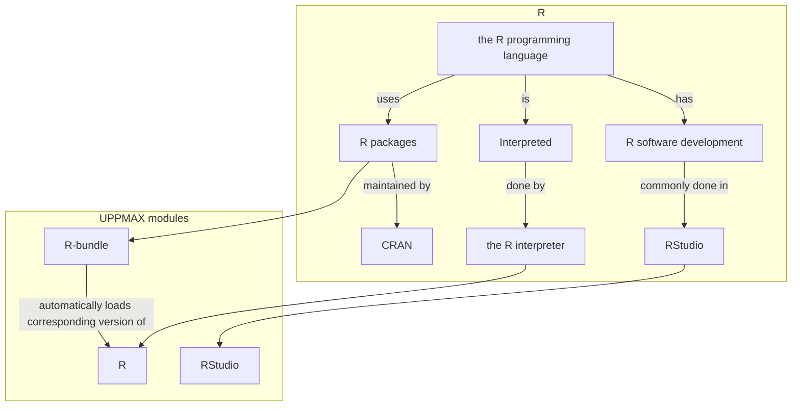
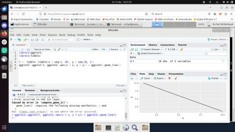

---
tags:
  - R
  - software
  - language
  - interpreter
  - programming language
---

# R on Pelle


R is a programming language for statistical computing and data visualisation
(from [Wikipedia](https://en.wikipedia.org/wiki/R_(programming_language))).

Here we discuss:

- [the R programming language](#the-r-programming-language)
- [the R interpreter](#the-r-interpreter)
- [R packages](#r-packages)
- [R software development](#r-software-development)
- [How to install personal packages](#how-to-install-personal-packages)
- [How to create a Singularity container for an R package](create_singularity_container_for_r_package.md)



## the R programming language

R is ['a programming language for statistical computing and data visualisation'](https://en.wikipedia.org/wiki/R_(programming_language)))
and is of the most commonly used programming languages in data mining,
analysis and visualisation.

R is an interpreted language; users can access it through [the R interpreter](#the-r-interpreter).

R is a [dynamically typed](https://en.wikipedia.org/wiki/Type_system#DYNAMIC)
programming language with basic built-in data structures are (among others): vectors, arrays, lists, and data frames.
and its supports both procedural programming and object-oriented programming.

R has many user-created [R packages](#r-packages)
to augment the functions of the R language,
most commonly hosted on [CRAN](https://cran.r-project.org).
These packages offer statistical techniques,
graphical devices, import/export, reporting (RMarkdown, knitr, Sweave), etc.

## the R interpreter

The R interpreter is the program that reads R code and runs it.
Commonly, 'the programming language R' and 'the R interpreter'
are use as synonyms.

To load the latest version of the R interpreter,
load the `R` [module](../cluster_guides/modules.md) version 4.3.1 like this:

```bash
module load R/4.3.1
```

???- "Do I really need to load an R module?"

    We strongly recommend loading an R module.

    If you do not load an R module, you will be using the version of
    R used by the UPPMAX systems.

    Sometimes that may work.

    If not, load an R module.

???- "Need a different version?"

    If you need a different R version,
    use the following command
    to see which versions of the R interpreter
    are installed on UPPMAX:

    ```bash
    module spider R
    ```

Then start the R interpreter with:

```bash
R
```

## R packages

R packages extend what R can do.
The most common repository for R packages is [CRAN](https://cran.r-project.org).
As these packages are so common, UPPMAX provides the CRAN packages 
in one module, called `R-bundle-CRAN`

To load the latest version of the pre-installed R packages, do:

```bash
module load R-bundle-CRAN
```

This will automatically load the corresponding version of the R interpreter (for version``2024.11-foss-2024a`` it is ``R/4.4.2`` ).

???- "Need a different version?"

    If you need a different package version,
    use the following command
    to see which versions of the R packages
    are installed on UPPMAX:

    ```bash
    module spider R-bundle-CRAN
    ```

### R-bundle-Bioconductor

For Bio users R-bundle-Bioconductor/3.20-foss-2024a-R-4.4.2 is useful!


## R software development



> RStudio in action on Bianca using the remote desktop environment

Software development is commonly done in a so-called
[Integrated Development Environment](../software/ides.md),
abbreviated 'IDE.

[RStudio](rstudio.md) is the most commonly used IDE for R software development.
See [the UPPMAX page about RStudio on Pelle](rstudio_on_pelle.md) on how to use.

## How to install personal packages

First load both `R-bundle-Bioconductor` and `R-bundle-CRAN/` to make sure that the package is not already installed!

To install personal packages in your own home directory you type

```r
install.packages("package_name")
```

as usual. That will install all your packages under the path `~/R/[arch]/[version of R]/`.
Then you can load it by just doing `library(package_name)`
or `require(package_name)` in the R environment.

You can also specify a specific folder for where to put your packages, with

```r
install.packages("package_name", lib="~/some/path/under/your/home/directory/")
```

But to then be able to find the package inside the R environment
you need to either export the `R_LIBS_USER` environment variable,
or specify the flag `lib.loc` when calling `require`/`library`, e.g.

```r
library(package_name, lib.loc='~/some/path/under/your/home/directory')
```

Notice that if you are planning on running R on different clusters
then it is probably wisest to manually specify the installation directory,
and to have separate directories for each cluster.
This is because some of the clusters have different architectures,
and this will render some packages unusable
if you compile them on one system but try to run them on the other.

## Technicalities

As of this writing, our most recent installations are

- `R/4.5.1`
- `R-bundles` compatible with R-4.4.2
- `RStudio/2025.09.0-387`

If you need an older version, do module avail R or R_packages or RStudio to see older versions as well.

Note that `R_packages/4.3.1` contains 23475 packages, nearly all packages available on CRAN and BioConductor, as well as several custom packages installed from Github and other repositories. See module help R_packages/4.3.1 and R_packages for more information.

