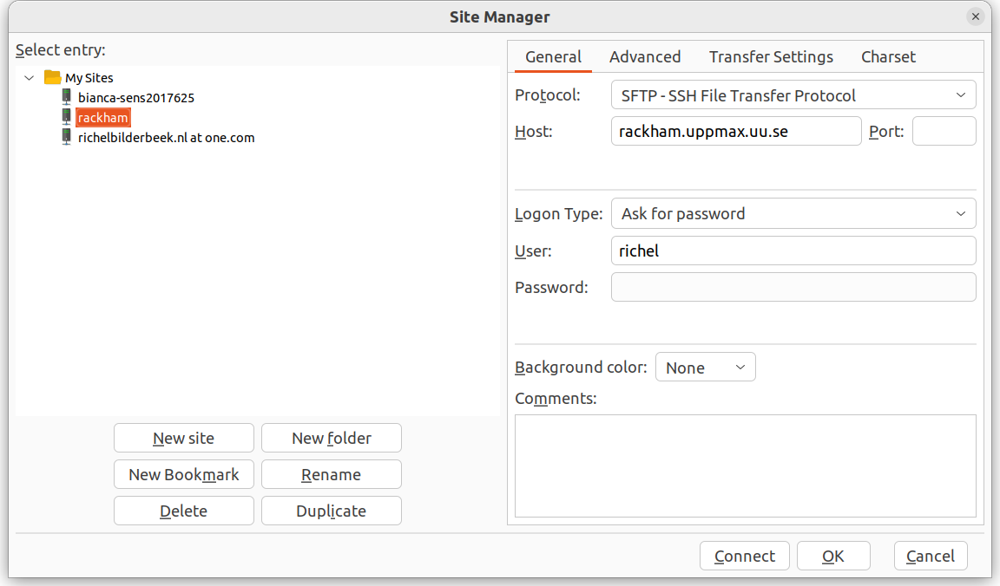

---
tags:
  - FileZilla
  - Rackham
---

# File transfer to/from Rackham using FileZilla

There are multiple ways to [transfer data to/from Rackham](../cluster_guides/transfer_rackham.md).

Here, we show how to transfer files using a graphical tool called [FileZilla](filezilla.md).

> FileZilla connected to Rackham

## Procedure

> The FileZilla logo

???- question "Would you like a video?"

    If you like to see how to do file transfer from/to Rackham
    using FileZilla, watch the video
    [here](https://youtu.be/7wHRCMdnNZE)

FileZilla is a secure file transfer tool that works under Linux, Mac and Windows.

To transfer files to/from Rackham using FileZilla, do
the following steps:

### 1. Start FileZilla

Start FileZilla.

### 2. Start FileZilla's site manager

From the menu, select 'File | Site manager'

???- tip "Where is that?"

    It is here:

    

    > The FileZilla 'File' menu contains the item 'Site manager'

### 3. Add a new site in FileZilla's site manager

In FileZilla's site manager, click 'New site'

???- tip "Where is that?"

    It is here:

    

### 4. Setup the site

In FileZilla's site manager:

- create a name for the site, e.g. `rackham`.
- for that site, use all standards, except:
    - Set protocol to 'SFTP - SSH File Transfer Protocol'
    - Set host to `rackham.uppmax.uu.se`
    - Set user to `[username]`, e.g. `richel`

???- tip "How does that look like?"

    It looks similar to this:

    

### 5. Connect to the site

Click 'Connect'.

### 6. Fill in your password

You will be asked for your password, hence
type `[your password]`, e.g. `VerySecret`.
You can save the password.

???- tip "How does that look like?"

    It looks similar to this:

    

### 7. Ready to transfer files

Now you can transfer files between your local computer and Rackham.

???- tip "How does that look like?"

    It looks like this:

    
