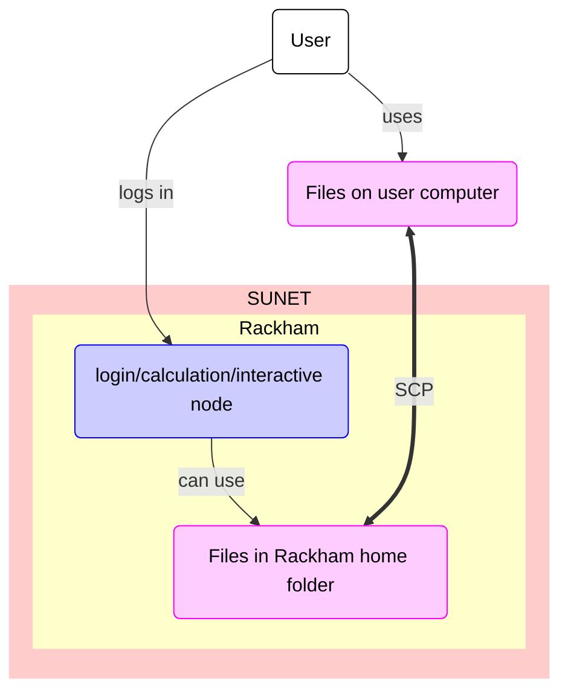

# Data transfer to/from Rackham using SCP

Data transfer to/from Rackham using SCP
is one of the ways ways to transfer files to/from Rackham

???- question "What are the other ways?"

    Other ways to transfer data to/from Rackham are described [here](../cluster_guides/transfer_rackham.md)

One can transfer files to/from Rackham using SCP.
SCP is an abbreviation of 'Secure copy protocol',
however, it is not considered 'secure' anymore:
instead it is considered an outdated protocol.
The program `scp` allows you to transfer files to/from Rackham using SCP,
by coping them between your local computer and Rackham.

The process is:

## Step 1. Start a terminal on your local computer

Start a terminal on your local computer

## Step 2. Copy files using `scp`

In the terminal, copy files using `scp` to connect to Rackham:

```bash
scp [from] [to]
```

Where `[from]` is the file(s) you want to copy, and `[to]` is the destination.
This is quite a shorthand notation!

This is how you copy a file from your local computer to Rackham:

```bash
scp [local_filename] [username]@rackham.uppmax.uu.se:/home/[username]
```

where `[local_filename]` is the path to a local filename,
and `[username]` is your UPPMAX username, for example:

```bash
scp my_file.txt sven@rackham.uppmax.uu.se:/home/sven
```

To copy a file from Rackham to your local computer, do the command above in reverse order:

```bash
scp [username]@rackham.uppmax.uu.se:/home/[username]/[remote_filename] [local_folder]
```

where `[remote_filename]` is the path to a remote filename,
`[username]` is your UPPMAX username,
and `[local_folder]` is your local folder, for example:

```bash
scp sven@rackham.uppmax.uu.se:/home/sven/my_remote_file.txt /home/sven
```

## Step 3. If asked, give your UPPMAX password

If asked, give your UPPMAX password.
You can get rid of this prompt if you have setup SSH keys




> Overview of file transfer on Rackham
> The purple nodes are about file transfer,
> the blue nodes are about 'doing other things'.
> The user can be either inside or outside SUNET.

