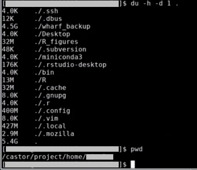

---
tags:
  - RStudio
  - Bianca
---

# RStudio on Bianca


## Introduction

[RStudio](../software/rstudio.md) is an [IDE](../software/ides.md)
specialised for the [R](../software/r.md) programming language

In this session, we show how to use RStudio on Bianca,
using Bianca's remote desktop environment.

???- tip "Forgot how to login to a remote desktop environment?"

    See [the 'Logging in to Bianca' page](../getting_started/login_bianca.md).

    Spoiler: go to [https://bianca.uppmax.uu.se/](https://bianca.uppmax.uu.se/)

As RStudio is a resource-heavy program,
it must be run on an interactive session.

???- tip "Forgot how to start an interactive session?"

    See [the 'Starting an interactive session' page](../cluster_guides/start_interactive_session_on_bianca.md).

## Procedure to start RStudio

Below is a step-by-step procedure to start RStudio on Bianca.

??? question "Prefer a video?"

    This procedure is also demonstrated in [this YouTube video](https://youtu.be/rRUb4pqaVak).

### 1. Get within SUNET

???- question "Forgot how to get within SUNET?"

    See [the 'get inside the university networks' page](../getting_started/get_inside_sunet.md)

### 2. Start the Bianca remote desktop environment

???- tip "Forgot how to start Bianca's remote desktop environment?"

    See [the 'Logging in to Bianca' page](../getting_started/login_bianca.md).

### 3. Start an interactive session

Within the Bianca remote desktop environment, start a [terminal](../software/terminal.md).
Within that terminal,
[start an interactive session](../cluster_guides/start_interactive_session_on_bianca.md)
with 2 cores:

!!!- info "Why two cores?"

    RStudio is a resource-heavy program.
    Due to this, we recommend using at least two cores
    for a more pleasant user experience.


```bash
interactive -A [project_number] -n 2 -t 8:00:00
```

Where `[project_number]` is your
[UPPMAX project](../getting_started/project.md), for example:

```bash
interactive -A sens2016001 -n 2 -t 8:00:00
```

???- question "What is my UPPMAX project number?"

    Easy answers that is probably true:

    The one you used to login, which is part of your prompt.
    For example, in the prompt below, the project is `sens2016001`.

    ```bash
    [sven@sens2016001-bianca sven]$
    ```

!!!- warning "Do not start RStudio from the menus"

    You can start a version of RStudio from the menus.
    However, this will not have access to loaded
    [modules](../cluster_guides/modules.md).

    Instead, load RStudio from the module system instead.

### 4. Load the modules needed

In the terminal of the interactive session, do:


```bash
module load R_packages/4.3.1 RStudio/2023.06.2-561
```

!!! warning

    RStudio/2023.12.1-402 may not always work.

???- questions "Do all combinations of `R_packages` and `RStudio` work?"

    No.

    Not all combination of `R_packages` and `RStudio` work equally well,
    but this one is known to work (as
    it was used in [this solved ticket](https://github.com/UPPMAX/ticket_304069)).

    There have been issues using `RStudio/2023.06.2-561` together with `R/4.3.1`

???- question "Shouldn't I load `R` first?"

    No.

    Loading `R_packages` will load the corresponding `R` module.

???- question "What happens if I do not load `R_packages`?"

    Then you will have RStudio running without any R packages installed

### 5. Start RStudio

With the modules loaded, start RStudio from the terminal (on the
interactive session):

```bash
rstudio
```

RStudio can be slow to startup, as R has thousands (!) of packages.
Additionally, at startup and if enabled, your saved RStudio workspace
(with potentially a lot of data!) is read.

???- info "How does RStudio look on Bianca?"

    RStudio when starting up:

    

    RStudio when started up:

    

    RStudio in action:

    

    The RStudio debugger, at the error message level:

    

    The RStudio debugger, at the function-that-caused-the-error level:

    

    The RStudio debugger, at the program level:

    

## Troubleshooting

### RStudio freezes when I start it, where yesterday it still worked

#### Hypothesis: Your home folder is full

Your home folder is full. That explains why it still worked yesterday:
at that day, your home folder was not full yet.

RStudio uses your home folder
to store the things it needs, so when it is full, it cannot do its
things.

To confirm, from a terminal do:

```bash
du -h -d 1 .
```

This will show how much space the folders in your home folder take:



In this example, there is a folder called `wharf_backup` that is
4.5 gigabyte. Moving it to a project folder solved the problem:

```bash
mv wharf_backup/ /proj/nobackup/[your_project_folder]
```

For example:

```bash
mv wharf_backup/ /proj/nobackup/sens2016001

```
