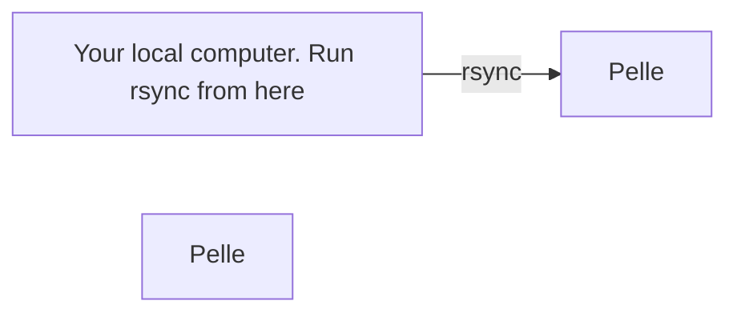

# `rsync` on Pelle

[`rsync`](../software/rsync.md) is a command-line tool for [file transfer](../cluster_guides/file_transfer.md).

This page describes how to use [`rsync`](../software/rsync.md) on [Pelle](../cluster_guides/pelle.md).

## Copy a folder from local to Pelle



Copy a folder from a local computer to a Pelle home folder.

On your local computer, do:

```bash
rsync --recursive [folder_name] [user_name]@pelle.uppmax.uu.se:/home/[user_name]/
```

For example:

```bash
rsync --recursive my_folder sven@pelle.uppmax.uu.se:/home/sven/
```

The `--recursive` flag is used to
copy a folder and all of its subfolders.

## Copy a folder from Pelle to local


Copy a folder from Pelle
to your local computer.

On your local computer, do:

```bash
rsync --recursive [user_name]@pelle.uppmax.uu.se:/home/[user_name]/[folder_name] [local_folder_destination]
```

For example:

```bash
rsync --recursive sven@pelle.uppmax.uu.se:/home/sven/my_folder .
```

Where `.` means 'the folder where I am now'.

## Links

- [`rsync` homepage](https://rsync.samba.org/)
