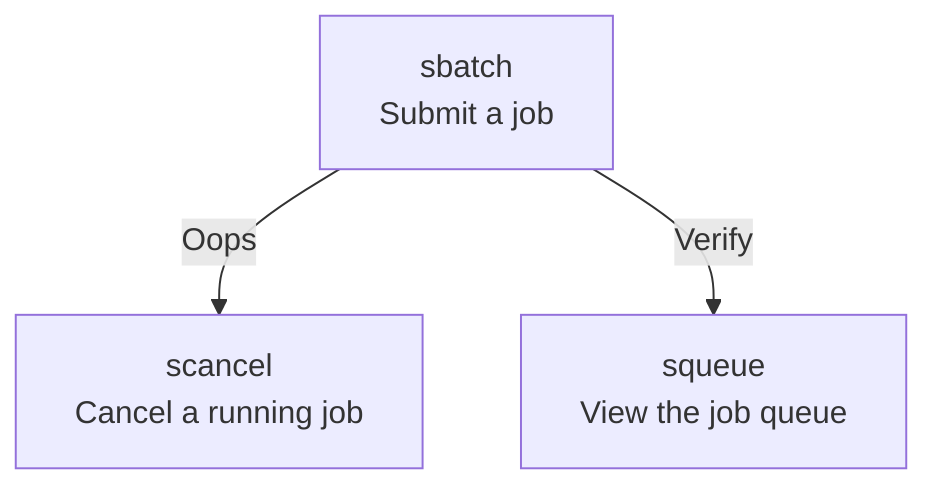

# `sbatch`

The [job scheduler](../cluster_guides/slurm.md) consists of many
programs to manage jobs.
`sbatch` is the program to submit a job to the scheduler.



After submitting a job, one can use [`squeue`](squeue.md) to
verify the job is in the job queue. If there is an error in the `sbatch`
command, one can cancel a job using [`scancel`](scancel.md).

## Minimal examples

There are two ways to demonstrate minimal use of `sbatch`:

- [with command-line Slurm arguments](#with-command-line-slurm-arguments):
  easier to experiment with
- [with Slurm parameters in the script](#with-slurm-parameters-in-the-script):
  easier when you know what you need

These minimal examples use a run-time of a short, default time.

### with command-line Slurm arguments

To let Slurm schedule a job, one uses `sbatch`, like:

```bash
sbatch -A [project_code] [script_filename]
```

for example:

``` bash
sbatch -A sens2017625 my_script.sh
```

???- question "What is in the script file?"

    The script file `my_script.sh` is a minimal example script.
    Such a minimal example script could be:

    ```bash
    #!/bin/bash
    echo "Hello"
    ```

### with Slurm parameters in the script

The minimal command to use `sbatch` with Slurm parameters in the script:

``` bash
sbatch [script_filename]
```

where `[script_filename]` the name of a bash script, for example:

```bash
sbatch my_script.sh
```

The script must contain at least the following lines:

```text
#SBATCH -A [project_code]
```

where `[project_code]` is the project code, for example:

```bash
#SBATCH -A uppmax2023-2-25
```

???- question "What is in the script file?"

    A full example script would be:

    ```bash
    #!/bin/bash
    #SBATCH -A uppmax2023-2-25
    echo "Hello"
    ```

## More parameters

See [the Slurm documentation on sbatch](https://slurm.schedmd.com/sbatch.html)

## Troubleshooting

See [Slurm troubleshooting](../cluster_guides/slurm_troubleshooting.md)
