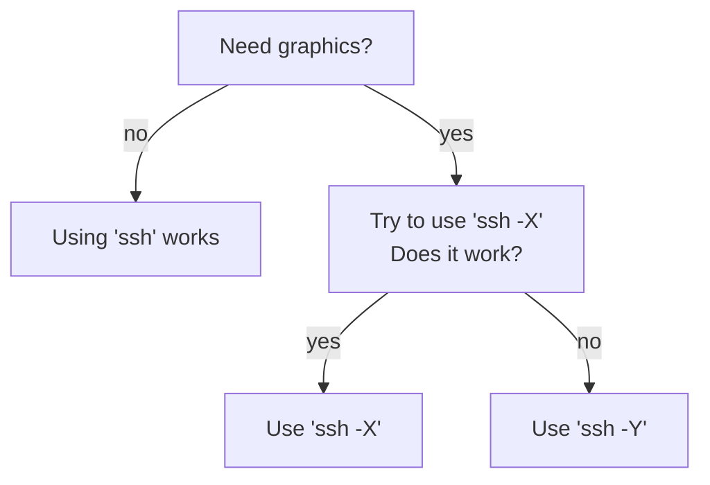

# ssh

From [Wikipedia](https://en.wikipedia.org/wiki/Secure_Shell):

> The Secure Shell Protocol (SSH) is a cryptographic network protocol 
> for operating network services securely over an unsecured network.

At UPPMAX we allow users to login via SSH, using the program `ssh`.

## Difference between `ssh -X` and `ssh -Y`

Adapted from [this AskUbuntu answer](https://askubuntu.com/a/35518):

If you need graphics, `ssh -X` is more secure. 
However, it may be too secure for your software to run.
In that case, run `ssh -Y`.

> Flowchart to determine to use `ssh` or `ssh -X` or `ssh -Y`.

???- question "Using `ssh -Y`? Let us know!"

    If you -a user- use `ssh -Y` when `ssh -X` does not work, 
    let us know. It helps us choose which option to show at these
    documentation websites.

