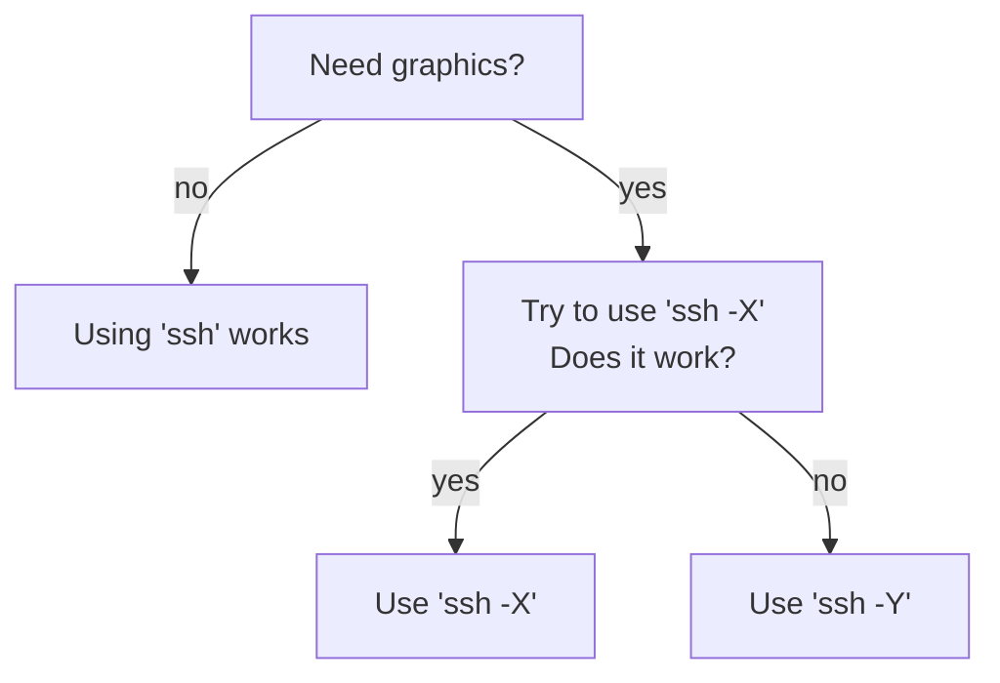

# ssh

From [Wikipedia](https://en.wikipedia.org/wiki/Secure_Shell):

> The Secure Shell Protocol (SSH) is a cryptographic network protocol 
> for operating network services securely over an unsecured network.

At UPPMAX we allow users to login via SSH, using the program `ssh`.

## Difference between `ssh -X` and `ssh -Y`

Adapted from [this AskUbuntu answer](https://askubuntu.com/a/35518):

If you need graphics, `ssh -X` is more secure. 
However, it may be too secure for your software to run.
In that case, run `ssh -Y`.



> Flowchart to determine to use `ssh` or `ssh -X` or `ssh -Y`.

???- question "Using `ssh -Y`? Let us know!"

    If you -a user- use `ssh -Y` when `ssh -X` does not work, 
    let us know (see the UPPMAX support page [here](../support.md)). 
    It helps us choose which option to show at these
    documentation websites.


## Create an SSH key pair for use with Rackham

Create an SSH key pair with the following command:

```
ssh-keygen -o -a 100 -t ed25519 -f ~/.ssh/id_ed25519_key -C "MyNewKey"
```

Add your newly generated Ed25519 key to an **SSH agent**:

```
ssh-add ~/.ssh/id_ed25519_key
```

Copy the public key to Rackham or other server.

```
ssh-copy-id -i .ssh/id_ed25519_key.pub rackham.uppmax.uu.se
```

Connect

```
ssh username@rackham.uppmax.uu.se
```

## Create an SSH key pair for use with Bianca

- Add the content of your public key `id_ed25519_key.pub` to 
  `$HOME/.ssh/authorized_keys`. 
  **You can not** use the same command ssh-copy as in the case for Rackham, 
  i.e. you have to manually bring the key on Bianca.
  If you paste it, **make sure it is in one line**, 
  not wrapped/split over multiple lines.
- **Make sure the permissions look something like this:**

```
ls -ld .ssh
drwx--S--- 2 user user 4096 May  7  2019 .ssh

ls -l .ssh
total 1
-rw-r----- 1 user user 743 May  7  2019 authorized_keys
```

- Connect to Bianca (it is critical to use **SSH agent** in this case, see above)

```
ssh -A user-sensXXXXX@bianca.uppmax.uu.se
```

- To debug, run with `-vv`

```
...
debug1: Requesting authentication agent forwarding.
debug2: channel 1: request auth-agent-req@openssh.com confirm 0
...

debug1: client_input_channel_open: ctype auth-agent@openssh.com rchan 2 win 65536 max 16384
debug1: client_request_agent: bound agent to hostkey
debug2: fd 8 setting O_NONBLOCK
debug1: channel 2: new [authentication agent connection]
debug1: confirm auth-agent@openssh.com
Last login: Tue Jul 11 18:44:21 2023 from 172.18.144.254
 _   _ ____  ____  __  __    _    __  __
| | | |  _ \|  _ \|  \/  |  / \   \ \/ /   | System:    sens2017625-bianca
| | | | |_) | |_) | |\/| | / _ \   \  /    | User:      user
| |_| |  __/|  __/| |  | |/ ___ \  /  \    | 
 \___/|_|   |_|   |_|  |_/_/   \_\/_/\_\   | 

  ###############################################################################
```

## WSL2 under Windows{10,11}

Here as a neat way to get persistent key-manger in WSL2 - credits: [original source](https://esc.sh/blog/ssh-agent-windows10-wsl2/).

```
sudo apt-get install keychain
```

Replace `XXXX` with the output of `hostname` command on the command line.

```
/usr/bin/keychain -q --nogui $HOME/.ssh/id_ed25519_key
source $HOME/.keychain/XXXX-sh
```

Remove `-q` to get some information if you want

```
* keychain 2.8.5 ~ http://www.funtoo.org
* Found existing ssh-agent: 4487
* Known ssh key: /home/user/.ssh/id_ed25519_key
```

First time you login, you will be asked for the password and the key wil be handled by the key-manager. Check with

```
ssh-add -l
256 SHA256:wLJvQOM....   ....cTTtiU MyNewKey (ED25519)
```

## MobaXterm

In MobaXterm you can use the internal `MobAgent` or/and the `Peagent` from the `PuTTy` tools.


## OPTIONAL: SSH config

Example `$HOME/.ssh/config` file to make your work easier.

```
Host rackham
User username
HostName rackham.uppmax.uu.se
ServerAliveInterval 240
ServerAliveCountMax 2

# Default settings
#=======================================
Host *
ForwardAgent no 
ForwardX11 yes
ForwardX11Trusted yes
ServerAliveInterval 120
#=======================================
```


Now

```
# without config
ssh -Y username@rackham.uppmax.uu.se
# with config
ssh rackham

# without config
scp local_file username@rackham.uppmax.uu.se:remote_folder/
# with config
scp local_file rackham:remote_folder/

rsync ...
sftp ...
```

## Links

 * [SSH Tips by Pavlin Mitev](https://hackmd.io/@pmitev/SSH_tips)
