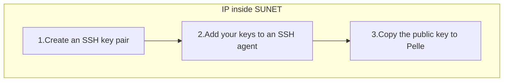

---
tags:
  - ssh
  - SSH
  - key
  - ssh key
  - SSH key
  - Pelle
---

# Create and use an SSH key pair for Pelle

This page describes [how to create and use an SSH key](ssh_key_use.md)
so that you can
[login to the Pelle console environment with an SSH key](../getting_started/login_pelle_console_ssh_key.md)

## Procedure

???- question "Prefer a video?"

    - [Create and use an SSH key pair for Pelle when outside of SUNET (fails!)](https://youtu.be/-f0C66zIrwI)
    - [Create and use an SSH key pair for Pelle on Ubuntu 24.04 Noble (fails!)](https://youtu.be/j6F8sJu2NFs)

This figure shows the procedure:



<!--

This procedure will fail if:

- You are outside of the university networks,
  see [how to get inside the university networks](../getting_started/get_inside_sunet.md).
  [This video](https://youtu.be/-f0C66zIrwI) shows it will fail when being
  outside of the university networks
- You use Ubuntu 24.04 Noble, as demonstrated by [this video](https://youtu.be/j6F8sJu2NFs),
  where a password is still requested after doing this procedure

-->

### 1. Create an SSH key pair

Create an SSH key pair with the following command:

```bash
ssh-keygen -a 100 -t ed25519 -f ~/.ssh/id_ed25519_uppmax_login -C "My comment"
```

- `-a 100`:  100 rounds of key derivations,
  making your key's password harder to brute-force,
  as is recommended by
  [this StackExchange post](https://security.stackexchange.com/a/144044)
- `-t ed25519`: type of encryption scheme
- `-f ~/.ssh/id_ed25519_uppmax_login`: specify filename,
  following the naming scheme as suggested
  [in this Superuser post](https://superuser.com/a/1261644)
- `-C "My comment"`: a comment that will be stored in the key, so you can find out what it was for

### 2. Add your keys to an SSH agent

Add your newly generated `ed25519` key to an SSH agent:

```bash
ssh-add ~/.ssh/id_ed25519_uppmax_login
```

### 3. Copy the public key to Pelle

Copy the public key to Pelle or other server.

```bash
ssh-copy-id -i .ssh/id_ed25519_uppmax_login.pub [username]@pelle.uppmax.uu.se
```

- `-i .ssh/id_ed25519_uppmax_login.pub`: the identity file, the public key's filename
- `[username]@pelle.uppmax.uu.se`: your UPPMAX username, for example `sven@pelle.uppmax.uu.se`

After this, you can login to Pelle without specifying a password.

## Troubleshooting

### On Linux, it still asks for a password

From [this post](https://unix.stackexchange.com/questions/26371/ssh-prompts-for-password-despite-ssh-authorized-keys)
and [its answer](https://unix.stackexchange.com/a/664213):

On Pelle, do:

```bash
chmod 700 .ssh/authorized_keys
chmod 700 .ssh
chmod 700 ~
```

On your local computer, do:

```bash
chmod 700 .ssh/authorized_keys
chmod 700 .ssh
chmod 700 ~
```
