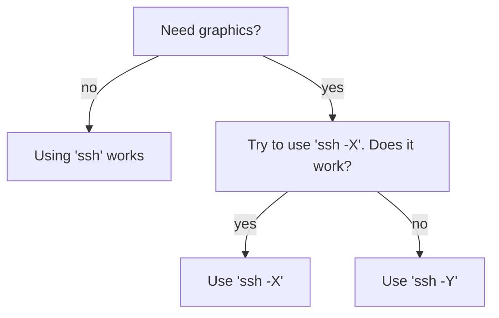

---
tags:
  - ssh
  - SSH
  - console
  - terminal
  - x-forwarding
---

# SSH X forwarding

SSH X forwarding (or simply 'X forwarding')
allows one to use graphics when using an [SSH client](ssh_client.md).

For example, this is how UPPMAX user `sven` would login
to Rackham using [`ssh`](ssh.md) with X forwarding enabled:

```bash
ssh -X sven@rackham.uppmax.uu.se
```

It is the `-X` that allows [ssh](ssh.md) to show graphics.

???- question "What is X?"

    In this context, [the X window system](https://en.wikipedia.org/wiki/X_Window_System).

???- question "How can I verify I allow X forwarding?"

    By running a simple program:

    Cluster|Program name         |UPPMAX documentation
    -------|---------------------|---------------------
    Bianca |[`xeyes`](xeyes.md)  |[`xeyes`](xeyes.md)
    Pelle  |[`xclock`](xclock.md)|[`xclock`](xclock.md)
    Rackham|[`xeyes`](xeyes.md)  |[`xeyes`](xeyes.md)
    Snowy  |[`xeyes`](xeyes.md)  |[`xeyes`](xeyes.md)

## UPPMAX clusters that allow SSH with X forwarding

Cluster|Allows SSH with X forwarding
-------|----------------------------
Bianca |No
Pelle  |Yes
Rackham|Yes
Snowy  |Yes

## SSH clients

See [SSH clients](../software/ssh_client.md).

## Difference between `ssh -X` and `ssh -Y`

Adapted from [this AskUbuntu answer](https://askubuntu.com/a/35518):

If you need graphics, `ssh -X` is more secure.
However, it may be too secure for your software to run.
In that case, run `ssh -Y`.



> Flowchart to determine to use `ssh` or `ssh -X` or `ssh -Y`.

???- question "Using `ssh -Y`? Let us know!"

    If you -a user- use `ssh -Y` when `ssh -X` does not work,
    let us know (see [the UPPMAX support page](../support.md)).
    It helps us choose which option to show at these
    documentation websites.
