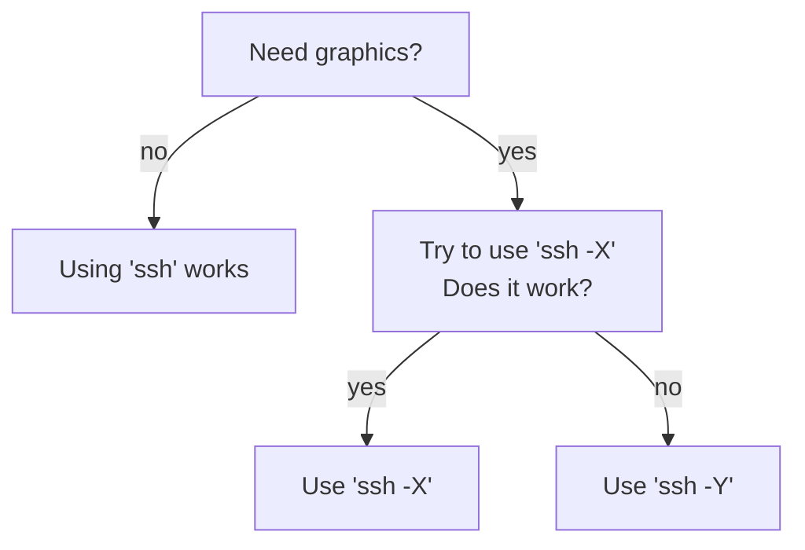

# SSH X forwarding

SSH X forwarding (or simply 'X forwarding') 
allows on the use graphics when using [ssh](ssh.md).

For example, this is how UPPMAX user `sven` would login
to Rackham using X forwarding:

```
ssh -X sven@rackham.uppmax.uu.se
```

It is the `-X` that allows [ssh](ssh.md) to show graphics.

???- question "What is X?"

    In this context, [the X window system](https://en.wikipedia.org/wiki/X_Window_System).

???- question "How can I verify I allow X forwarding?"

    In a terminal, type:

    ```
    xeyes
    ```

    If you have X forwarding enabled, you will see:

    

    > SSH X forwarding is enabled, as there are eyes shown in the top-right of the screen

    If you do not have X forwarding enabled, you will get the error:

    ```
    Error: Can't open display:
    ```

    

    > SSH X forwarding is not enabled, as this gives an error message

## Difference between `ssh -X` and `ssh -Y`

Adapted from [this AskUbuntu answer](https://askubuntu.com/a/35518):

If you need graphics, `ssh -X` is more secure. 
However, it may be too secure for your software to run.
In that case, run `ssh -Y`.



> Flowchart to determine to use `ssh` or `ssh -X` or `ssh -Y`.

???- question "Using `ssh -Y`? Let us know!"

    If you -a user- use `ssh -Y` when `ssh -X` does not work, 
    let us know (see the UPPMAX support page [here](../support.md)). 
    It helps us choose which option to show at these
    documentation websites.
